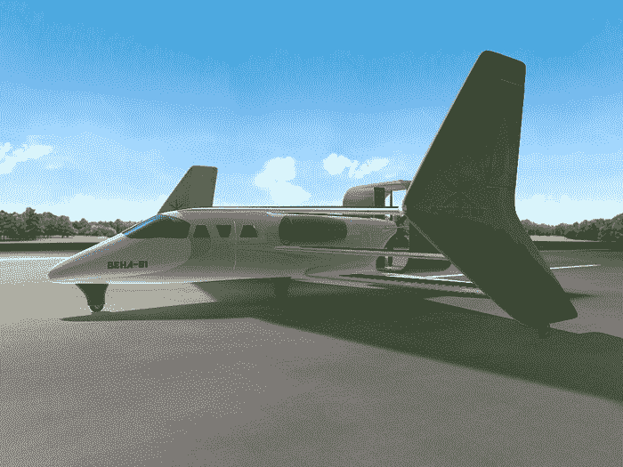
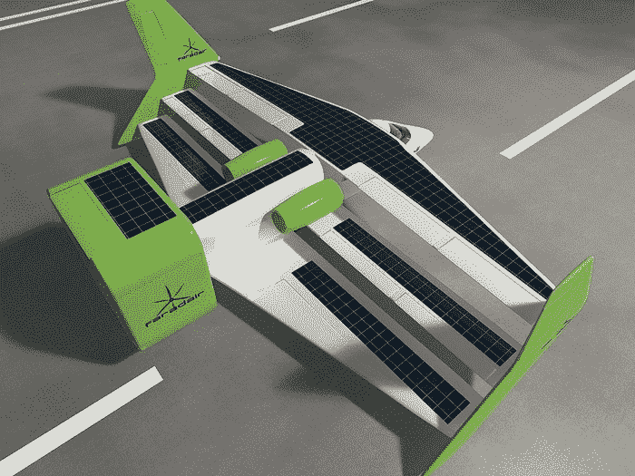

# 生物燃料驱动的电动三翼飞机在 Kickstarter  上发布

> 原文：<https://web.archive.org/web/https://techcrunch.com/2014/11/27/bio-fuel-powered-electric-triplane-launches-on-kickstarter/?iframe=true&guccounter=1&guce_referrer=aHR0cHM6Ly93d3cuZ29vZ2xlLmNvbS8&guce_referrer_sig=AQAAAF0JvKIuQ4lGn4ssbzJihr79OhOKX10VwJQ_TJR0XbLAVuqy0uw4Pz7KSO2ARxQIm70G5iuHFZ9_DyC3XmSUfRgp6l9uV0u3k38wSR3zCtgQih_xomqwqNwT8q10DUYWeXXHIGjqYvvzMQ_lulPwxtcykg_p3lYBZcVaELot-cgC>

# 生物燃料驱动的电动三翼飞机在 Kickstarter 上发布

我们以为三平面在一战后就消失了。但一家新的创业公司旨在用一种新型混合电动飞机将他们带回来，这种飞机由生物燃料驱动。FaradAir 现在正在 Kickstarter 上筹集资金，以实现其飞机的初始融资目标。

这种生物电力混合动力飞机，简称 BEHA，旨在成为世界上第一架“混合动力”环保飞机，但要到 2020 年才会上天。英美合资企业涉及多个技术合作伙伴，包括位于英国克兰菲尔德的著名航空工程大学。

Neil Cloughley 总经理说，这种近乎静音的飞机消除了夜间飞行的限制和污染问题。

与 BEHA 的主要区别在于它的大小。大多数电动飞机都有巨大的长滑翔机一样的翅膀，这限制了它们的操作范围，但通过采用三架飞机的形式，BEHA 可以在普通机场降落。

所有飞行表面都有太阳能电池板外壳，风力涡轮机将为飞行中和地面上的电池充电。

然而，价格不菲:每架飞机 100 万美元。

