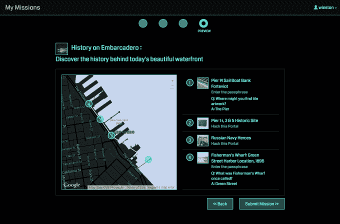

# Ingress 的开发者 Niantic Labs 从谷歌分离出来，成立了自己的公司 

> 原文：<https://web.archive.org/web/https://techcrunch.com/2015/08/12/niantic-labs-maker-of-ingress-spun-out-as-its-own-company/?guccounter=1&guce_referrer=aHR0cHM6Ly9lbi53aWtpcGVkaWEub3JnLw&guce_referrer_sig=AQAAAJAmFKd0NqRieigsk__kqjv7P9BqMyLoQAc9RJaQoLUhcdAgdlC4i0ZaIrRo-1sPsUM4Oo0muEbfPKMqKZ0HtLX0TPSHlWyw1A6x3-BlMRK-kRKqzodHKayUCl3x-1AMRStFWhR_kHISo2JbqlYvZ1AF2o1NaWl7qfGLdfAjANT4>

# Ingress 的开发者 Niantic Labs 从谷歌分离出来，成为自己的公司

谷歌的字母表移动还没有完全尘埃落定，我们被告知新的保护伞公司将会很灵活。今天，该公司内部的一个小组宣布，它将被分拆成一个独立的公司…但它会留在 Alphabet 之下吗？( **coughNOcough。**)

以下是该团队在 [Google+帖子](https://web.archive.org/web/20230131222857/https://plus.google.com/+Ingress/posts/GVvbYZzWyTT)中所说的话:

> 重要帐户信息:Niantic 实验室正在成为一个独立的公司。我们将把我们独特的探索和乐趣带给更多的观众，一些了不起的新伙伴将作为合作者和支持者加入谷歌。Niantic 将以+Ingress 的成功为基础，该软件已被下载超过 1200 万次，吸引了超过 25 万人在世界各地直播活动，并激励用户在玩耍、探索和发现的同时集体行走从地球到太阳的距离。

所以，no. [N 不是给 Niantic](https://web.archive.org/web/20230131222857/https://techcrunch.com/gallery/google-alphabet/) 的。他们真的要靠自己了，当然还有一些谷歌的支持(如 [Niantic，Inc.](https://web.archive.org/web/20230131222857/http://nianticlabs.com/) )。

谷歌发言人向 TechCrunch 传递了这份关于此举的声明，确认了 Niantic 的独立性:

> Niantic Labs 已经创造了一些令人难以置信的创新移动体验，如流行的增强现实游戏 Ingress，同时正在谷歌内部孵化。他们现在准备通过成为一家独立公司来加速增长，这将有助于他们与娱乐领域的投资者和合作伙伴更加紧密地保持一致。我们很高兴能继续支持他们，因为他们给世界上更多的人带来了探索和乐趣。

约翰·汉克在 2010 年成立的谷歌内部初创公司制作了令人讨厌的增强现实游戏《入口》(Ingress)和应用程序《T2》(new York)和《野外旅行》(Field Trip)。更有可能的是，这些项目并不符合谷歌正在发生的任何其他事情，因此它有机会作为自己的公司尝试一下。