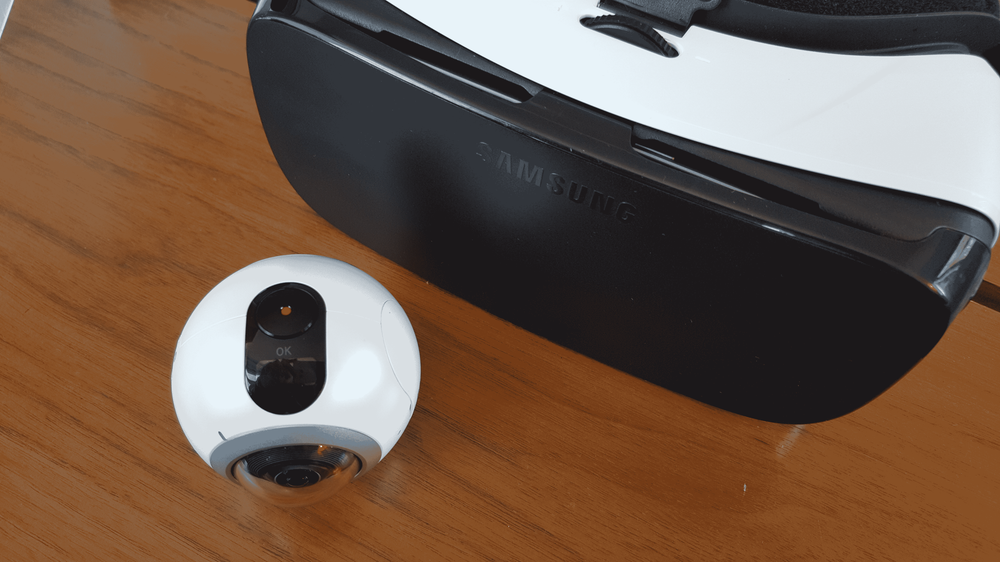
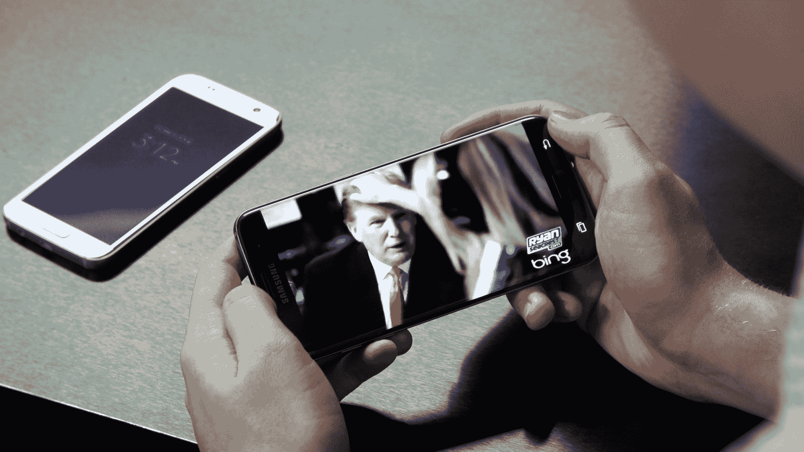
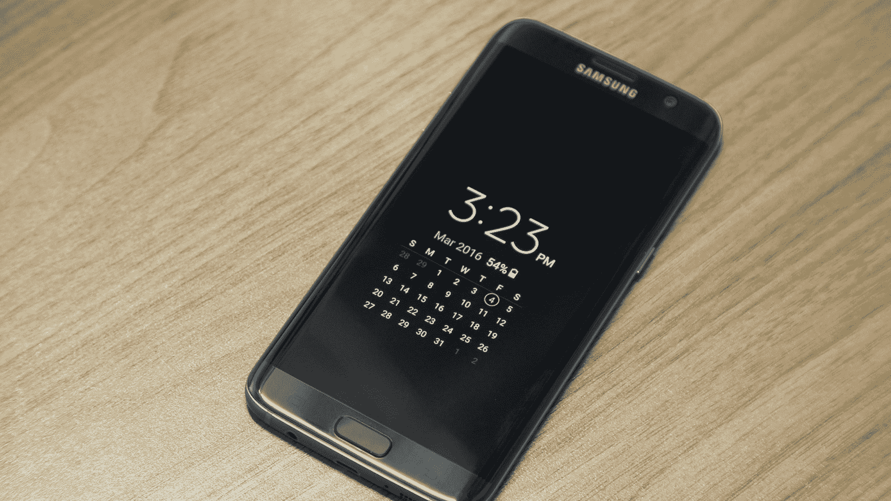
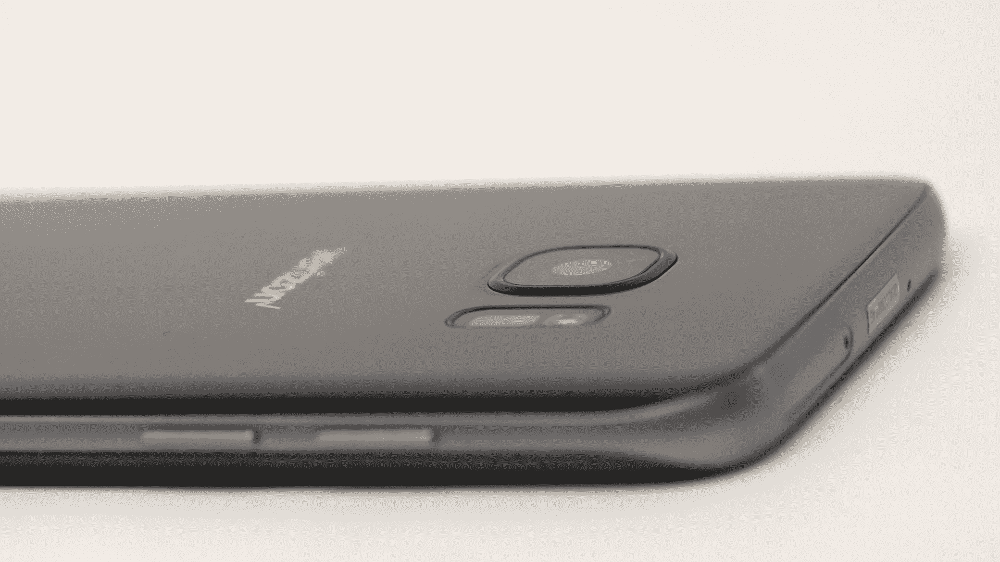
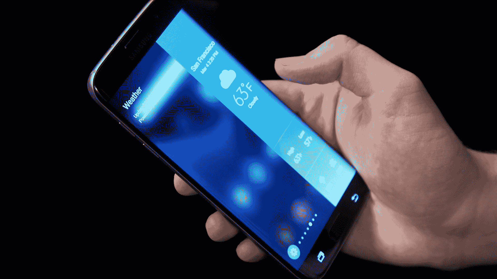

# 点评:三星的 Galaxy S7 和 S7 edge 是我们梦寐以求的手机

> 原文：<https://web.archive.org/web/https://techcrunch.com/2016/03/08/review-samsung-galaxy-s7-and-s7-edge/?guccounter=1&guce_referrer=aHR0cHM6Ly93d3cuZ29vZ2xlLmNvbS8&guce_referrer_sig=AQAAAFsY4b1fJaPlvtWtP5oDi1-cugDekb0U3JK_RHwPrM4qDdBOehn_1_ZUuXYKpcLHhZGyOEknKvtJ56R6rcwK-nQgZb_ZSHXRWr0qbOAm30tXwv9iLYBC-3lmLOP5PGdo691Qd8LE5wOSjnzzAZvW-SJQEKcmiBR2qKQ6MepkvgbS>

三星的 Galaxy S7 和 S7 edge 是人民的智能手机。

它们的功能不一定代表三星对公司未来的宏伟愿景。他们不会为用户没有意识到的问题提供解决方案。它们不会以牺牲电池寿命来换取克数和毫米数。在许多方面，S7 设备代表了反 iPhones。

三星几乎接受了人们对 Galaxy S6 系列的所有投诉，并简单地解决了它们。延长电池寿命。防水。更快的指纹感应。可扩展内存。完成了。复选标记。耶珀斯。

这里有一个明确的论点，S7 系列可能是一个反动的举动，旨在让现有的 Galaxy 客户高兴和兴奋地升级。三星这样做的动机很明确。S6 的统治对三星来说是一个麻烦的时期，它的全球智能手机市场份额被华为和苹果等公司蚕食。

但在所有这些举措的背后，三星并不只是在对批评者唯唯诺诺。当然，该公司正在制造用户想要的手机，但他们正在将手机打造成一个不断扩大的虚拟现实生态系统，萨米认为这将在未来发挥重要作用。

## 虚拟反思

其他智能手机制造商正在销售的 Galaxy 系列产品是三星正在构建的丰富的下一代生态系统，用于安装他们的移动设备。这个生态系统就是虚拟现实。

由于大量携带智能手机的公众似乎对移动虚拟现实的承诺持矛盾或不相信的态度，对于一个原本民粹主义的智能手机系列来说，这当然是一场冒险的赌博，但它也是一个有巨大前景的赌博。

> Oculus Gear VR 商店还没有给我带来让 S7 设备感到慌乱的体验。

很明显，三星一直在设计他们的整个移动产品线，以在物理上和概念上融入 Gear VR 生态系统。新的 S7 edge 弥合了 S6 edge 和 S6 edge+之间的屏幕尺寸差距，但却紧密地适合 Gear VR 耳机，没有一毫米的间隙。为了启动，S7 edge 的加宽显示屏将曲面显示屏的任何头戴式耳机漏光降至难以察觉的程度。

S7 系列新的“VR 优化”Snapdragon 820 芯片组带来的进步为 Gear VR 上观看的体验质量注入了新的潜力。S6 和 S6 edge 上对系统要求更高的 VR 内容让用户[巧妙地试图](https://web.archive.org/web/20221209220629/https://www.youtube.com/watch?v=3hOQJzzW8N8)为他们的设备降温，Oculus Gear VR 商店还没有向我展示过让 S7 设备慌乱的体验。

随着 S7 的发布(以及挥舞着免费耳机的新用户的冲击)，预计会看到更多可用的体验推动针对 S7 优化的移动 VR 的边界。新的 Gear 360 相机还没有看到发布日期或价格，它也将为 S7 用户提供精细制作 VR 内容和实时预览内容的机会，并在设备上制作有限的镜头编辑。

## 电池生命线

S7 的电池容量增加了近 20%，而 S7 edge(现在为更大的屏幕供电)的电池容量增加了 40%。

我可能比大多数人都更在意我的电池节省技术，但我对 S7 系列在电池寿命方面的改进印象深刻，两款手机都做了出色的工作，在屏幕打开时间约为 6-7 小时的情况下，我可以坚持一整天。

遗憾的是，我在视频中没有达到 0%的证明在最近几场相当长的 Gear VR 游戏的启发下没有达到，但在一般使用中，手机从早上充电到晚上充电毫不费力，这是我对 S6 edge 不总是说的

## 由于许多人的要求

当 Galaxy S6 首次推出时，愤怒的客户观众中引起最多共鸣的抱怨是与防水材料的移除、用户可更换电池和 microSD 插槽有关的抱怨。

microSD 插槽在后面，与 microSIM 放在同一个托盘中。如果你是一个经常换卡的人，这肯定不是最容易访问的，但对于像我这样的大多数人来说，当 S7 系列的可用库存 32GB 用完时，它非常适合插入一张卡来腾出额外的存储空间。

S7 设备的新 IP68 防水认证意味着手机可以潜水，并在约 1.5 米的深度停留半小时。

令人失望的是(但并不意外的是),新相机(稍后会有更多介绍)并没有为拍摄水下照片进行优化，我曾希望物理快门按钮可以实现这一点，但试图让设备扣篮的方式让我选择拍照是非常不可靠的。

总的来说，防水只是一种功能性保障，防止你需要随身携带装满大米的自封袋，它非常好地完成了这项任务。

S6 设备上的指纹传感器几乎毫无用处，因为它们让你等了太久。令人欣慰的是，这也看到了改进，你会立即注意到。它没有 iPhone 6S 那么快，但它实际上是可用的，所以我不能抱怨这一点。

## 总是在我的脑海里

我想这很大程度上是因为我是一个千禧一代的科技博客作者，对智能手机的礼仪有限，对通知有着贪得无厌的胃口，但我的手机实际上很少放在口袋里。我手里拿着它走在街上，当我坐下来工作/吃午饭/上课时，我把它面朝上放在我面前的桌子上。

去年夏天，我买了一块智能手表，希望我能稍微移动一下我坚定的目光，结果我做到了。这里的关键是*扫视*的想法。我不必完全转移注意力，打开手机，短暂地研究那些甜蜜的通知的透明清单，我只需翻转手腕，补上我错过的内容。

一个新的智能手机操作系统功能能够每天重复地强行宣布它的存在并证明它的有用性并不常见，但新的永远在线显示的持续能力令人惊讶地有意义。这项功能正以这样或那样的形式出现在许多最新一代的手机上。它的报应很大程度上要归功于智能手表的孤立优势，智能手表的存在恰好让它变得更加过时。

当您启用该功能时，S7 将始终存在。它会提醒你时间、日期、后台累积的电子邮件数量以及你忽略的电话数量。尽管它无处不在，但当它被打开或关闭时，似乎并没有对我的电池寿命产生太大影响。我想这很大程度上是因为当它开着的时候，它达到了它的目的，我完全唤醒了我的手机，而不是去检查快速的事实。

## 弱光

就图片质量而言，相机的改进通常更加微妙，但 S7 的对焦速度已经轻松加快，而新相机对弱光捕捉的改进实际上令人震惊。

Galaxy S6 edge

银河 S7 Edge

三星对 S7 系列后置摄像头的新改进是以当前一代的百万像素为代价的，从 16MP 降至 12MP。该相机还设法获得了更大的 f1.7 光圈镜头。

新的“双像素”传感器的自动对焦非常锐利，快如闪电。相比之下，光学技术让我的 iPhone 6 的相位检测溅射。

S7 系列的新传感器比我用过的市场上的任何智能手机都更好地控制了弱光摄影。三星表示，他们的新相机比以前的 Galaxy 型号多捕捉 95%的光线。从我这一周抓拍的照片中，很容易看出光线不足时照片清晰度的提高。

## 规格和性能

*   四核高清 Super AMOLED 2560×1440 屏幕
*   四核 2.15GHz + 1.6GHz 处理器
*   4GB 内存(LPDDR4)
*   microSD 卡插槽
*   永远在线的显示器
*   IP68 防水防尘等级
*   摄像头:后置双像素 1200 万像素/前置 500 万像素
*   安卓 6.0 棉花糖

在我的设备的 Geekbench 测试中，我发现 S7 edge 的单核性能得分为 2279，比 S6 edge 高出 52.4%。多核方面的进步更小，S7 edge 的得分为 5460，仅比其前代产品的 5186 分高出 5%。在我的测试中，S7 的表现与 S7 edge 相似。

## 哪一个？

除了电池容量之外，S7 和 S7 edge 具有如此相同的内部结构，您不会因为选择其中一个而对性能感到失望。真正重要的是你对展示和设计的偏好。

这些设备的价格因运营商而异，但 S7 edge 通常比 S7 贵 100 美元左右。两款设备的分辨率相同，S7 edge 更大的 5.5 英寸显示屏显示的像素密度更低。

这两款手机最大的区别在于，S7 edge 给人的感觉更好。两款设备的构建质量都很好，但 S7 edge 更适合您使用。两款 S7 手机的弧形背面都是对 S6 系列硬边平背的重大改进，S6 系列的硬边平背感觉有点冷，有点参差不齐。

从界面的角度来看，曲面显示设备的双边缘本质上仍然没有用，但它们看起来非常光滑。

新的 edge 应用程序屏幕非常漂亮。任务和应用程序面板让您可以快速访问最常用的应用程序，并随时了解您正在进行的操作。只是，唯一可以让这个功能变得更好的是，如果你不需要向上滑动曲面显示器来使用它。

## 结果

Galaxy S7 和 S7 edge 都是强劲的手机，缺点有限。他们欢迎 S5 中一些最缺失的功能，并正在收集一些新功能，如永远显示，这些功能肯定会成为 Galaxy 的支柱。三星的虚拟现实生态系统继续加强，随着该公司的智能手机越来越多地与虚拟现实交织在一起，未来有可能爆发一些真正神奇的东西。

S7 edge 的曲面屏幕仍然只是一张漂亮的脸，但凭借新的更大的显示屏和更符合人体工程学的背板，它已经进一步成为该公司漂亮的旗舰机型。