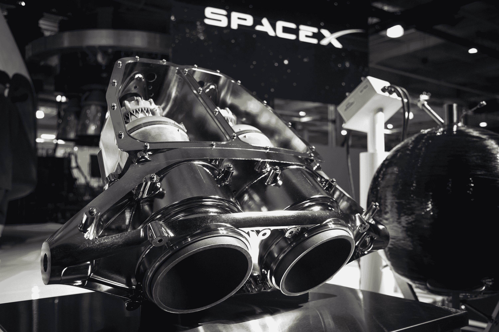
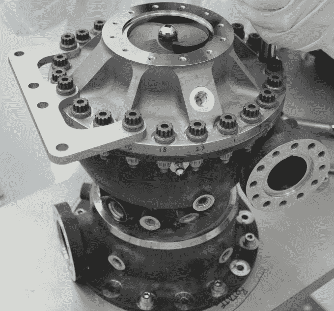

# 金属 3D 打印起飞 

> 原文：<https://web.archive.org/web/https://techcrunch.com/2016/07/24/metal-3d-printing-takes-flight/?guccounter=1&guce_referrer=aHR0cHM6Ly93d3cuZ29vZ2xlLmNvbS8&guce_referrer_sig=AQAAAGNtEGNASM2ZVi8_SvTSCPmNsOrzgNLm5-qiVsx3EnerYFlQc0pAGpKTtO7CuLCDApO-_qTa6rPSwi3njHjwpBVfFDSclGwbz9h0KihW-L396NykqWGwjo2F942OJQd8dey7259fnkxw-9YZySOmykXSIttQK58jI6zDciYT8o1W>

菲莱蒙·谢弗撰稿人

Filemon Schoffer 是

[3D Hubs](https://web.archive.org/web/20221208100521/https://www.3dhubs.com/)

.

More posts by this contributor

虽然许多设计师和工程师在塑料 3D 打印零件用于原型制作和小批量生产方面取得了成功，但使用类似技术生产金属零件最近导致了一些最令人兴奋的 3D 打印零件的诞生。

随着金属印刷[的关键专利于 2016 年底](https://web.archive.org/web/20221208100521/https://beta.techcrunch.com/2016/05/15/how-expiring-patents-are-ushering-in-the-next-generation-of-3d-printing/)到期，事情看起来特别令人兴奋。尽管主流消费者对 3D 打印的采用可能落后于某些预期，但产品设计师和工程师的金属 3D 打印似乎正在发挥 3D 打印的所有潜力。

在其核心，“金属 3D 打印”是一种基于金属的增材制造工艺的简化术语；主要是直接金属激光烧结(DMLS)或选择性激光熔化(SLM)。与依赖移除或冲压金属来达到预期设计的传统金属制造技术不同，金属 3D 打印通过融合材料和编程激光来一层一层地构建物体，编程激光从字面上绘制每一层的形状，直到制造出一个物体。

[https://web.archive.org/web/20221208100521if_/https://www.youtube.com/embed/Lyc2yOCk7As?feature=oembed](https://web.archive.org/web/20221208100521if_/https://www.youtube.com/embed/Lyc2yOCk7As?feature=oembed)

视频

当与优化模拟和分析以生成最佳设计解决方案的现代且强大的设计工具相结合时，例如用于生产轻质、网格设计的更新的创成式设计工具，这些设计通过添加制造在功能上优化并精确用于生产，所得到的零件不仅需要更少的设计时间，而且比使用传统制造方法生产的零件设计更坚固、更轻。

例如，在太空探索领域，埃隆马斯克(Elon Musk)的 SpaceX 和美国宇航局(NASA)等行业领导者已经完全接受了金属 3D 打印，将其作为生产火箭船部件的一种方式，这种方式在大幅提高性能的同时大幅降低了成本。SpaceX，[例如](https://web.archive.org/web/20221208100521/http://www.spacex.com/news/2014/07/31/spacex-launches-3d-printed-part-space-creates-printed-engine-chamber-crewed.html)，严重依赖 SpaceX SuperDraco 发动机燃烧室的定制金属部件。

[美国国家航空航天局能够为他们的火箭发动机开发一种涡轮泵](https://web.archive.org/web/20221208100521/http://www.nasa.gov/centers/marshall/news/news/releases/2015/successful-nasa-rocket-fuel-pump-tests-pave-way-for-3-d-printed-demonstrator-engine.html)，与通过传统制造工艺制造的泵相比，这种涡轮泵的零件数量减少了 45%。整个火箭引擎能够被 3D 打印出来似乎只是时间问题。

因此，3D 打印在一些行业可能被夸大了，但它肯定会在其他行业发挥作用。

更接近地球的是，航空航天业是采用 3D 打印金属增长最快的行业之一，因为它能够大幅减轻飞机的整体重量，同时提高建造效率，并允许定制设计。截至今天，飞机制造巨头波音公司已经在飞机上生产了超过 [20，000 个添加制造零件](https://web.archive.org/web/20221208100521/https://3dprint.com/49489/boeing-3d-print/)，并已交付给客户。

同样，[空中客车公司正在把各种各样的 3D 打印零件放进他们的飞机](https://web.archive.org/web/20221208100521/http://www.3ders.org/articles/20160407-alcoa-to-supply-airbus-with-metal-3d-printed-airplane-parts.html)。该公司甚至让空客以外的其他专业人士也能使用他们独特的技术。

就像 3D 打印的金属部件正在彻底改变太空和地球上的航空旅行一样，它们也在医疗保健行业取得突破性的成就。事实上，前景如此光明，以至于美国美国食品药品监督管理局已经批准在医疗程序中使用 3D 打印金属植入物。

最近金属 3D 打印在医疗领域的成功应用包括[一个钛 3D 打印颅骨植入物](https://web.archive.org/web/20221208100521/https://3dprint.com/104316/3d-print-skull-reconstruction/)和 [3D 打印胸腔](https://web.archive.org/web/20221208100521/http://www.npr.org/sections/health-shots/2015/09/15/440361621/engineers-create-a-titanium-rib-cage-worthy-of-wolverine)——这两个都是在肿瘤切除手术后使用数字扫描为癌症患者定制的。

在过去的 200 年里，包括研磨、加工和铣削在内的减成金属制造方法为我们带来了一些最令人兴奋的产品和技术，但我们只花了几年时间就意识到了添加金属制造的强大。

再加上现代 CAD 软件强大的新设计能力和创造全新几何形状的能力，否则不可能制造，依赖复杂金属产品的行业——特别是太空探索、航空航天和医疗保健——正在经历一场制造业革命，这要归功于 3D 打印的能力。

从本质上来说，这些高度可定制的、复杂的金属部件，产量相对有限，似乎是 3D 打印的完美市场。随着新的金属 3D 打印机和材料不断涌现，金属 3D 打印的宣传继续蓬勃发展似乎是公平的。