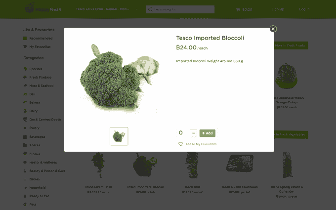

# 东南亚电子杂货商 HappyFresh 退出两个市场，募集未披露的 B 轮 

> 原文：<https://web.archive.org/web/https://techcrunch.com/2016/08/29/happyfresh-series-b/?guccounter=1&guce_referrer=aHR0cHM6Ly93d3cuZ29vZ2xlLmNvbS8&guce_referrer_sig=AQAAAEImnrFTNhNHnAVzO8qIXJkgHHB_K5LnXDsa-UMpdp7wllEIyzS77tmZFcsgPVJ9g0W-edrI-1I-QkIu4j0KlRsktSo8_6ggD5rlqYKwS-ejp1OIwUFeEeC79kn20somWIPvZfyMhYuBhrc47l-WQj8kQSY4DHcQmQoISFdrWBH7>

杂货点播服务 [HappyFresh](https://web.archive.org/web/20221005195051/https://www.happyfresh.com/) 今天带来了一个喜忧参半的消息。该公司已退出亚洲的两个市场，并宣布了一轮未披露的 B 轮融资，旨在成为一家可持续发展的企业。

[该公司于 18 个月前推出](https://web.archive.org/web/20221005195051/https://beta.techcrunch.com/2015/03/10/happyfresh/)，成为东南亚首个此类服务——来自美国的 Instacart 模式。[有一年](https://web.archive.org/web/20221005195051/https://beta.techcrunch.com/2015/09/16/happyfresh-lands-12m-to-expand-its-on-demand-grocery-service-in-southeast-asia/)，它筹集了 1200 万美元的 A 轮融资，但首席执行官兼联合创始人马库斯·比勒尔对新一轮融资的评价是金额更高。这笔融资由总部位于迪拜的私募股权公司 Samena Capital 牵头，该公司在非洲、中东和亚洲的前沿市场管理着超过 10 亿美元的资金。领投首轮融资的 Vertex Ventures 和金光数码(Sinar Mas Digital Ventures)也参与了融资。

在运营方面，HappyFresh 已经关闭了在台湾和菲律宾的业务。Bihler 说，取而代之的是，它将“专注于”另外三个市场:印度尼西亚、马来西亚和泰国。这些变化在上周五传达给了近 1000 名员工，这意味着将有数量不详的员工被解雇，其中一些人将被重新安置。

“我们当然会在整个地区提供就业机会，但不是每个人都有这种灵活性，”比勒尔在接受 TechCrunch 采访时表示，并补充说，这一变化“凸显了我们对整个地区可持续发展和盈利能力的关注。”

有传言称，HappyFresh 正试图再次筹集资金，但没有透露这轮融资的规模可能表明，它没有比勒和他的团队希望的那么大。

相比之下，Bihler 称新的资金“为这种能力的投资者接受 HappyFresh 愿景投下了强有力的信任票”，他特别看好利用 Samena Capital 在新兴市场的经验。

HappyFresh 旨在在东南亚实现每周在线购物，该地区拥有超过 6 亿消费者，预计到 2025 年数字消费将达到每年 2000 亿美元。

该公司与线下零售商合作，通过互联网和移动应用程序销售产品，采用按需模式，在一小时内送货上门。全球零售巨头乐购和家乐福都是该地区的合作伙伴。它实际上会派自己的私人购物者为你购物，可以选择信任他们在需要的地方挑选替代品，或者打电话给你确认开关。

该公司通过三种方式赚钱。

向顾客收取少量的送货费——这因市场而异，但例如，在我所在的泰国曼谷，送货费是 60 泰铢(2 美元)。它还从零售合作伙伴那里收取费用，帮助他们通过其平台销售产品。最后，它运营着一项分析和数据业务——happy data——零售商和品牌可以通过在 HappyFresh 平台上进行促销、赞助和广告来推广他们的产品和服务。

Bihler 拒绝讨论每个货币化流的具体收入，也不会说每个占总收入的比例。

“这三项对我们来说都是重要的收入来源，”他说。

比勒补充说，分析业务 HappyData 已经是一项盈利业务。与其把它变成一个独立的业务，不如让它成为快乐生鲜“生态系统”的一部分。它的服务——包括洞察产品购买、消费者看什么和其他行为数据——免费向零售合作伙伴提供，但品牌和其他人必须付费。这项业务是以价值超过 10 亿美元的特易购旗下的消费者洞察部门为模板的。

展望未来，Bihler 说他的目标是扩大 HappyFresh 业务的所有收入来源，并推动整个公司盈利。他说有一个盈利目标，但拒绝公开分享。

东南亚拥有巨大的在线消费者业务潜力，但是，正如许多人艰难地发现的那样，该地区互联网用户数量的增长曲线很长。Lazada 是一家模仿亚马逊的在线零售商，由 Rocket Internet 提供支持，今年早些时候，在阿里巴巴投资 10 亿美元收购其业务的大部分股份之前，[在](https://web.archive.org/web/20221005195051/https://beta.techcrunch.com/2016/04/13/alizada/)资金告罄。

事实是，在东南亚，网上交易不到所有交易的百分之三。虽然预计未来十年这一数字将增长 10 倍，但任何建立消费者互联网业务的公司都必须应对蛋糕的增长——这可能会慢得令人沮丧。

比勒说，“我们不把自己的合作伙伴视为竞争对手”，尽管他们在 HappyFresh 旁边经营着自己的网上商店。“最重要的一点是市场的教育，以及消费者行为从线下向线上的转移。”

“如果我们能帮助推动我们整个行业的在线渗透率上升几个百分点，那么我们对自己和我们的客户都有好处，”他补充道。