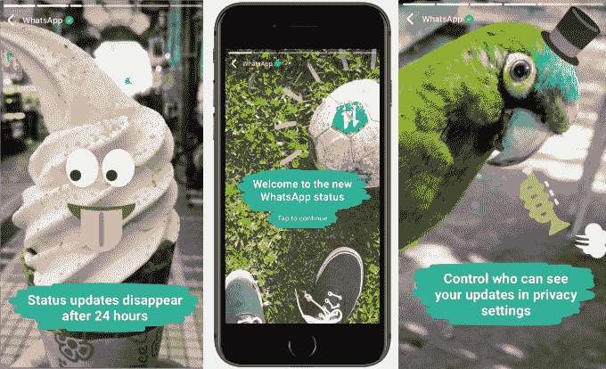

# 脸书在 F8 发布的所有产品以及为什么 

> 原文：<https://web.archive.org/web/https://techcrunch.com/2018/05/01/10-big-announcements-from-day-1-of-f8/>

脸书 F8 会议的第一天充满了公告和更新。以下是马克·扎克伯格在第一天的主题演讲中的 10 大要点。[你可以在这里找到对 F8 的全面报道和分析。](https://web.archive.org/web/20230216050707/https://techcrunch.com/tag/f8/)

**1。面签日期**

脸书正在推出一个约会功能，在这里你可以自愿做一个只有那些选择寻找爱情的非朋友才能看到的简介。脸书将根据其所有数据与你匹配，消息将在专用收件箱而不是 Messenger 中发送。

原因:如果脸书想要建立“有意义的联系”，没有比把你介绍给你的生活伴侣更有意义的了。脸书将不得不小心保持一切隐私，因为人们已经认为这是令人毛骨悚然或不酷的。但投资者喜欢它，考虑到 Tinder 母公司 Match Group 的股价今天下跌了 22%。

**2。【清除历史】T10**

脸书正在建立 Clear History，这是一个新的隐私功能[，允许用户删除脸书从使用其广告和分析工具](https://web.archive.org/web/20230216050707/https://techcrunch.com/2018/05/01/facebook-announces-way-to-clear-history-of-apps-and-sites-youve-clicked/)的网站和应用程序收集的数据。这意味着你可以从脸书的数据存储中抹去你的一些浏览历史。马克·扎克伯格把这比作从你的浏览器历史中删除 cookies。对于注重隐私的人来说，这是一个很好的姿态，尽管这会让你在脸书的经历不那么个性化。

原因:扎克伯格面临来自国会的大量关于其从网络上收集数据的问题。用户得知他们对此几乎无法控制，感到很恼火。清晰的历史可以平息一些要求监管的呼声。

**3。Instagram 视频聊天和反欺凌**

[Instagram 正在推出视频聊天功能，](https://web.archive.org/web/20230216050707/https://techcrunch.com/2018/05/01/instagram-launches-video-chat/)TechCrunch 在三月抢先报道了这一功能，当时我们发现它的 Android 应用程序中隐藏了这一功能。与此同时，Instagram 也获得了一个新的过滤器，以保护用户免受欺凌的评论，以及一个改进的探索标签。

原因:Instagram Direct messaging 超级受欢迎，但缺乏视频聊天…视频聊天在 Messenger 和 WhatsApp 上也超级受欢迎。结合反欺凌功能，Instagram 可能成为青少年更安全、更愚蠢的闲逛场所——这正是脸书想要击败 Snapchat 的地方。

**4。脸书重启应用审查程序**

[继剑桥分析危机后暂停之后，脸书将重新开放其应用审查流程](https://web.archive.org/web/20230216050707/https://techcrunch.com/2018/05/01/facebook-re-opens-app-reviews-on-its-platform/)——这对开发者来说是个好消息。

原因:脸书不能冒险让另一个粗略的应用程序泄露并出售用户数据，但它也必须让开发者忠于其平台，以便他们不断创造吸引用户的体验。今天，脸书明智地平衡了安全性和隐私性与新的开发者能力。

**5。Oculus Go 售价 199 美元**

Oculus Go，脸书廉价且功能强大的独立 VR 耳机，[现已在](https://web.archive.org/web/20230216050707/https://techcrunch.com/2018/05/01/199-oculus-go-vr-headset-goes-on-sale-today/)发售。32GB 板载存储版本售价 199 美元，64GB 版本售价 249 美元。

原因:你必须将手机插入其中的虚拟现实耳机很笨拙，并阻止脸书控制整个体验。脸书不再依赖于三星 Gear 耳机外壳和你的 iPhone 或 Android，而是开始决定你可以给第一次使用的完美虚拟现实装备的一切。

**6。Messenger 简化并开始翻译**

[脸书正小心翼翼地在 Messenger](https://web.archive.org/web/20230216050707/https://techcrunch.com/2018/05/01/facebook-messenger-translation/) 中翻译聊天主题，首先是在美国的 Marketplace 中翻译英语和西班牙语。与此同时，脸书正在剥离相机和游戏标签，给信使一个更干净的设计。

原因:通过消除语言障碍，让人们意识到他们有多少共同点，翻译可以实现脸书的承诺，让世界更加紧密。但是 Messenger 的新功能太多，太臃肿了，所以简化应该让真正有用的功能大放异彩。

**7。引入虚拟现实记忆和 3D 照片**

脸书正在将 3D 插图和模型引入新闻。它还将把 2D 的照片变成[虚拟现实记忆](https://web.archive.org/web/20230216050707/https://techcrunch.com/2018/05/01/facebooks-wants-weird-vr-memories-to-take-you-back-to-your-childhood/)——你可以使用一种迷幻的点云设计来探索 3D 环境。

原因:脸书希望走在内容潮流的前面，成为未来格式的发源地。它们在今天可能看起来很新奇，但至少让脸书保持了趣味性。

**8。WhatsApp 点击 4.5 亿故事用户**

WhatsApp 的 Snapchat Stories 克隆 [WhatsApp 现在的状态是拥有 4.5 亿日活跃用户。](https://web.archive.org/web/20230216050707/https://techcrunch.com/2018/05/01/whatsapp-stories/)这是 Snapchat 整个应用程序用户数量的两倍多。而且 WhatsApp 也在增加贴纸和群组视频通话。

原因:这是一件大事，因为 Snapchat 今天召开了灾难性的财报电话会议，其用户增长率跌至有史以来的最低水平，而 WhatsApp 的地位继续保持爆炸式增长。Snapchat 起初忽视了国际市场，现在 WhatsApp 已经在全球范围内击败了它。

**9。将其他应用的故事分享到脸书和 Instagram】**

从 Spotify、SoundCloud 和 GoPro 开始，其他应用程序可以将照片和视频直接分享到脸书和 Instagram 中的故事。

原因:脸书想让自己的故事比 Snapchat 更有趣。这个平台的新翅膀可以为音乐发现创造巨大的机会，这是自 Myspace 以来我们从未见过的。

**10。Oculus TV**

[Oculus 想让你通过它的新 Go 耳机](https://web.archive.org/web/20230216050707/https://techcrunch.com/2018/05/01/oculus-tv-is-the-vr-set-top-streaming-box-you-never-knew-you-needed/)看电视。首先，你会有 Facebook Watch，但预计像网飞和 Hulu 这样的应用程序最终会出现。

原因:现在还没有足够好的虚拟现实体验，但也许脸书可以通过为 2D 内容创建一个虚拟大屏幕，让人们花更多时间在耳机上。

*更多 TechCrunch 的 F8 报道，请查看我们所有的故事:*

