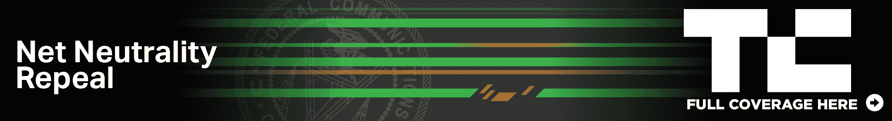

# 10 名国会议员在官方网络中立评论中指责 FCC 

> 原文：<https://web.archive.org/web/https://techcrunch.com/2017/08/06/10-members-of-congress-rake-fcc-over-the-coals-in-official-net-neutrality-comment/>

多年来，联邦通信委员会应该如何以及在多大程度上监管互联网接入一直是一个热门问题，现任政府与前任政府持相反的观点，导致 T2 提议取消 2015 年的开放互联网令。但是国会(或者至少是它的一些成员)不会善罢甘休:10 名曾帮助[起草管理联邦通信委员会的法律](https://web.archive.org/web/20221209103908/https://beta.techcrunch.com/2017/05/30/commission-impossible-how-and-why-the-fcc-created-net-neutrality/)的代表已经提交了一份关于无情废除该委员会的提案的官方评论。

[可以在这里查看完整评论(PDF)](https://web.archive.org/web/20221209103908/https://democrats-energycommerce.house.gov/sites/democrats.energycommerce.house.gov/files/NN%20Comments%20-%20Final%20-%208.4.2017.pdf)；这本书不到 20 页，写得通俗易懂，很容易在周日阅读。该法案由 10 名国会议员签署，其中包括能源和商业委员会的资深成员弗兰克·帕隆和迈克·多伊尔。

> 我们作为国会议员，同时也是众议院能源和商业委员会的成员，提交这些评论是出于对 FCC 取消其网络中立规则的提案从根本上严重违反法律的深切关注。作为 1996 年电信法案通过或是否更新该法案的决定的参与者，我们写信来提供我们对该法律的意义和意图的独特见解。

作为背景，重要的是要知道，FCC 从 2015 年起取消网络中立规则的提案很大程度上取决于扭转当时将宽带归类为“电信服务”而不是“信息服务”的决定。

正如我和许多其他人指出的那样，这种说法的基本原理是站不住脚的，并且基本上把互联网服务提供商视为提供谷歌和脸书等公司实际上提供的服务。作为一个独立的机构，联邦通信委员会完全有权解释法律，它没有必要听取像你我这样的人的相反意见。

然而，它必须听取国会的意见——“国会的意图”是决定法律解释是否合理的一个重要因素。在他们刚刚提交的评论中，众议员帕隆、道尔等人。非常清楚地表明，他们的意图过去和现在都与 FCC 选择的表述方式大相径庭。

这是最关键的部分:

> 自从我们在 1996 年投票支持《电信法案》以来，美国人拒绝了有组织的互联网服务，转而支持开放平台。现在，任何订阅了 ISP 的人都可以访问他们选择的任何合法网站或应用程序。美国的互联网服务提供商不再挑选他们的客户可以访问的在线服务。
> 
> 虽然技术发生了变化，但我们达成一致的政策仍然是坚定的。法律仍然要求 FCC 将承载数据的网络基础设施与创建数据的服务区分开来。利用今天的技术，这意味着法律指导 FCC 将 ISP 服务与网络上的服务区别开来。
> 
> 委员会的提议玩了一个历史性的花招，不允许将这一基本区别混为一谈。FCC 建议将网络基础设施视为信息服务，因为基础设施提供了对运行于其网络上的服务的访问。联邦通信委员会认为，互联网服务提供商因此“提供能力”使用创建内容的服务。然而，这一建议抹杀了国会在法律中规定的区别——我们的意思是让 FCC 将携带数据的服务与创建数据的服务分开考虑。因此，联邦通信委员会的提案将解读为我们在法律之外做出的基本选择。根据该提案的建议，今后任何服务都不能成为电信服务。

相当明确，对不对？

除了澄清国会在《电信法案》中的意图之外，这封信还指出了 FCC 提案中的一些不足之处，主要是在用来证明自己的数据选择上。

该机构因未能考虑到[压倒性的公众支持](https://web.archive.org/web/20221209103908/https://beta.techcrunch.com/2017/07/13/net-neutrality-day-of-action-spurs-millions-to-speak-out-for-online-freedoms/)网络中立，[严重依赖行业投资指标](https://web.archive.org/web/20221209103908/https://beta.techcrunch.com/2017/07/17/comcasts-fcc-filing-pits-pet-economists-against-net-neutrality-rules/)(本身是一个复杂和有争议的问题)，以及其自身公认有缺陷的宽带部署支持撤销现有规则而受到指责。

> 绝大多数美国人支持更强、更清晰的隐私规则。然而，该委员会——未加评论——提议取消联邦通信委员会的事前保护，支持只执行的方法。联邦通信委员会不应该在没有充分考虑的情况下降低人们的隐私权。
> 
> 该提案没有考虑这些关键的国家优先事项，而是一心一意地专注于一个问题，排除了所有其他问题:网络部署的原始费用。这种狭隘的关注显然违背了公众利益——如果我们打算将网络投资作为 FCC 决定政策的唯一衡量标准，我们就会明确地将这一点写入法律。

最后，这封信暗示联邦通信委员会可能不恰当地接受了行政部门的指示:

> 总统似乎直接命令 Pai 主席废除网络中立，可能是在访问椭圆形办公室期间。如果是真的，这个提议显然违背了我们建立一个独立于行政部门的机构的意图。

具有讽刺意味的是，Pai 对 2015 年规则的一个主要批评是，它们受到了奥巴马总统的白宫的不当影响。

这封信还有更多内容，请随意阅读。一定要更新(并可能帮助更新)我们的[反对网络中立观点指南](https://web.archive.org/web/20221209103908/https://beta.techcrunch.com/2017/05/19/these-are-the-arguments-against-net-neutrality-and-why-theyre-wrong/)。

签署这封信的其他 8 名代表是:

*   安娜·埃舒
*   戴安娜·德盖特(D-CO)
*   扬·沙科夫斯基
*   多丽丝·松井
*   凯西·卡斯特
*   约翰·萨班斯(医学博士)
*   杰里·麦克纳尼
*   彼得·韦尔奇
*   约瑟夫·肯尼迪三世

