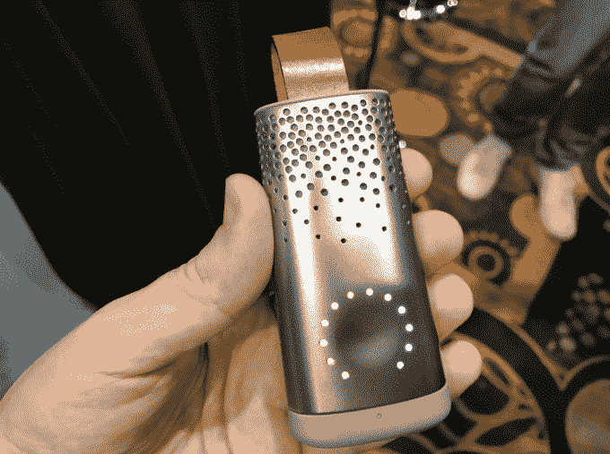
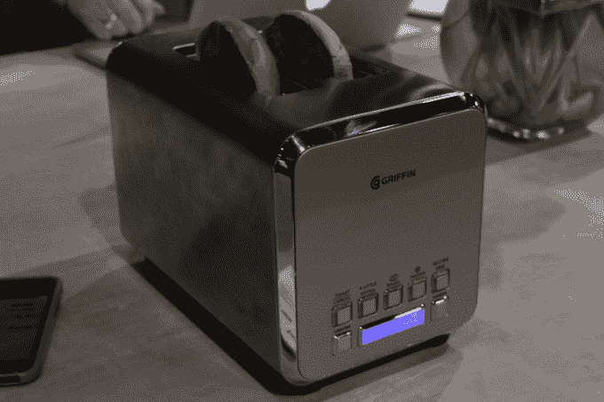
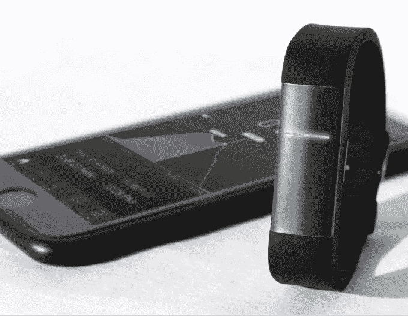
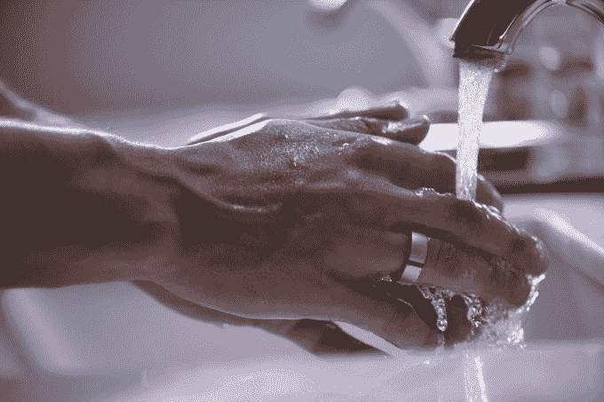
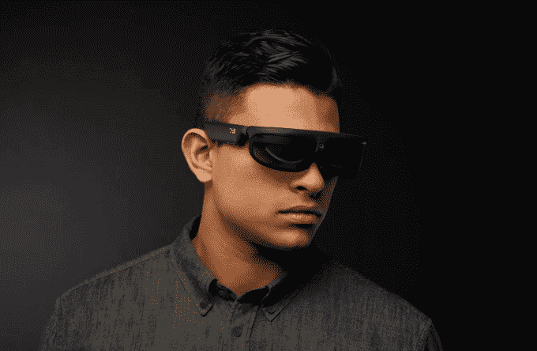
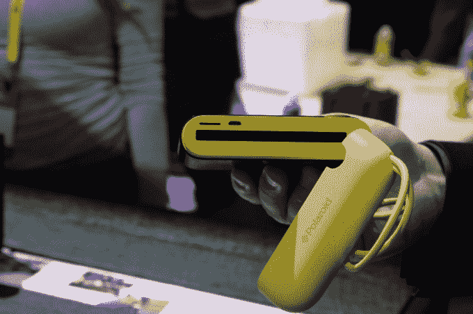
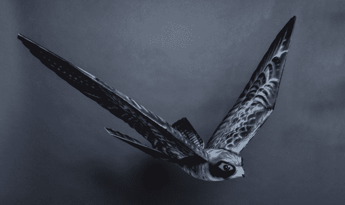
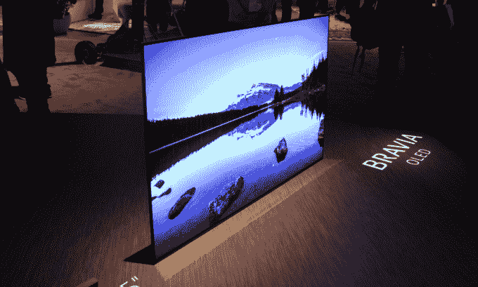

# 我们在 CES 2017 上看到的 10 个最酷的小工具 

> 原文：<https://web.archive.org/web/https://techcrunch.com/2017/01/09/10-of-the-coolest-gadgets-we-saw-at-ces-2017/>

很难缩小今年 CES 上发生的所有事情的范围。我们遇到了大量有前途的新创业公司，并在展览馆的地板上、夜间活动中和我们的硬件战场舞台上亲自动手操作全新的小工具。这些，没有特定的顺序，是展会上最热门的硬件创业公司和最有趣的小工具，你可以在这里找到我们的[今年活动的完整报道](https://web.archive.org/web/20221007070031/https://beta.techcrunch.com/tag/ces/)。

[Plume](https://web.archive.org/web/20221007070031/https://beta.techcrunch.com/2017/01/03/plume-labs-flow-is-an-air-quality-tracker-to-avoid-pollution/) 是一种可穿戴设备，可以追踪你周围的污染——如果你愿意的话，有点像空气质量的 Fitbit。它可以跟踪颗粒物(PM2.5)、二氧化氮、臭氧、挥发性有机化合物(VOCs)、温度和湿度。它可以夹在袋子里，是为生活在污染严重的大城市的人们设计的。

* * *

智能烤面包机来了。格里芬联网烤面包机在应用程序上有一个滑块，可以让你微观管理你的面包有多烤。一面是一块白面包的图标。另一边是全黑的。可笑还是高明？

* * *

当你和朋友出去时，用酒精测试仪检测你血液中的酒精含量可能只是聚会上的一个小把戏——但是如果你真的想知道它来决定你是否应该再喝一杯，拿出一杯可能会很尴尬。 [Milo Sensors](https://web.archive.org/web/20221007070031/https://beta.techcrunch.com/2017/01/07/proof-will-track-your-blood-alcohol-content-with-a-wristband/) 是一家围绕可穿戴传感器建立的公司，该公司通过佩戴这种腕带，根据皮肤排汗来检测你体内的各种化学物质。

* * *

Kuri 是一个为家庭设计的可爱的小机器人。该机器人是 Mayfield Robotics 的第一款产品，Mayfield Robotics 是一家由博世完全拥有和资助的初创公司。Kuri 对语音输入做出反应，这与谷歌 Home 或亚马逊 Echo 等其他设备类似。但是她用机器人的声音、灯光和眨眼动作来回应。她生来就是一个伴侣和助手。板上有一个处理器来处理语音和图像识别处理等任务，它可以通过 IFTTT 等工具进行编程，以扩展其功能集。

* * *

[Motiv 的健身追踪戒指](https://web.archive.org/web/20221007070031/https://beta.techcrunch.com/2017/01/03/motiv-ring/)将整个健身带的功能都塞进了一个戒指里。这款钛制设备可以追踪睡眠和健康状况，包括步数、卡路里和距离。它还设法安装了一个光学心率传感器，一次充电的电池寿命为三到五天。

* * *

可穿戴设备公司 Osterhout Design Group (ODG)发布了其首款消费者 AR/VR 眼镜，这是首款基于高通 Snapdragon 835 芯片的眼镜。 [R-8 和 R-9](https://web.archive.org/web/20221007070031/http://tcrn.ch/2i55mdJ) ，这两款增强/虚拟现实智能眼镜面向更广泛的消费者和轻型企业用户。R-9(如上图)将于今年在 Q2 上市，售价约为 1799 美元。它们针对高端智能眼镜应用的“轻型企业”和专业消费者用户。

* * *

宝丽来用这一招一举成功。但是现在，该公司宣布推出宝丽来 Pop T2，这是一款照片打印相机，尺寸回到了宝丽来标志性的 3”x4”尺寸。在设备的背面是一个 3.97 英寸的触摸屏液晶显示器，让您可以在照片显影之前看到照片。印刷看起来很棒。

* * *

鸟类对机场来说是一场严峻的考验，机场需要远离鸟类。[Clear flying Solutions 的 Robird 是一种无人机](https://web.archive.org/web/20221007070031/https://beta.techcrunch.com/2017/01/07/is-it-a-bird-is-it-a-plane-well-it-is-a-drone-actually/)，它扇动翅膀，吓退其他鸟类，确保航空安全。机器鸟被设计成模仿猛禽。它通过拍打翅膀飞行，用两个尾鳍驾驶。它甚至可以在空中滑行一段时间，就像跟踪猛禽一样。

* * *

> [消费电子展上的柳树](https://web.archive.org/web/20221007070031/https://www.facebook.com/techcrunch/videos/10155084659862952/)
> 
> 柳树的 429.00 美元连接吸奶器跟踪奶量，时间和会议
> 
> 由 [TechCrunch](https://web.archive.org/web/20221007070031/https://www.facebook.com/techcrunch/) 于 2017 年 1 月 5 日星期四发布

柳树吸奶器让您可以自由喂奶。该设备因其零件数量少、易于安装和清理而受到称赞。它的对应应用程序会跟踪你所有的牛奶量、时间和疗程。该泵将于 2017 年春季上市，售价为 429 美元。

* * *

CES 上有如此多的电视，很难脱颖而出。但是索尼旗舰产品 Bravia 系列的新电视实际上看起来非常棒。这是一台 4K·HDR OLED 电视，索尼称之为 A1E 系列。这款电视采用边对边设计，没有支架，这意味着它直接坐在地上，靠着一条后腿。这也意味着它没有扬声器。索尼表示，声音将来自屏幕本身，使用的新技术被称为声学表面。