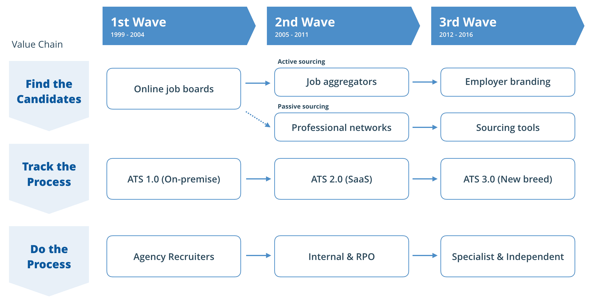
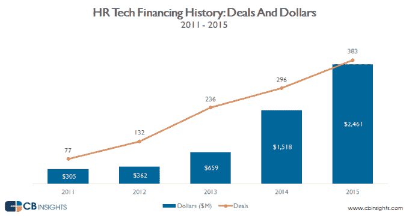

# 招聘技术和服务的创新历史–第 1054 页–

> 原文：<https://web.archive.org/web/https://techcrunch.com/2016/10/29/the-history-of-innovation-in-recruitment-technology-and-services/1054/>

迈克尔·奥弗尔撰稿人

迈克尔·奥弗尔是首席执行官和联合创始人

[RecruitLoop](https://web.archive.org/web/20200320191909/http://recruitloop.com/)

这是一个由独立招聘人员组成的在线市场，为公司提供了一种更智能的招聘方式。

*“你必须了解过去才能理解现在。”卡尔·萨根*

2016 年是招聘行业的分水岭时刻。LinkedIn 和 Monster 正在被收购，CareerBuilder [正在被出售](https://web.archive.org/web/20200320191909/http://www.bloomberg.com/news/articles/2016-09-07/tegna-to-spin-off-cars-com-unit-weigh-options-for-careerbuilder)——这是该领域最受瞩目的三家科技公司。微软正在大举进军，而现金充裕的现任者则在一旁密切关注。

涟漪将波及整个行业——从创始人、投资者、服务提供商到求职者。基本上每个做生意的人。这对你有什么影响？

这篇文章从历史的角度阐明了问题。它为该行业在过去 20 年的发展提供了一个框架，以帮助创始人、投资者和从业者了解和驾驭当前最大的趋势。

## 变革的浪潮

招聘是一个有吸引力的破坏目标——每年花费数千亿美元，商业模式效率低下，普遍感到痛苦。但是，尽管成千上万的初创公司获得了数十亿美元的投资，真正的结构性创新却可以在一页纸上描绘出来。

招聘的基本工作流程对技术变化保持了显著的弹性。今天，就像 20 年前一样，我们仍然寻找候选人，对他们进行面试和选择，并需要有人来管理这个过程。

下面的框架描绘了创新的三个不同时期最重要的转变。箭头显示了创新的“方向”,新的模式由此产生。例如，在 2000 年代中期，工作聚合器(比如[实际上是](https://web.archive.org/web/20200320191909/https://www.crunchbase.com/organization/indeed#/entity))出现，扰乱了在线工作平台。

来源:RecruitLoop

这个框架概括了招聘价值链，忽略了数以千计尚未产生广泛影响的创业和创新。一种新模式的出现并不会让以前的模式变得多余(例如，求职公告板如今被广泛使用)，但它确实提供了何时以及有多少知名公司出现的背景。

在深入研究之前，请注意过去 20 年的创新是水平的(从左到右)，并且被限制在价值链的特定步骤中。

2016 年，这一切都在改变。

## 招聘价值链

首先，让我们来看看决定价值链中每一步的定义模型和公司，然后再研究决定当今行业的最大趋势。我们将其简化为三个容易理解的步骤——找到候选人，跟踪流程，然后执行流程。

### 找到候选人

最初有报纸。如果你想找到候选人，你可以花钱在实体报纸上登广告。简单有效又贵。你好，互联网。

第一波:在线求职板。*出现于 20 世纪 90 年代末，目的是从报纸和平面媒体上抢眼球。这个时代的标志性公司是 [Monster](https://web.archive.org/web/20200320191909/https://www.crunchbase.com/organization/monster#/entity) 、 [CareerBuilder](https://web.archive.org/web/20200320191909/https://www.crunchbase.com/organization/careerbuilder-com#/entity) 和[Craigslist](https://web.archive.org/web/20200320191909/https://www.crunchbase.com/organization/craigslist#/entity)——彻底重塑了雇主和求职者的招聘广告和搜索体验。尽管成为明显的破坏目标，就业委员会仍然贡献了美国 10-15%的就业岗位*

 *第二波:主动与被动采购。在 2000 年代中期，社交网络将市场分为主动和被动候选人*。求职公告板是为活跃的求职者准备的，但仅限于他们可以赚取或购买的流量。然后[的确](https://web.archive.org/web/20200320191909/https://crunchbase.com/organization/indeed) 发现聚合其他网站的广告更容易，于是引入了“点击付费”的招聘广告。*工作聚合*成为主动采购的主导模式——2012 年 [Recruit Co .收购了 Indeed](https://web.archive.org/web/20200320191909/https://www.crunchbase.com/acquisition/d7cee2b9c04cecc5d316b2aa473ec586) ，并带动了美国 58%的外部招聘[。](https://web.archive.org/web/20200320191909/http://blog.indeed.com/2016/04/27/indeed-remains-the-leading-source-of-external-hire-for-5-consecutive-years/)*

> 2016 年将被铭记为招聘服务和技术的分水岭。

但是这个时期的定义公司是 [LinkedIn](https://web.archive.org/web/20200320191909/https://www.crunchbase.com/organization/linkedin) 。它通过将个人资料数据在线化，开创了被动采购的新类别。现在任何人都可以搜索潜在的候选人，无论他们是否申请了工作。以前，由于雇主的“专有”数据库，招聘人员可以对雇主进行信息套利。不会了。候选人数据对任何拥有工具和技能的人来说都是免费的。

**第三波:雇主品牌和采购工具。**求职公告板模式很快受到了另一种数据来源的攻击——公司评论*。Glassdoor 悄然登场，应用了 Expedia 和 Yelp 在用户生成内容方面的经验。它很快增加了一个真正风格的聚合器，成为了[发展最快的](https://web.archive.org/web/20200320191909/https://www.glassdoor.com/blog/glassdoor-outpaces-careerbuilder/)求职网站，将近 50%的美国求职者在求职过程中的某个时候访问过这个网站。*

与此同时，*被动外包*被认为是招聘中的一项独特活动，得到了一整类新工具和技术的支持。这一时期最大的创新是从网络上收集个人资料数据的人民搜索引擎——例如 [Connectifier](https://web.archive.org/web/20200320191909/https://www.crunchbase.com/organization/connectifier#/entity) (被 LinkedIn 收购) [TalentBin](https://web.archive.org/web/20200320191909/https://www.crunchbase.com/organization/talentbin#/entity) (被 Monster 收购)以及其他几十个仍在争夺份额的搜索引擎。

### 跟踪流程

*申请人跟踪系统* (ATS)是招聘的 CRM。大多数公司都在使用他们需要但不喜欢的又旧又丑的技术。

第一波:内部 ATS。ATS 在 20 世纪 90 年代作为一个独特的软件类别出现。像那个时期的大多数软件一样，它被安装在客户的服务器上，主要面向企业。这一时期的标志性公司是 [Taleo](https://web.archive.org/web/20200320191909/https://www.crunchbase.com/organization/taleo) ，它成功地转移到 SaaS(在第二波中)，并被甲骨文以 19 亿美元收购[。它仍然以 36%的份额统治着市场。](https://web.archive.org/web/20200320191909/https://beta.techcrunch.com/2012/02/09/oracle-buys-talent-management-solutions-company-taleo-for-1-9-billion/)

第二波:搬到 SaaS。在 21 世纪初，一种新的“网络优先”安非他明类兴奋剂出现了，这符合 SaaS 的总体趋势。新玩家获得了份额，包括 [Jobvite](https://web.archive.org/web/20200320191909/https://www.crunchbase.com/organization/jobvite#/entity) 和 [iCIMS](https://web.archive.org/web/20200320191909/https://www.crunchbase.com/organization/icims) 。这一浪潮也见证了整合，企业现任者 Oracle 和 SAP 寻求建立完整的人力资源软件套件。

第三波:新品种。然后期望值变了。企业软件需要高效*和*性感。一种新的 ATS 出现了——用户友好、移动优先、开放集成且没有技术债务。在过去的几年里，超过 1 亿美元的投资流向了新的参与者，包括[温室](https://web.archive.org/web/20200320191909/https://www.crunchbase.com/organization/greenhouse-software#/entity)、[杠杆](https://web.archive.org/web/20200320191909/https://www.crunchbase.com/organization/lever#/entity)、[智能招聘](https://web.archive.org/web/20200320191909/https://www.crunchbase.com/organization/smartrecruiters#/entity)和[可行](https://web.archive.org/web/20200320191909/https://www.crunchbase.com/organization/workable-hr#/entity)。这仍然是一个竞争激烈的领域，赢家将把产品创新与积极的营销和销售结合起来。

### 做流程

尽管有 20 多年的技术创新，人才获取方面的大部分资金仍然花在招聘服务提供商(T2)身上，包括外部和内部。

“扰乱招聘者”的流行观念有其优点，但忽略了三个重要因素:(a)有人需要使用工具和管理过程，无论是外部还是内部；(b)服务提供者非常分散，范围很广；(c)招聘服务行业本身也经历了重大创新和颠覆。

**第一波:机构招聘人员的“淘金热”。**20 世纪 90 年代到 2005 年是中介公司招聘人员的淘金热。专有数据库给了他们信息套利的机会，他们可以向雇主收取额外费用。这个行业充斥着各种各样想发财的人。许多机构是销售密集型环境，几乎没有规则；所有者变得富有，有些甚至上市了公共公司。

**第二波:内部和 RPO。宿醉始于 2000 年代中期到后期，有两种相互矛盾的趋势。首先，LinkedIn 和其他技术的流行使许多公司能够减少外部招聘人员的支出，并在内部管理招聘过程。这一时期的主要趋势是企业招聘团队。许多机构招聘人员转向了内部环境。他们仍然“做”招聘，只是为一家公司，通常是在一个更稳定的环境中。**

其次，*招聘流程外包* (RPO)的出现是因为大型雇主意识到，他们可以通过外包整个招聘职能，以更低的成本获得内部团队的好处。早期的玩家都是被现任收购的——比如 Sourceright ( [Randstad](https://web.archive.org/web/20200320191909/https://www.crunchbase.com/organization/randstad) )，TheRightThing ( [ADP](https://web.archive.org/web/20200320191909/https://www.crunchbase.com/organization/adp#/entity) )。今天的独立领导者已经吸引了私募股权的大量投资，例如[Cielo](https://web.archive.org/web/20200320191909/https://www.crunchbase.com/organization/cielo-talent#/entity)(KKR)[Wilson HCG](https://web.archive.org/web/20200320191909/https://www.crunchbase.com/organization/wilsonhcg#/entity)(前沿资本)。RPO 目前是一个价值 30-40 亿美元的行业，每年以 10%的速度增长，但由于交付成本高，通常仅限于大批量的雇主。

**第三波:专业化和独立。**过去五年，技术创新已经开始重塑招聘行业。专家*来源*，专注于候选人识别和拓展的技术活动，已经成为一个不同于招聘人员的类别。与此同时，独立的合同招聘人员模糊了内部和外部的界限。独立招聘人员(和来源)现在有更多的选择为自己工作，使用新的工具和平台，在各种定价模式下(例如，按小时计算，基于项目，基于成功)。这通过降低成本和增加灵活性使雇主受益。

## 下一波

2016 年是一个分水岭，其中许多趋势正在汇聚。下一波浪潮即将到来——这将是一个整合、创新或两者兼而有之的时期吗？以下是已经发生的四次冲击，以及将在未来十年或更长时间内塑造该行业的问题。

### 主要新进入者

微软以 260 亿美元收购 LinkedIn，大举进军这一领域。整合需要时间，但将对整个行业产生深远的影响。这会为其他主要进入者打开大门吗？

我们知道 Salesforce、谷歌和脸书等公司对 LinkedIn 感兴趣，尤其是 Salesforce 对人力资源技术有着长期的兴趣。微软的加入会抑制还是增强这些野心？

然后是甲骨文、SAP、IBM 这些“被遗忘”的巨头，财大气粗，这场竞赛中的主要马匹，有落在招聘技术下一波创新浪潮后面的风险。

这些公司或其他公司如何找到进入这个领域的方法？

### 沿着价值链的垂直整合

任仕达(全球第二大招聘服务公司)正在收购 [Monster、](https://web.archive.org/web/20200320191909/https://crunchbase.com/organization/monster) 以支持[其建立全球最全面的人力资源服务组合的目标](https://web.archive.org/web/20200320191909/http://www.monster.com/about/a/randstad-to-acquire-monster-worldwide-to-transform-the-way-people-and-jobs-connect)。这并不是垂直整合的第一个大例子——在 Recruit Group(日本企业集团)收购 Indeed 之后——但鉴于整合的潜力，这可能是最有影响力的。

垂直整合也发生在其他领域；例如:

*现任工作委员会*投资于工作发布之外的步骤:

*混合模式*新兴、融合技术和服务:

*   [雇佣](https://web.archive.org/web/20200320191909/https://hired.com/)——招聘机构和技术平台的混合体。
*   这是一项新服务，看起来像是被雇佣的。

*ATS 供应商*以拥有整个招聘流程为目标进行扩张和整合。

现有服务提供商或传统模式将如何应对垂直整合？

### 技术解决方案的碎片化

当高端正在巩固和整合时，专注于招聘技术的创业公司数量出现了爆炸式增长。创办一家科技公司从未如此容易或便宜，这个行业已经充斥着追逐下一件大事的创始人和新投资。

许多这些新的创业公司感觉更像是功能而不是业务，并将转向或消失。对于从业者和潜在客户来说，现在比以往任何时候都更难打破噪音，理解哪种新技术能够真正影响你的招聘过程。

下一个需要扩展的突破性技术和创新是什么？

### 服务提供商的专业化

传统服务提供商——招聘人员、信息来源、猎头顾问——在与科技解决方案竞争时面临着利润压力。许多公司正在适应不同的定价和商业模式。最优秀的人将继续按照行业、地理位置和招聘过程的阶段进行专业化。

通才供应商将会苦苦挣扎。不采取大胆举措的现任者将被甩在后面。在技术整合和竞争日益激烈的环境下，许多公司将退出该行业或干脆灭亡。

现有服务提供商如何实现差异化以保持利润并保持相关性？

本文不打算回答这些问题。其目的是构建历史背景和当前推动行业发展的最大趋势。唯一的预测是，2016 年将成为招聘服务和技术的分水岭。

这对你有什么影响？*