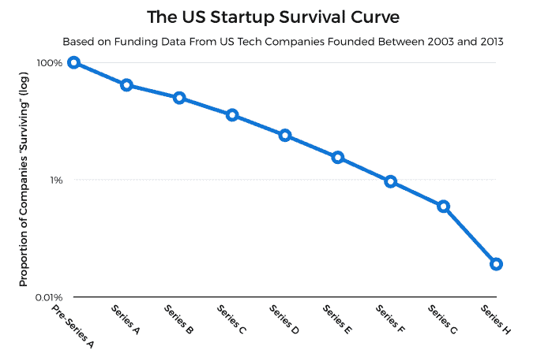
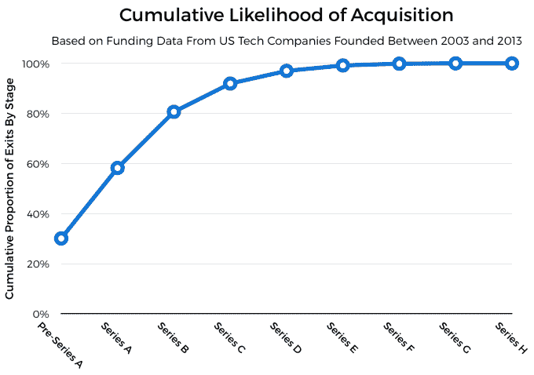

# 以下是你的初创公司在任何阶段被收购的可能性——第 1076 页

> 原文：<https://web.archive.org/web/https://techcrunch.com/2017/05/17/heres-how-likely-your-startup-is-to-get-acquired-at-any-stage/1076/>

杰森·罗利是《金融时报》的风险投资和科技记者

[Crunchbase News](https://web.archive.org/web/20200720113314/https://about.crunchbase.com/news/)

.

More posts by this contributor

假设你随机选择了 1000 家位于美国的种子期创业公司。其中有多少人会继续进行首轮融资？在继续进行 A 轮融资的公司中，有多少会继续进行 B 轮融资？你可以继续这个过程，直到只剩下几家公司。

但是仅仅问一轮又一轮的公司的[存活率](https://web.archive.org/web/20200720113314/https://mattermark.com/startup-graduation-rate-surprisingly-low/)是多少是不够的。更大的问题是，那些没有通过筹款挑战的人会怎么样？当然，死亡是创业生活的一个事实。但也有更令人高兴的理由无法进入下一轮，比如当公司通过收购或 IPO 退出融资竞争时。那么，这些公司中有多少找到了出口？

今天，我们将通过 2003 年至 2013 年间成立的约 15，600 家美国科技公司的融资数据来回答这些问题。让我们先来看看生存曲线，以及下降的幅度有多大。

## 陡峭的创业生存曲线

下面，你会发现一个图表，它显示了在前几轮融资中有多少(或有多少)初创公司在下一轮融资中融资:

在我们假设的 1，000 家成功完成首轮融资前融资的创业公司(例如种子或天使轮、可转换票据或股权众筹轮)中，我们预计其中会有 400 多家成功进入首轮融资。换句话说，我们的数据集表明，约 60%筹集首轮融资前融资的公司未能进入首轮融资或更多轮融资。

从线性尺度来看，退学率相当惊人。但是在图表上的 E 系列之后，丢失了相当多的细节。让我们用对数标度来看看同样的数据:

(这与上面的图表是相同的数据，只是显示的规模有助于显示在融资周期中初创公司数量的接近指数级的下降。)

根据我们的分析，在 2003 年至 2013 年间成立的公司中，只有大约 1%成功筹集了 F 轮融资。在我们数据集中的大约 15，600 家公司中，只有 4 家——pivot 3、Smule、Glassdoor 和 Aquantia——进行了 H 轮融资。

## 右边最后一个出口

正如我们之前讨论的，公司有很多理由停止融资。

对于那些没有关闭店铺或实现财务可持续性的公司，退出融资周期有两种方式:收购或 IPO。让我们来看看公司什么时候最有可能通过收购的方式退出。在我们的数据集中，走收购之路的公司是走上市之路的公司的 16 倍多。

我们将绘制出这条路径，以两种方式退出。首先，我们将放大分析已被收购的公司，找出最有可能发生收购的阶段。最后，我们将看看一家公司在融资周期中被收购的总体机会。到第一个。

### 收购阶段

大多数公司什么时候被收购？直觉可能表明，这是该公司股票最便宜的时候，因此收购很可能发生在相对早期的阶段。但是有多早呢？可能令人惊讶的是，在高达 90%的收购中，人们只需要采取筹款字母表中的几个步骤。

以下是收购的累积分布情况，从除了首轮融资前没有筹集过任何资金的公司开始，一直到完成 H 轮融资的公司:

随着融资周期的推进，为了调整(迅速)下降的创业公司数量，我们将每个融资阶段退出的公司数量除以该阶段被收购的公司总数。这产生了每轮融资后被收购公司的比例份额，显示了退出的相对可能性。

重申一下:上图并不是说大约 92%的公司是在 C 轮融资后被收购的。它表明，在我们的数据集中，被收购并获得风险融资的公司中，大约 92%是通过 c 轮融资获得的。因此，企业家们，如果你下定决心创办一家被收购的公司，你有十分之一的机会在 c 轮或之后被收购。

### 在每个融资阶段收购的公司

上图显示了被收购的初创公司何时会被收购，但它没有回答一个显而易见的问题。让我们直截了当地告诉你:这是通过每个融资阶段获得的公司份额:

在 E 轮阶段的公司中，最终被收购的创业总人数的比例最高达到 16%左右，之后只有微小的变化。最终，在我们的数据集中，大约六分之一的公司最终被收购。

#### 重新审视资金的减少

就像我们之前提到的，公司停止融资有几个原因。一些企业实现了财务可持续性，一些企业关闭了店铺，还有一些企业通过收购或上市找到了出路。至于退出，我们主要关注收购。这是大多数公司采取的退出方式，也是我们有最多数据得出结论的退出方式。

早期创业公司数量急剧下降的原因很复杂，但如果有一点是明确的，那就是大多数退出机会都来得很早，创业失败的主要原因也是如此。团队解散、在找到适合市场的产品之前就耗尽资本、无法扩大规模、运气不佳以及许多其他扼杀公司的陷阱，在初创公司刚刚起步时更为普遍。

这里还有其他需要注意的因素，比如后期融资可能会因为投资者的类型而被贴上“私募股权”的标签，我们在这里没有考虑到这一点。我们描绘的场景可能比现实更可怕，但如果是这样，也差不了多少。筹钱还是很难。

在所有让创办一家成功的公司变得困难的因素中，创业公司在融资过程中的陡峭曲线可能是最重要的因素之一。因此，如果你的公司在风险投资轮次中排名不是很靠后，而你又很难找到走出困境的道路，那就在可能的时候退出。这样做的不只是你一个人。