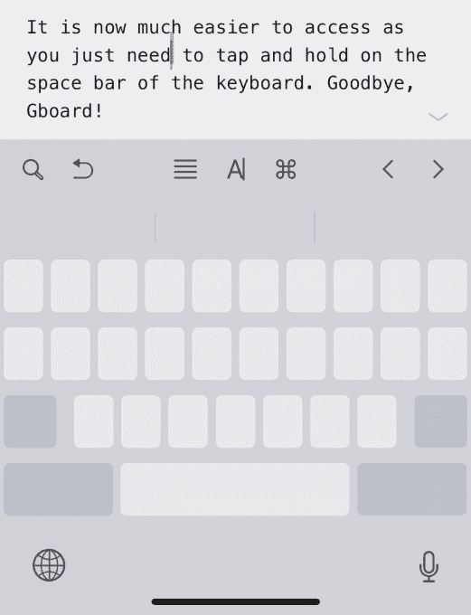

# iOS 12  中的 11 个巧妙的隐藏功能

> 原文：<https://web.archive.org/web/https://techcrunch.com/2018/09/17/11-neat-hidden-features-in-ios-12/>

iOS 12[终于来了](https://web.archive.org/web/20230307140213/https://techcrunch.com/2018/09/17/ios-12-is-now-available-to-download/)。此次更新包含了许多改进。特别是，苹果隐藏了许多你不会马上看到的小功能。

如果你想用你疯狂的 iOS 技能给你所有的朋友留下深刻印象，这里列出了一些功能。我也给[写了一篇关于 iOS 12](https://web.archive.org/web/20230307140213/https://techcrunch.com/2018/09/17/ios-12-makes-your-phone-faster-than-ever/) 的评论，如果你想了解更多关于 iOS 12 的变化。

## #1:是手机吗？是触控板吗？

许多人不知道这项超能力，但你可以通过将手机变成触控板来移动电子邮件或短信。在之前版本的 iOS 上，你必须使用 3D Touch。

现在它更容易访问，因为你只需要点击并按住键盘上的空格键。再见，Gboard！

## #2:第二个 Face ID

[RIP](https://web.archive.org/web/20230307140213/https://techcrunch.com/2018/09/12/so-long-then-iphone-home-button/) ，触控 ID。但是 Face ID 才刚刚开始。苹果知道你想让你的配偶或朋友解锁你的手机。当然，您可以随时共享您的密码。但是它不太安全，人们总是忘记密码。

前往“设置”>“Face ID 和密码”>“设置备用外观”。哒哒，获得第二张脸。

## #3:不要打扰一点，很多或永远

如果你不使用勿扰模式，因为你总是忘记关掉它，这已经是过去的事了。现在，您可以使用控制中心中的 3D Touch 来开启一个小时的“请勿打扰”，直到今天晚上(或第二天早上)，直到活动结束或直到您离开某个位置。

别忘了，这是减少使用手机的最有力的工具之一。

## #4:请安静

即使你没有打开“请勿打扰”,你也有可能收到太多的通知。在锁定屏幕上，轻扫通知以打开“悄悄发送”。通知不会让你的手机嗡嗡作响，并会跳过锁屏。查看它们的唯一方法是手动调出通知中心。我已经在大多数新闻应用程序中使用它，因为我不需要马上看到标题。一切都变得更安静了。

## #5: AirPods 作为超级耳朵

如果你想更像杰克·多西，进入设置>控制中心>自定义，添加“听觉”。这项名为 [Live Listen](https://web.archive.org/web/20230307140213/https://techcrunch.com/2018/06/05/airpods-to-get-live-listen-feature-in-ios-12/) 的功能可以让你把 AirPods 变成助听器。

如果你在一些拥挤的环境中很难听到对话，这是一个重要的功能。

## #6:你忘记了密码，但没关系

苹果在 iOS 12 上改进了密码管理器的工作方式。如果您已经在使用第三方密码管理器，如 1Password、LastPass 或 Secrets，您的生活将变得更加轻松。

转到设置>密码和帐户>自动填充密码。您将能够使用第三方密码管理器中的数据登录网站和帐户，而无需打开它。

## #7: 637-201

至于一次性代码，如果你仍然依赖于短信(你不应该这样)，iOS 会扫描你收到的短信，自动复制并粘贴你的一次性代码。整洁！

## #8:拖放备忘录

耶，梅莫吉斯来了！当然，你可以录制语音信息，然后在信息中发送。但是别忘了用你的 Memoji 自拍。

您还可以将 Memoji 拖放到照片或信息上。表情符号太 2017 了。

## # 9:Safari 中的图标

在你的 iPad 上，你可以*最终*打开浏览器标签的收藏夹图标——标签栏中的那些小图标。这样，你就能更容易地找到你要找的东西。前往设置> Safari。

## #10:说对不起是不是太晚了？

当你不停地在脑海中听到一首歌，但你却记不起它的名字时，这是多么令人恼火。也许你只知道歌词中的一行。

您现在可以在苹果音乐中键入这些歌词。该服务现在允许您根据歌词进行搜索。

## #11:那些甜蜜的捷径

iOS 12 最强大的功能显然是 Siri 快捷键。结合苹果的 Shortcuts 应用，你可以用一个简单的短语触发一连串的动作。

快捷方式应用可在应用商店免费获得[。是时候考虑一下你自己的早晨日程了！](https://web.archive.org/web/20230307140213/https://itunes.apple.com/us/app/shortcuts/id915249334?mt=8)