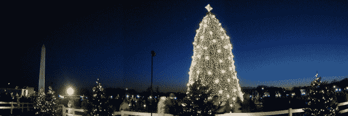

# 本周你不想错过的 11 个故事

> 原文：<https://web.archive.org/web/https://techcrunch.com/2014/12/07/11-techcrunch-stories-you-dont-want-to-miss-this-week-13/>

本周的科技新闻看到了来自优步、Spotify 和科技 IPO 市场的最新消息。TechCrunch 还报道了索尼影业黑客事件、用代码点亮白宫圣诞树的女孩以及 Tinder 的新竞争对手。以下是我们本周(11/29-12/5)的最佳故事。

**1。**优步宣布再融资 12 亿美元，[估值 400 亿美元](https://web.archive.org/web/20221209091231/https://beta.techcrunch.com/2014/12/04/uber-confirms-new-1-2b-funding-round-looks-to-asia-for-expansion/)。

**2。** Spotify 通过其个性化的 [Year In Review 应用程序](https://web.archive.org/web/20221209091231/https://beta.techcrunch.com/2014/12/03/find-out-what-you-listened-to-most-on-spotify-this-past-year/)向我们展示了我们一整年所听的内容，该应用程序可以抓取您 2014 年的数据和精彩片段。

**3。Alex Wilhelm 对科技 IPO 市场进行了更多的分析，提出了一个问题，即公开市场是否会欢迎一家亏损扩大的公司。**

**4。**在年度股东大会上，[微软首席执行官塞特亚·纳德拉和董事长约翰·汤姆逊回答了一系列关于公司内部多元化的问题](https://web.archive.org/web/20221209091231/https://beta.techcrunch.com/2014/12/04/microsofts-plan-to-become-more-diverse/?ncid=rss&utm_source=feedburner&utm_medium=feed&utm_campaign=Feed%3A+Techcrunch+%28TechCrunch%29)。纳德拉强调了包容性的重要性，并表示多元化是公司“一切的核心”，而不仅仅是一件小事。

**5。Josh Constine 写了一篇关于公民新闻及其在最近事件中的影响的文章。他将公民记者与“小弟”相提并论，并提倡执法人员在与公民会面时佩戴随身相机。**

**6。在工作室的电脑系统被黑后，五部索尼电影公司的电影登上了种子网站。五部电影中有四部是未发行的电影。**

**7。**乔丹·克鲁克写了一篇关于[邦布尔的文章，邦布尔是由惠特尼·沃尔夫](https://web.archive.org/web/20221209091231/https://beta.techcrunch.com/2014/12/02/bumble-is-exactly-like-tinder-except-girls-are-in-charge/)和其他前 Tinder 员工发起的 Tinder 竞争对手。她总结说，这两个应用程序有一个显著的区别:在 Bumble 中，女孩们说了算。

**8。我们为面临艰难招聘环境的创始人列出了一些策略，在这种环境下，每个人都想创建自己的公司。**

9。 [谷歌让数千名女孩用代码编写白宫圣诞树灯的程序](https://web.archive.org/web/20221209091231/https://beta.techcrunch.com/2014/12/04/google-gets-thousands-of-girls-to-program-the-white-house-christmas-tree-lights/)，通过用代码制作的程序。

10。丹·康伦指出了物联网的问题，并警告说，如果用户体验不迅速改善，智能家居的梦想就有破产的危险。

**11。**还记得江南 Style 吗？好吧，PSY 的视频被观看了很多次，以至于[打破了 YouTube 的观看计数器](https://web.archive.org/web/20221209091231/https://beta.techcrunch.com/2014/12/03/gangnam-style-has-been-viewed-so-many-times-it-broke-youtubes-code/)，使它成为第一个打破 32 位整数范围的视频。