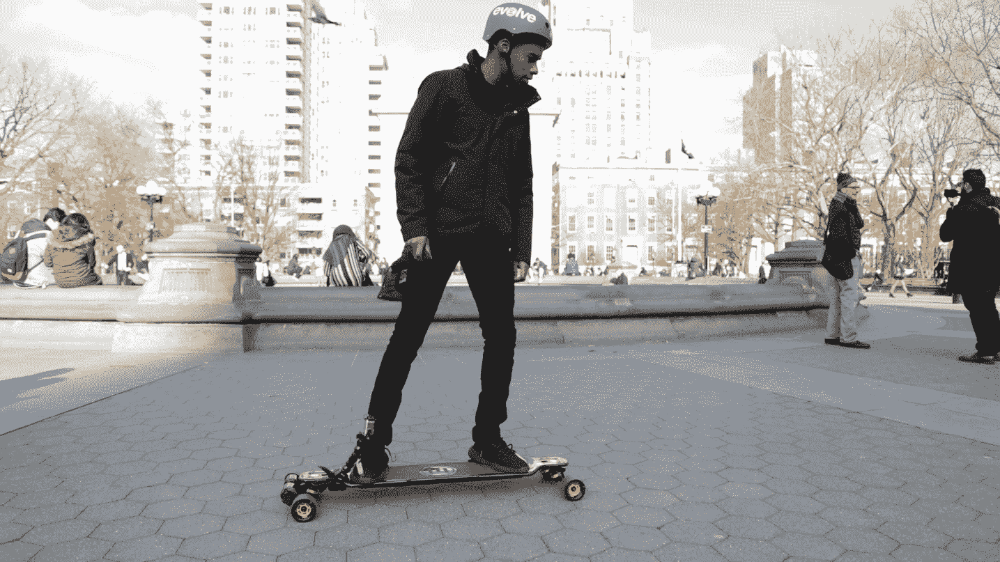
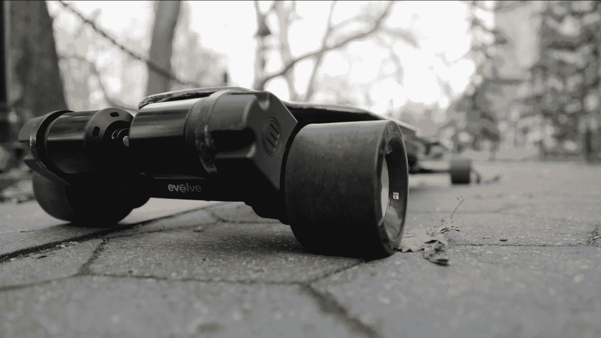

# Evolve 的 GT 碳纤维电动滑板速度很快但远非最佳 

> 原文：<https://web.archive.org/web/https://techcrunch.com/2017/02/07/evolves-gt-carbon-fiber-electric-skateboard-is-fast-but-far-from-the-best/?guccounter=1&guce_referrer=aHR0cHM6Ly93d3cuZXZvbHZlc2thdGVib2FyZHMuY28udWsv&guce_referrer_sig=AQAAAJH4JBtPtaLuTrZ8GPO_t75iTHJGSVzOEvWOvcOLWrxvZPwqPUQ0qrjaGo2TcKIYOfOcFYBMXCRmOOZe-SS6YM8UAIr-Jaimd9yY_8iBTqgPQHkE6pqXM0Poa58K9Y69SZh6YUOAPDFXAa5k-TrY8WxYVT-Xde90Tb-iykBpoWDJ>

随着电动滑板市场的各种噪音，新的滑板需要有一个独特的或更好的方法来吸引新的骑手。然而，[尽管最近被召回](https://web.archive.org/web/20221205054937/https://beta.techcrunch.com/2017/01/12/boosted-issues-battery-recall-for-its-second-generation-board/)，Boosted 仍然是利基市场的冠军，内侧[很快赶上了](https://web.archive.org/web/20221205054937/https://beta.techcrunch.com/2016/12/06/inboards-m1-electric-skateboard-offers-stiff-competition/)。

但如果你想要更快的东西，由碳纤维和凯夫拉尔纤维制成，但射程更远呢？进化滑板 GT 板是成为那种板的一种尝试，但是它还没有完全实现。

*价格已审核:[$ 1959](https://web.archive.org/web/20221205054937/https://evolveskateboardsusa.com/collections/gt-series/products/evolve-gt-carbon-street-series)在 Evolve 滑板*

## 录像

## 使用它

我必须让它进化:他们设计了一个光滑的电动滑板。碳纤维和凯夫拉尔可能不会迎合每个人的口味，但它是我见过的最薄的甲板。考虑到电池和电子设备夹在里面，我甚至可以说它令人印象深刻。

使用 GT 实际上与其他电路板相同:打开遥控器，然后打开电路板，等待蓝牙连接同步。配对过程不超过五秒钟。谢天谢地，我没有在城市街道上遇到会切断连接的无线电干扰。不幸的是，遥控器本身并不那么直观；它有一个廉价的塑料显示屏，带有一个不直观的触发器/油门死区。

描述驾驶 Evolve GT 的最佳方式是:尽管我有驾驶其他板的经验(极速),但由于油门反应不稳定，这是最难控制的。此外，GT 的时速比竞争对手快 3-4 英里，但良好的制动似乎仍然是许多电动滑板设计师的一个谜。

说到速度，GT 的遥控器遵循了竞争对手看到的趋势:骑行模式。它们通过限制传递给后轮的速度和功率来工作，使其更加用户友好，特别是对新车手来说。

在你来个急停之前，最初几秒钟的刹车反应很小。我会继续宣扬这一点:电动滑板*是*危险的，需要有制动力，让你至少*有机会*避免事故。以每小时 24 英里的速度雕刻(或舀水)不是一个真正的解决方案。当刹车时，你从遥控器和皮带驱动的最初反馈是最小的，增加了问题。

[gallery ids="1449565，1449566，1449568，1449569，1449570，1449572，1449564，1449567"]

在某种程度上，GT 的范围是其他车无法比拟的。Evolve 声称该板一次充电可以行驶 30 英里。我已经接近这个数字了，只要我需要，我就在板上滑来滑去，而不是试图以最快的速度，不停地耗尽电池。

此外，还有一些设计错误:电机从电路板的背面伸出。这使得一个长板(已经很长了)变得更长。但是更糟糕的是把板子靠在墙上:你在给马达施加压力。这意味着电机和电路板上会有很深的划痕，从长远来看可能会损坏它们。

## 结果

Evolve GT 滑板是为那些坚信电动滑板是最好的最后一英里交通工具的人准备的。不幸的是，在 Evolve 的情况下，这意味着牺牲 2000 美元来获得仅比增强和内置产品稍快的体验。它也不比竞争对手提供的更轻或更易于运输。

说到底，Evolve 的 GT 的主要优势是其范围和速度，但这不足以证明其标价的合理性。