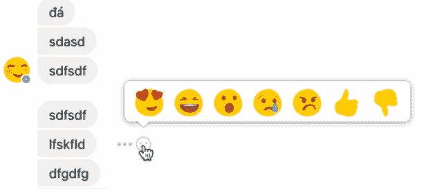
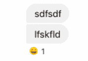
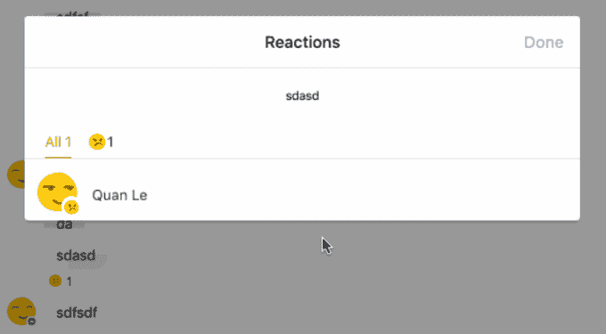
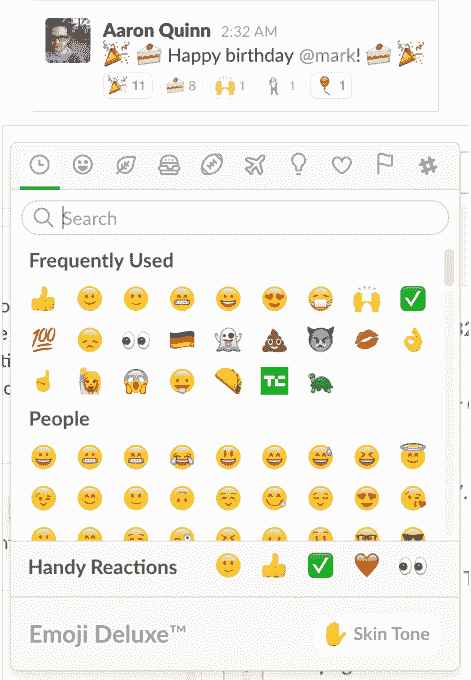

# 脸书测试反应和不喜欢按钮(！)在消息上 

> 原文：<https://web.archive.org/web/https://techcrunch.com/2017/03/04/facebook-messenger-dislike-button/?guccounter=1&guce_referrer=aHR0cHM6Ly93d3cuZ29vZ2xlLmNvbS8&guce_referrer_sig=AQAAAGAfps2Nzk5O_wvz03qP3OX9az1_o_IGM-WII6o8LvHHTvs_PyVvcZwBUuTwORynpD8TW8icuaTAbqvQjkke_UH0OLrydSScSgYDcPj4Q9edPte6lxXNZKKILjMw8W18TLAZLnOhjADyW-UNa4MBSnIFxY0xkkmjoW32DSraCxYR>

脸书终于有了一个不喜欢的按钮，但这不是你所期望的。

如何在连珠炮式的聊天线程中回复特定的消息？脸书希望你能像对待新闻推送帖子一样，在朋友的信息中附上表情符号。

将鼠标悬停在一条消息上，点击表情按钮以添加回应

反应计数器

TechCrunch 读者 [Hoan Do](https://web.archive.org/web/20221207151220/https://twitter.com/hoandesign) 向我们发送了一个提示，Facebook Messenger 向一些用户展示了一个反应选项。当你悬停在朋友在聊天线程中发送的消息上时，你可以点击表情符号按钮，选择附加一个竖起大拇指喜欢、不喜欢或心形眼睛、哈哈、哇、悲伤或愤怒的表情符号。然后，该主题中的每个人都会看到该回复被计算在您附加的特定消息的下方，您可以点击查看谁留下了哪个回复的完整列表。

脸书向 TechCrunch 证实了这一新功能，称“我们一直在测试让 Messenger 更有趣、更吸引人的方法。这是一个小测试，我们让人们分享一个最能代表他们对信息的感受的表情符号。”这意味着现在不是每个人都可以访问，但如果人们喜欢它，Messenger 反应可以推广到所有用户。

值得注意的是，Messenger 反应列表不同于 News Feed 列表，因为增加了一个经常被请求但总是被拒绝的不喜欢按钮。虽然它被认为是脸书最受欢迎的功能，但该公司不想在 feed 中注入太多负面因素，所以从未开发过。[相反，它建立了反应](https://web.archive.org/web/20221207151220/https://beta.techcrunch.com/2015/09/15/the-sorry-button/)，这样人们可以快速分享更微妙的情绪，但留下不喜欢的评论。

该公司告诉我，脸书认为这更像是一个“不”按钮。它说，人们经常使用 Messenger 进行规划和协调，它正在试验看看反应是否有助于快速物流和投票。这就是为什么它提供了是/否选项，尽管人们会很自然地认为它也是一个不喜欢的按钮。

Messenger 的反应类似于 iMessage 最近添加的 Tapback 表情符号，这是由 Slack 的表情符号反应在西方开创的一种格式。事实证明，它们在快速的群聊中特别有用，在你可以回复你感兴趣的消息之前，可能已经有更多的消息进来了。

想象一下这个线程:

**老板**–大家午餐点披萨没问题吧？

**员工 1**–有人想去餐车吗？

同事 2–我要去吃寿司，如果有人愿意的话。

**你**——是的。

—

Slack 在信息上提供了类似的表情反应菜单和表情计数器

你要回复哪个信息是完全不明确的，而且不得不说“是的，我想去餐车”，这很烦人。在 Slack 最终添加线程对话之前，它通过表情符号反应解决了这个问题。像 Messenger 这样的轻量级社交聊天应用可能不需要线程对话，尽管这是一种可能性，但移植新闻反馈反应非常有意义。

几乎在一年前[脸书推出了 Reactions](https://web.archive.org/web/20221207151220/https://beta.techcrunch.com/2016/02/24/facebook-reactions/) ，事实证明它们很受欢迎，迄今已发送超过 3000 亿条。“爱”是使用频率最高的，占所有反应的一半以上。墨西哥、智利和苏里南的用户反应最强烈。现在，脸书在决定一个帖子有多有趣以及在新闻提要中显示的突出程度时，比标准赞更看重人们的反应。

鉴于表情符号在 Slack 中的成功反应，该功能可能会为脸书为其企业协作套件 Workplace 开发的消息系统 Work Chat 增添一个强大的功能。它还可以用于与聊天机器人互动，脸书本周还通过[持久菜单](https://web.archive.org/web/20221207151220/https://beta.techcrunch.com/2017/03/02/as-messengers-bots-lose-steam-facebook-pushes-menus-over-chat/)增强了聊天机器人，用于当你不知道该键入什么命令时。

脸书让 Messenger 变得越方便，它就越能与 Snapchat、Line 和谷歌支离破碎的消息应用竞争。提供最简单的回复方式可以让用户锁定脸书生态系统，即使他们的社交媒体分享会转向其他应用。

