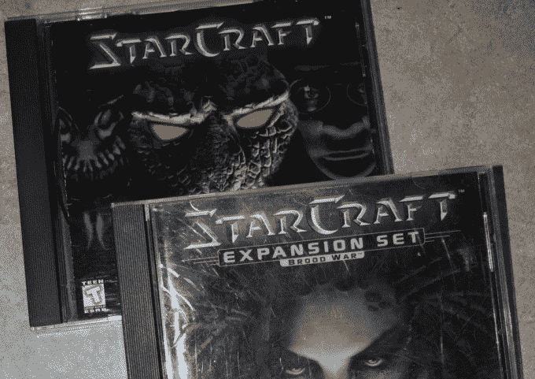

# 星际争霸在发布近 20 年后现在是免费的

> 原文：<https://web.archive.org/web/https://techcrunch.com/2017/04/18/starcraft-is-now-free-nearly-20-years-after-its-release/?guce_referrer=aHR0cHM6Ly93d3cuZ29vZ2xlLmNvbS8&guce_referrer_sig=AQAAACc1uifvo64zr3LYleTv4fQ_RoXdXWyEMOB5kb1vU0j1jaVRnSeIxiuF77Vv-5UCriBJUZNmrEWjSjthy50i00lHdMM-0l2CwgNBeck-feeWIpSqPofjtbhytzy6vcMbHPWEmXqVi3jSCl57GYJoXtIX_uVFftMjPoBwXe7mpEgQ&_guc_consent_skip=1676724920>

# 星际争霸在发布近 20 年后现在是免费的

你是否一直想看看那个你久闻其名的*星际争霸*游戏，但不知何故却设法在*将近 20 年*的时间里没有买一个副本？

好消息！在 1998 年发行近 20 年后，星际争霸现在是免费的。合法！

暴雪刚刚发布了原版游戏——加上*育雏战争*资料片——对 PC 和 Mac 都免费。你可以在这里找到它。直到几周前，获得游戏及其资料片还需要花费 10-15 美元。

该公司表示，他们还利用这个机会改进了游戏的反作弊系统，增加了与 Windows 7、8.1 和 10 的“改进兼容性”，并修复了一些长期存在的漏洞。

为什么是现在？该公司将在几个月后发布这款游戏的重制版，其图形/音频针对现代系统进行了彻底改造。一旦这个版本上市，相比之下，原版可能会显得有点过时——所以他们还不如用它来赢得一些新粉丝，对吧？

这对于像我一样在过去 20 年中一直想玩游戏但一直没能玩的人来说也是一个好消息，因为比利借了你的星际争霸光盘的 CD 夹，并且再也没有还给你。我还记得，比利。