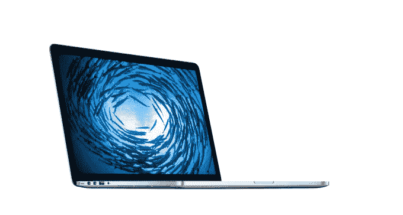
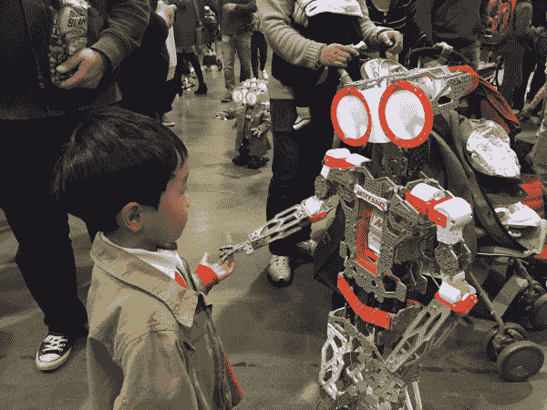

# 本周你不想错过的 13 个故事

> 原文：<https://web.archive.org/web/https://techcrunch.com/2015/05/22/13-techcrunch-stories-you-dont-want-to-miss-this-week-9/>

TechCrunch 本周有一些重大的内部消息，因为我们告别了共同编辑 Alexia Tsotsis 和会议项目主席 Susan Hobbs。在其他科技新闻方面，Clinkle 死了，Spotify 宣布了新的服务，苹果推出了新的 MacBook，等等。这些是我们本周(5/15-5/21)最精彩的故事。

**1。**我们祝贺我们的共同编辑[亚历克西亚·措特西斯被商学院](https://web.archive.org/web/20221210033811/https://beta.techcrunch.com/2015/05/20/make-new-friends-keep-the-old/)录取为史丹福大学斯隆管理学院研究员，祝贺我们的活动总监[苏珊·霍布斯获得 Y Combinator](https://web.archive.org/web/20221210033811/https://beta.techcrunch.com/2015/05/19/shining-like-the-brightest-stars-a-transmission-on-the-midnight-radio/?ncid=rss) 的新职位。我们会非常想念他们，我们很兴奋地看到他们职业生涯的下一步会给他们带来什么。

**2。经常被嘲笑的支付奖励初创公司 Clinkle 因七名员工因对公司 24 岁的首席执行官卢卡斯·杜普兰不满而同时辞职。**

**3。**TechCrunch 的常驻手表爱好者约翰·比格斯详细讲述了[他为什么还戴着他的苹果手表](https://web.archive.org/web/20221210033811/https://beta.techcrunch.com/2015/05/16/why-im-still-wearing-my-apple-watch/#.qoqpyu:sq8a)。

**4。**苹果发布了一款新的 [15 英寸 MacBook Pro，配有 Force Touch 和一台 2000 美元的 27 英寸 Retina iMac](https://web.archive.org/web/20221210033811/https://beta.techcrunch.com/2015/05/19/apple-debuts-new-15-inch-macbook-pro-with-force-touch-and-1999-27-inch-retina-imac/#.qoqpyu:EYfV) 。

**5。**皮尤研究中心的一项新调查称[不到 31%的美国成年人表示相信政府有能力保护他们的数据](https://web.archive.org/web/20221210033811/https://beta.techcrunch.com/2015/05/20/another-pew-privacy-report-flags-huge-public-mistrust/#.qoqpyu:Itm1)。娜塔莎·洛马斯描述了这对美国公民、政府和技术服务的意义。

**6。**约翰·比格斯写了关于 Light Phone 的文章，这是一款反智能手机，大小如信用卡，充电可持续 20 天，除了打电话和接电话之外什么也不做—[这就是重点](https://web.archive.org/web/20221210033811/https://beta.techcrunch.com/2015/05/18/the-light-phone-is-the-anti-smartphone/#.qoqpyu:BGbf)。

**7。** Spotify 宣布将在服务中引入[视频、新闻和播客](https://web.archive.org/web/20221210033811/https://beta.techcrunch.com/2015/05/20/spotify-introduces-video-clips-podcasts-and-activity-based-playlists/#.qoqpyu:eMeY)，并为跑步者推出新功能，如[根据你的速度变化的歌曲](https://web.archive.org/web/20221210033811/https://beta.techcrunch.com/2015/05/20/spotify-for-runners/)。

**8。第十届年度湾区创客大会本周如火如荼地进行着，莎拉·布尔写了一些最有趣的发明，包括巨型机器人、电动犀牛和香蕉钢琴。**

**9。** Matthew Lynley 写了一篇关于 [Tilt 的深度文章，这家初创公司专注于为价值 4 亿美元的项目提供资金](https://web.archive.org/web/20221210033811/https://beta.techcrunch.com/2015/05/20/tilts-global-ambitions-grow-as-it-seeks-to-raise-at-a-400m-valuation/#.qoqpyu:Xuxm)。

**10。我们与 Pinterest 的联合创始人埃文·夏普坐下来谈论该公司的全球雄心、苹果手表和旧金山住房危机。**

**11。丹尼·克赖顿(Danny Crichton)分析了教育技术空间(ed tech space),建议我们需要更深入地思考人类的动机和首要地位，以便建立一种与大学提供的教育技术相媲美的教育技术的新组合。**

**12。**特邀撰稿人 Bill Briggs 写了一些关键点，开发[物联网的公司应该考虑](https://web.archive.org/web/20221210033811/https://beta.techcrunch.com/2015/05/19/the-internet-of-some-things/#.qoqpyu:uZN2)才能取得成功。

**13。**应用程序开发工具提供商的竞争格局变得更加激烈，因为 [Meteor Development Group 筹集了 2000 万美元](https://web.archive.org/web/20221210033811/https://beta.techcrunch.com/2015/05/19/meteor-raises-20m-to-build-the-one-javascript-stack-to-rule-them-all/#.qoqpyu:wGQN)来建立一个 JavaScript 堆栈来统治它们。