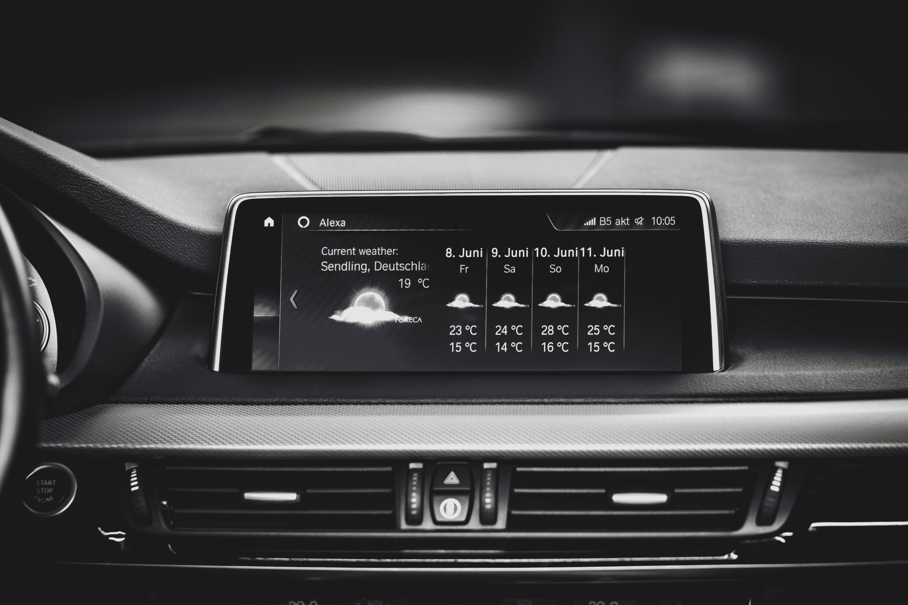
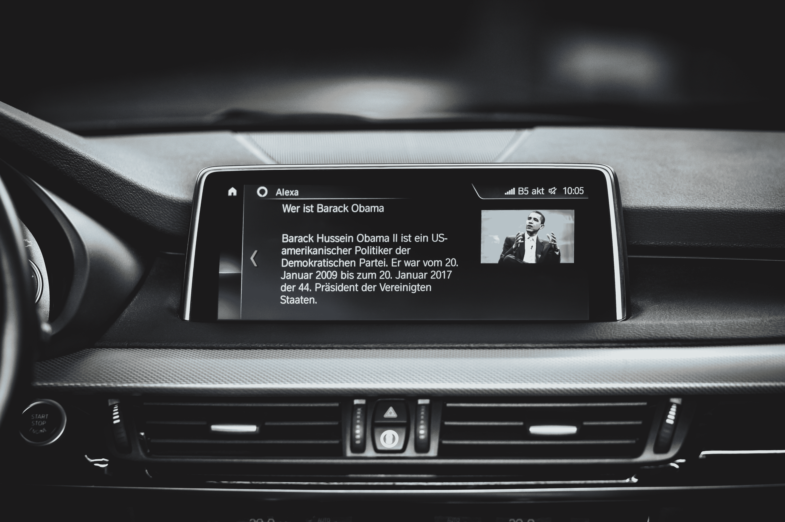
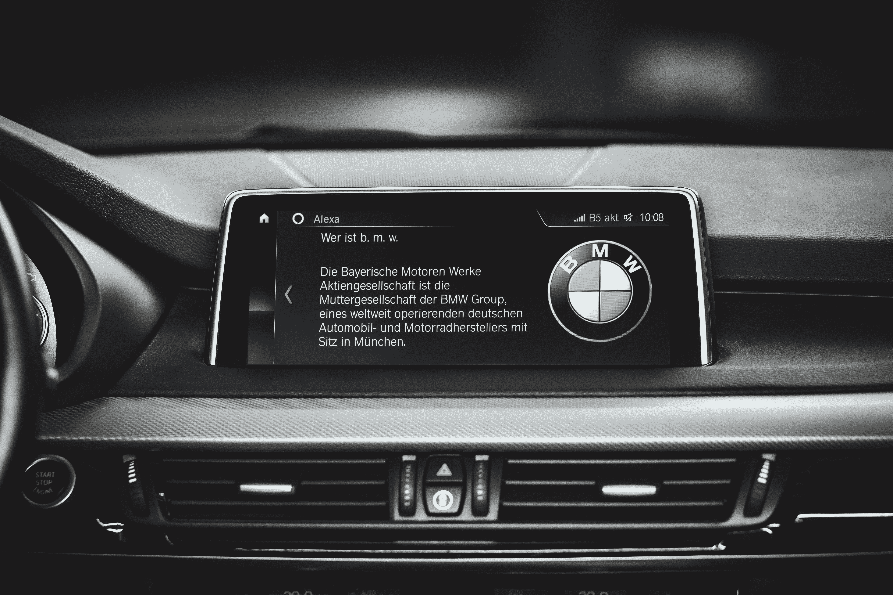

# 宝马的 Alexa 集成做对了——第 1365 页

> 原文：<https://web.archive.org/web/https://techcrunch.com/2018/07/29/bmws-alexa-integration-gets-it-right/1365/>

几天后，宝马将开始向其许多司机推出对亚马逊的 T2 语音助手的支持。宝马正在这样做的事实并不令人惊讶，因为它长期以来一直在谈论将 Alexa——以及可能的其他个人助理，如 Cortana 和谷歌助理——引入其汽车的计划。在它正式在德国、奥地利、美国和英国推出之前(其他国家将在稍后推出)，我去了慕尼黑，看看在宝马上使用 Alexa 是怎么回事。

正如 [Dieter May、](https://web.archive.org/web/20191219025715/https://crunchbase.com/person/dieter-may) 宝马负责数字产品的高级副总裁今年早些时候告诉我的那样，该公司长期以来一直认为车载数字助理必须不仅仅是“杯架上的一个回声点”，这意味着它们必须深度融入车内的体验和其他技术。这正是宝马在这里所做的——而且做得非常好。

**更新** : *澄清一下，Alexa 功能的更新将适用于 2018 年 3 月左右生产的所有宝马*。

可能最让我惊讶的是，我们不只是在这里谈论语音界面。宝马正直接与亚马逊的 Alexa 团队合作，整合来自 Alexa 的视觉反应。使用大多数新宝马中控台上方的平板显示器，该服务不仅可以读出答案，还可以在需要时显示额外的事实或图表。这意味着宝马里的 Alexa 更像是在使用回声秀，而不是圆点(尽管你显然无法在上面观看任何视频)。

在我看到的演示中，2015 款宝马 X5 在发布前专门安装了 Alexa，例如，当你询问天气信息或从维基百科帖子中返回信息的查询时，显示屏会激活。

这里最酷的是，宝马团队使用同样的设计语言设计了这些响应，这种语言也适用于该公司的其他车载产品。因此，如果你看到 Alexa 的天气预报，那看起来就像宝马自己的互联驱动系统的天气预报一样。唯一的区别是屏幕左上角的“Alexa”名称。

所有这一切听起来很容易，但我确信，要建立这样一个系统，需要与亚马逊进行一番谈判，特别是因为这种集成还有一个非常独特的重要的第二部分。你可以通过按下汽车上通常的“通话”按钮来启动查询(在新款车型中，Alexa wake word 功能也可以工作)，这些查询首先被发送到宝马的服务器，然后再发送到亚马逊。宝马希望保持对数据的控制，并确保其用户的隐私，所以它在中间添加了这个代理。这意味着从亚马逊获得响应会有一点额外的延迟，但团队正在努力减少这种延迟，对于我们在演示期间尝试的许多查询，这已经可以忽略不计了。

正如团队告诉我的，它必须构建的第一件事是一种能够将您的查询路由到正确服务的切换方式。毕竟，这款车已经内置了语音识别服务，例如，可以让你在导航系统中设定方向。现在，它必须识别出说话者在查询开始时说“Alexa ”,然后将其路由到 Alexa 服务。该团队还强调，我们在这里谈论的是非常深入的整合。“我们不只是通过你的智能手机传输所有内容，或者使用一些即插即用的解决方案，”宝马发言人指出。

“你从宝马那里得到了你所期望的东西，一种深度集成，为了做到这一点，我们使用了我们已经在车上的技术，特别是内置的 SIM 卡。”

Alexa 开放生态系统的优势之一就是技能。并不是每项技能在汽车环境中都有意义，有些可能会让人分心，所以团队正在整理一份你可以在汽车中使用的技能清单。

众所周知，宝马也在与微软合作(它的许多云服务都运行在 Azure 上)。宝马辩称，Alexa 和 Cortana 有不同的优势，例如，Cortana 是关于生产力和与 Office 365 的连接。很容易想象未来你可以从汽车上调用 Alexa 和 Cortana 这肯定是宝马建立自己的语音命令路由系统的原因，也是它希望控制这一过程的原因。

宝马告诉我，它将研究用户将如何使用这项新服务，并相应地进行调整。因为许多功能运行在云中，更新显然很容易，团队可以快速发布新功能——就像任何其他软件公司一样。

