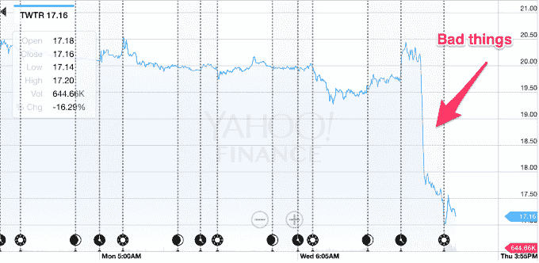
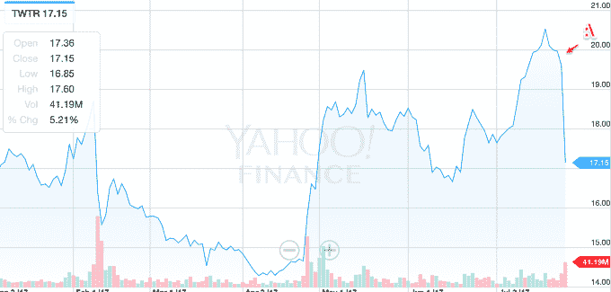

# 推特今天过得很糟糕

> 原文：<https://web.archive.org/web/https://techcrunch.com/2017/07/27/twitter-is-having-a-very-bad-day/?guccounter=1&guce_referrer=aHR0cHM6Ly93d3cuZ29vZ2xlLmNvbS8&guce_referrer_sig=AQAAAFSmwROqmH7xOHjBYc2ESf02kO0VoM8a5UiWQkwCSmNyr46oeZ09G7UWSRExxIy3HVJa894BNbSMOZ9rlLvVbyyNzFypEXORLIXk-b627VMm1h48dRXzkkL5eEc7xEFX_ymKiFPLOYauDfMend_yMX5jqgaUZU_QUbhc2VETeCEp>

推特[今天发布了第二季度收益报告](https://web.archive.org/web/20221204233413/https://beta.techcrunch.com/2017/07/27/twitters-user-growth-went-nowhere-and-the-stock-is-diving/)，但进展并不顺利。结果，该股在今天的交易中下跌了 12%以上——可以说，这是推特上的一件大事。

这是图表，可以用一个😐：

如今，它也抹去了今年迄今为止积累的大部分收益。推特的上一份报告对该公司来说是一份罕见的积极报告，当时其每月活跃用户的增长速度实际上超过了预期,“T4 ”,而且一切都领先于华尔街的分析师。本季度，推特用户数量没有增长，广告业务再次停滞，这让人们对该公司的未来产生了更多的怀疑。

公平地说，该公司仍然或多或少地以其每月活跃用户的增长来衡量。Twitter 的实际受众一直是一个很难衡量的事情，因为很多内容都在平台之外，Twitter 正试图进一步扩展到视频直播。该公司试图与 MAU 指标保持距离，因为不管是好是坏，它的增长可能会被脸书等其他广告网络所超越。

股票跳水实际上是对公司未来成功的重新评估，但在短期内肯定没有帮助。Twitter 正试图控制其基于股票的薪酬，但保持这一价格也很重要，以帮助招募更多的人才和提高士气。Twitter 正在迅速尝试推出有助于改善服务的产品，比如试图遏制骚扰，并通过算法反馈使服务更容易使用。

为了应对 MAUs 上的这种困扰，Twitter 已经开始强调其每日活跃用户的增长。这就是 Snap 在宣传它是脸书的替代产品时采用的策略。我们的目标是让华尔街相信，华尔街的眼球比脸书的眼球更有价值，因为这项服务更有吸引力，人们一天中会花更多的时间多次查看 Twitter。更好的参与意味着更昂贵的广告，这意味着该公司将能够重新启动其引擎，但这意味着它必须增加这些 dau。

尽管如此，Twitter 并没有公开这些 dau，而是采取了非常高科技的举措，告诉我们增长率，并在谈论其 dau 时给我们一个没有 Y 轴的图表。我们可能会在未来变得更加清晰，但就目前而言，这无助于 Twitter 作为一个潜在的巨大广告产品以及市场上的其他选择。