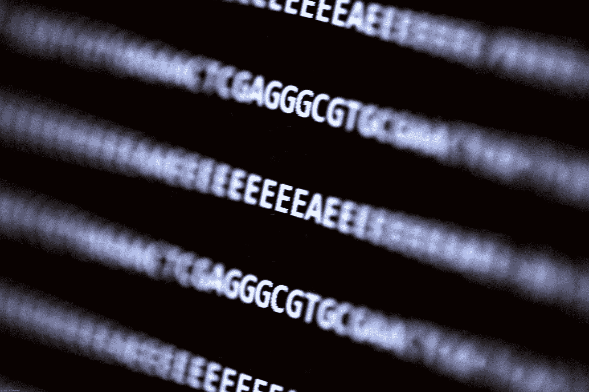

# 写入 DNA 的恶意代码会感染读取它的计算机 

> 原文：<https://web.archive.org/web/https://techcrunch.com/2017/08/09/malicious-code-written-into-dna-infects-the-computer-that-reads-it/?guccounter=1&guce_referrer=aHR0cHM6Ly9kdWNrZHVja2dvLmNvbS8&guce_referrer_sig=AQAAAIp5dO7XYHUUfM2UAaPpHhI02oZpTzGM_G14JFGVAjLLHyUCkhFIvhSOm-dXIG9-I-kunoYitHOTitbm3fYH-dYXmWQ6NA_1q8ZoEV1BbiiCL_MgVzsa3IRuRzUL7vYGla9Rnp1HLOzfOLWHFVmX5o7rFDxzUq0UJx5hm6YY8X7w>

一个令人难以置信的世界第一，一个由生物学家和安全研究人员组成的团队成功地用一串 DNA 编码的恶意程序感染了一台电脑。

这听起来像科幻小说，但我向你保证这是真的——尽管你可能不用担心这种特殊的威胁载体。也就是说，这个项目提出的可能性同样令人着迷，也令人恐惧。

[华盛顿大学的多学科团队](https://web.archive.org/web/20221208110756/http://dnasec.cs.washington.edu/)并不打算制造古怪的头条新闻，尽管它确实做到了。他们担心围绕 DNA 转录和分析的安全基础设施是不充分的，发现了世界各地实验室使用的开源软件中的基本漏洞。鉴于通常处理的数据的性质，这可能是一个严重的问题。

当然，他们可以用常见的恶意软件和远程访问工具展示系统的弱点。这就是任何有能力的攻击者攻击这样一个系统的方式。但是有鉴别力的安全专家更喜欢保持领先地位。

“我们在计算机安全领域努力做的一件大事是，避免出现这样的情况，我们会说，‘哦，天哪，对手来了，他们正在敲我们的门，而我们却没有准备好，’”Tadayoshi Kohno 教授说，他一直在寻求针对起搏器等嵌入式和利基电子产品的不同寻常的攻击载体。

从左至右，来自 UW 分子信息系统实验室和安全与隐私研究实验室的李·有机克、卡尔·科舍尔和彼得·内伊准备 DNA 利用技术进行测序

“随着这些分子和电子世界越来越近，我们以前没有真正考虑过的潜在相互作用，”该研究的合著者 Luis Ceze 补充道。

因此，他们实现了许多科幻作家在过去实现的飞跃，这也是我们目前正在通过 CRISPR 等工具探索的:DNA 基本上是生命的文件系统。分析程序读取 DNA 链的碱基(胞嘧啶、胸腺嘧啶等，我们都知道的 A、T、G 和 C ),并将它们转化为二进制数据。假设这些核苷酸最初编码的是二进制数据？毕竟，以前有人做过——就在大厅那头的。

## 疯狂的科学来了

他们是这样做的。关于转录应用程序，您真正需要知道的是，它读取来自转录过程的原始数据并对其进行排序，寻找模式并将找到的碱基序列转换为二进制代码。

“从 ASCII As、Ts、Gs 和 Cs 到比特流的转换是在一个固定大小的缓冲区中完成的，该缓冲区假定了一个合理的最大读取长度，”合著者 Karl Koscher 在回答我关于更多技术信息的请求时解释道。

这使得基本缓冲区溢出攻击的时机成熟，在这种攻击中，程序执行任意代码，因为它超出了预期的参数。(他们在软件中引入了一个特定的漏洞，这是一种欺骗，但他们也指出，类似的漏洞在其他地方也存在，只是不便于演示。)

在开发了一种在基本序列中包含可执行代码的方法后，他们开始着手利用漏洞本身。具有讽刺意味的是，称它为病毒是不准确的，尽管它可能比任何恶意代码都更接近于“真正的”病毒。

“这个漏洞长达 176 个碱基，”科斯切尔写道。压缩程序将每个碱基转换为两位，这两位打包在一起，转换后会产生 44 字节的漏洞

假设有 4 个碱基，让每个碱基代表一个二元对是有意义的。科斯切尔证实了这一点。(如果你和我一样好奇:A=00，C=01，G=10，T=11。)

 “这些字节中的大部分被用来编码一个 ASCII shell 命令，”他继续说道。四个字节用于使转换函数返回到执行 shell 命令的 C 标准库中的 system()函数，另外四个字节用于告诉 system()命令在内存中的位置

本质上，DNA 中的代码一旦从 ACGTs 转换为 00011011s，就会逃离程序，并在系统中执行一些命令——这充分证明了威胁载体的存在。如果你想做的不仅仅是脱离应用程序，还有足够的空间来编写更多代码。

参与该项目的研究科学家 Lee Organick 说，176 个碱基的 DNA 链构成了“几乎任何生物标准，都非常小”。

## Biopunk 未来已确认

按照每个科学记者的首要指示，即获取有趣的新闻，并将其转化为对人类生存的威胁，我向团队提出了更多的问题。

“可以想象，”我问道，以强调我们正在进入推测的领域，“这样的有效载荷可以通过，例如，篡改过的血液样本，甚至直接来自一个人的身体吗？人们可以想象一个人的 DNA 对安全性差的计算机来说是致命的。”

不负责任地，Organick 点燃了我的恐惧之火。

 “一个被篡改的生物样本确实可能被用作恶意 DNA 的载体，在测序后被下游处理并被执行，”她写道。

“然而，从篡改的样本中获取恶意 DNA 链进入测序仪是非常困难的，存在许多技术挑战，”他继续说道。即使您能够成功地将它放入测序仪进行测序，它也可能没有任何可用的形状(例如，它可能太零碎而无法有效读取)

这并不完全是我想象的生物朋克启示录，但研究人员确实希望人们沿着这些思路思考，至少作为潜在的攻击途径。

Organick 说:“我们确实希望科学家们考虑这一点，这样他们就可以让他们编写的 DNA 分析软件符合适当的安全标准，这样一来，它就永远不会成为潜在的攻击媒介。”

“我认为任何输入都是不可信的，有可能危及这些应用程序，”Koscher 补充道。“明智的做法是以某种隔离方式(在容器、虚拟机等中)运行这些应用程序。)来遏制漏洞可能造成的损害。这些应用程序中有许多也是作为公共可用的云服务运行的，我会优先考虑隔离这些实例。”

像这样的攻击被成功完成的可能性微乎其微，但它是数字和生物之间日益增加的重叠的象征性里程碑。

研究人员将于下周在 T2 举行的 USENIX 安全会议上展示他们的发现和过程。