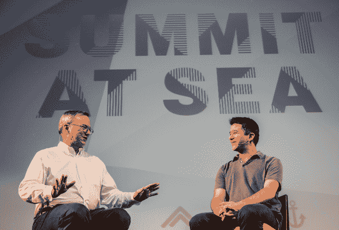
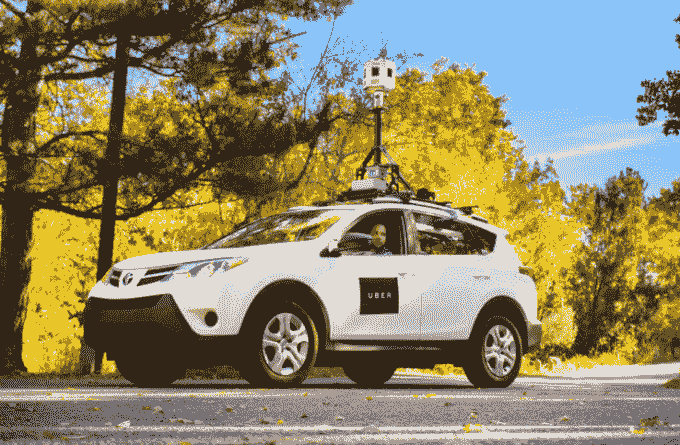
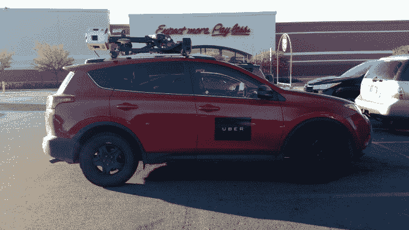

# 随着汽车走向自动驾驶，优步考虑让司机接受“职业培训”——第 1395 页

> 原文：<https://web.archive.org/web/https://techcrunch.com/2015/11/16/uber-vocational-training/1395/>

一旦汽车自动驾驶，[优步](https://web.archive.org/web/20200216165458/https://crunchbase.com/organization/uber) 的司机会怎么样？首席执行官特拉维斯·卡兰尼克用一种更温和的方式表示，这不仅仅是丢掉工作。优步有可能训练司机在后驾驶时代做其他工作。

此前，卡兰尼克采取了更加冷酷高效的立场，他在去年的 CODE Conference 上说，他喜欢自动驾驶汽车，并且“当车里没有其他人时，优步的成本变得比拥有一辆汽车更便宜。”当被问及他将如何解决优步车手可能担心他们会被淘汰，卡兰尼克回答说:“我会告诉他们，这是世界正在前进的方式。”

但是周五晚上，卡兰尼克在迈阿密海岸的海上峰会[舞台上发言时，为司机提供了新的潜在选择。这艘几乎没有连接的船刚刚返回港口。](https://web.archive.org/web/20200216165458/http://sas.summit.co/)

在与谷歌/Alphabet 董事长埃里克·施密特(Eric Schmidt)进行台上讨论后，一名紧张的观众直言不讳地问卡兰尼克，当自动驾驶汽车上路时，优步司机的命运如何。首先，卡兰尼克开始总结为什么开车从根本上来说是不好的。他举例说，每年有 30，000 人死于车祸，数十亿个小时花在紧张的驾驶过程中“降低生活质量”，交通伤害了人们的效率。他认为无人驾驶技术是许多这些问题的解决方案。

优步的新地图工具，它用来使路线和 eta 更准确

卡兰尼克继续把优步关于司机的困境框定为“我们是想要拥抱未来，拥抱技术，还是抗拒它？”他宣称优步的立场是成为未来的一部分，并“乐观地领导它”。

这时，他暗示优步可能会做些什么来处理从承包人类司机到路由自动驾驶汽车的转变。卡兰尼克说，有几个“简单的想法”可以帮助司机进行这种转变，他引用了“职业时期、教育和过渡期”。他坚持认为“在转变发生之前，你会看到优步以这种方式工作。”

优步联合创始人兼首席执行官特拉维斯·卡兰尼克

从这些声明来看，优步似乎正在考虑为司机提供驾驶汽车以外的职业指导。优步不会在自动驾驶汽车与传统汽车竞争时袖手旁观，而是有可能让司机为另一份职业或赚钱的工作做好准备。优步还可能提供过渡期，这样司机就能在一定程度上保证他们的车费不会一夜之间消失。

这一立场更符合去年底卡兰尼克说他希望优步采取的更友好的态度，因为它已经变得如此主导。当被要求发表官方声明时，优步告诉我没有什么要补充的。

为什么优步想要帮助司机呢？一个可能的原因是，无人驾驶汽车不会立即在世界各地激增。优步可能会在一些市场比其他市场更长时间地需要更多的人类司机。

如果他们看到其他地方的同胞被自动驾驶汽车取代，招募和留住这些司机可能会很困难。他们可能会觉得不值得去买一辆符合优步标准的车，或者决定追求建立另一种技能或雇佣关系会更好。优步也可能希望改善自己的形象，以便更成功地招募到顶尖人才。

优步目前正在建立自己的无人驾驶汽车技术，由匹兹堡的一个实验室牵头，该实验室配备了从附近的卡耐基梅隆大学(T2)挖来的工程师。与此同时，优步投资者谷歌风险投资公司的母公司也在推进其自动驾驶汽车原型。

卡兰尼克和施米特的谈话发生在[峰会系列](https://web.archive.org/web/20200216165458/http://www.summit.co/series/)海上峰会活动上，这是一个仅限受邀者参加的目的地会议和文化节，被描述为成年人的智力夏令营。这艘 3000 多人的游轮还包括由投资者克里斯·萨卡主持的与爱德华·斯诺登的视频聊天，与艺术摇滚团体“百水”和鲍勃·马利的乐队“哭泣者乐队”的音乐会，与人权领袖亨瑞·贝拉方特的谈话，以及深夜 DJ 节目。

在与优步首席执行官的聊天中，Schmidt 问了一个关于优步发生的最疯狂的事情。卡兰尼克描述了一名司机说服他的妻子藏在后备箱里，这样他就可以搭车了。当乘客带着行李出现时，司机打开行李箱让他们把行李放好，随之而来的是一阵大笑。

特拉维斯·卡兰尼克

两人还讨论了优步的起源故事，每辆优步取代数十人汽车所有权的能力，以及现在旧金山几乎 50%的乘车都是 UberPool 拼车。卡兰尼克批评汉普顿市长禁止优步，尽管当地酒后驾车事故盛行。

至于优步将如何实现无人驾驶汽车，卡兰尼克说有许多选择，“还不清楚它将如何实现。”然而，他确实提到了一种潜在的商业模式，即让一家物流公司拥有并“管理一支数千辆汽车的车队”。

对于全球无数的优步合作伙伴司机来说，自动驾驶汽车可能是担忧的正当理由。但现在，无论是出于纯粹的善意还是有效的战略原因，优步似乎愿意做的不仅仅是在路边抛弃司机。