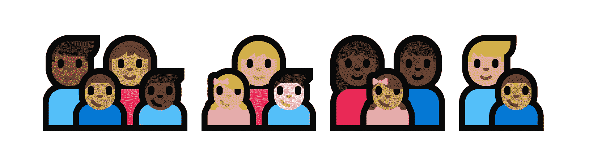

# 脸书给家庭表情符号添加了肤色，但这很复杂——第 14 页

> 原文：<https://web.archive.org/web/https://techcrunch.com/2017/08/24/facebook-adds-skin-tones-to-family-emoji-but-its-complicated/14/>

将现实世界的多样性添加到表情符号中是一项正在进行的工作，但随着平台跨越全球，这对像[脸书这样的大公司来说显然很重要。这家社交网络刚刚](https://web.archive.org/web/20200218233546/https://crunchbase.com/organization/facebook)[推出了一套新的“家庭”表情符号](https://web.archive.org/web/20200218233546/https://blog.emojipedia.org/facebook-adds-black-family-emojis/)，虽然它们还没有涵盖全部范围，但至少让你的伴侣和孩子拥有除黄色皮肤之外的东西。

它现在在桌面和移动网站上运行——但不包括 Messenger，因为某种原因它使用不同的表情符号或移动应用程序。你所要做的就是下拉表情菜单，然后长按家庭表情——你的选项应该出现在默认的黄皮肤表情上面。

 那么为什么要花这么长时间呢？嗯，标准的制定需要一段时间，而修改表情符号肤色的 UTF 标准必须得到发展和认可。一旦发生这种情况，这取决于平台如何实现该标准。

在这种情况下，是微软在一年多前首先抓住了多样化家庭表情符号的可能性。但是看看你是否能发现上面的和微软的区别:

 耶——多样性是复杂的！家庭通常不全是黑色、棕色或黄色。在家庭中反映真正的多样性不同于在个人中这样做。编码过程也不同。

通常你有表情符号(👩‍🚀)和肤色(🏽)由一个特殊字符连接，该字符告诉系统将它们组合起来，产生具有该肤色的表情符号(👩🏽‍🚀).但是可以说，家庭不是那么容易被编码的。如果你有一个西班牙裔男人娶了一个黑人女人，他们有一个肤色较浅的儿子和一个偏爱母亲的女儿，会怎么样？原来有 52000 种不同性别和颜色的组合。

有一个现有的代码语法，但它没有得到很好的支持——如果你在其他平台上看到他们的复杂系列之一，它不会正确呈现。相反，它表现为家庭中每个人的一个序列——实际上是一个相当优雅的失败。

总之，回到脸书。它们都是关于易用性的，在表情菜单中弹出 52，000 个选项不是一个好的用户体验。因此，目前社交网络选择保持时尚的单色，尽管没有以前那么单色。对于肤色类似的人来说，黄色的脸可能是一个不错的选择，但肤色较深的人肯定会喜欢这个选择，即使它还不全面。

我已经问了脸书是否计划在近期内增加多音家庭，如果有回音，我会更新。