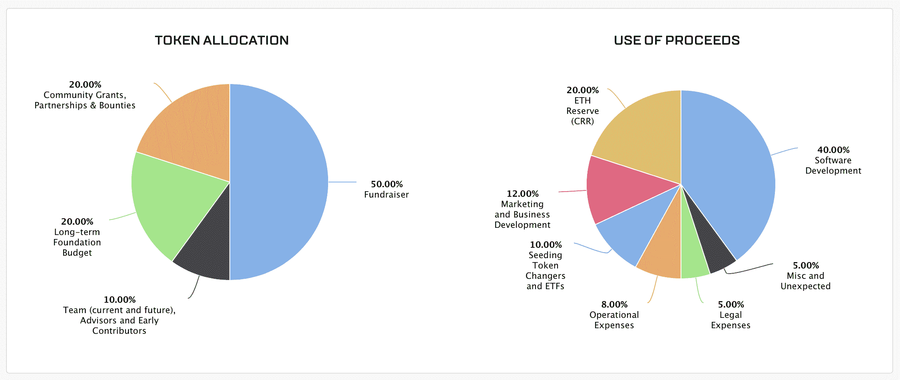
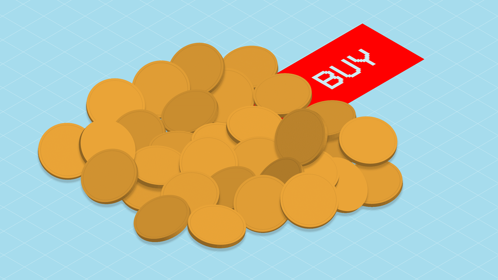

# 如何进行象征性销售 

> 原文：<https://web.archive.org/web/https://techcrunch.com/2017/09/22/how-to-run-a-token-sale/?guccounter=1&guce_referrer=aHR0cHM6Ly93d3cuZ29vZ2xlLmNvbS8&guce_referrer_sig=AQAAAIqa4PegXPY4DewjyxErFZ9vdwuUtu8_Zfv81zrhbezw71-V4P9pamaN-QQG_IALgUT5k-xtJgxPC17IVCHutLwYhb100lnztvr5HSBq7ZEc4K9Vg71YpnWxYUdw5msRkGm1CAmJ9zgvDnAACPCZ_2g0UZ9xL0zun37bxvdaVMS0>

种子基金正在枯竭。加速器正在争夺收入。创业生态系统正在发生巨大的变化。

为什么？

首先，众所周知，创业比以往任何时候都容易。一个 MVP 可以在几天内登陆应用商店，为服务器和软件筹集数百万美元的需求已经结束。其次，投资者希望看到牵引力，很少有人会在相对未知的事物上冒险。那么，当你的产品需要的不仅仅是一些 Django 代码和一个 AWS 实例时，你如何筹集资金呢？

你经营 ICO，对吧？

我们已经听到了大肆宣传:这是一个快速致富系统遇到 Kickstarter！你可以在几分钟内筹集到几百万！已经成功上百次了！完全安全！

所有这些观点都是正确的。但是所有这些观点都伴随着巨大的警告。欢迎来到代币销售的陌生新世界。我们来探索一下。

## 等等，什么？

很简单，代币销售是一个生成和销售新加密货币的过程。虽然每笔交易的细节都有所不同，但这个过程包括在区块链上建立一个智能合同，生成硬币，然后出售。这一过程通常涉及律师、合格投资者和最终公开出售，同时也是一场虚拟路演、一场马戏表演和一次社区建设活动。

首先，一些定义。

在这个过程中，您销售的是加密生成的令牌。这些是代表你的业务的数字对象。你可以用代币代表几乎任何东西——t 恤网站上的免费衬衫或者啤酒厂的啤酒。但是，如果没有大量的法律保护，你就不能使用代币出售股票，至少在美国是这样。这也是大多数象征性销售努力停止的地方:证交会不希望你插手它的领域。除此之外，在大多数情况下，其他一切都是公平的游戏。

我们将带着一些美国人的基本事实进入这篇文章。这些规定在美国以外并不总是适用，许多创始人只是在美国以外进行销售，以避免与 SEC 和其他方面打交道。我不会阻止或鼓励这一点。你说了算。世界各地这些销售的合法性仍然悬而未决，代币和细价股之间只有一线之隔，这是很少有人愿意承认的事实。

此外，代币销售不是一种融资工具。虽然许多公司都是这样对待它们的——并为几分钟内爆发的数百万美元融资而沾沾自喜——但它们真正做的是在公开市场上发行加密货币。通过大量的规划和大量的运气，这些加密货币可以升值，如果代币销售结构正确，这将给公司带来比他们开始之前多一点的资金。没有计划，你会弄得一团糟。

代币应该是你公司生命力的一部分。正如迪士尼美元曾经让你接触到迪士尼商品，优步巴克斯应该在某种程度上让你接触到一些由优步和 Krablr Koins 应该让你接触到你的新螃蟹捕捞系统的一个方面。各公司通过各种技巧让他们的硬币为他们的业务服务，包括将一个令牌挂在一克合成犀牛角上。还是那句话，不做判断。这是一个安全的空间。如果你想出售一个按摩令牌或爆米花令牌或与机器人语音生成相关的令牌，没有人能阻止你。一旦你的螃蟹被铸造出来，你所建立的小螃蟹专用经济应该可以自我维持。这就是你“赚”钱的地方——靠投机自己的成功。

代币销售将取代传统的天使轮和种子轮，这是显而易见的，甚至可以完全颠覆风投。但是他们如何以及何时做到这一点还不清楚。所以，最终，你应该做一个象征性的销售吗？

还是那句话，看情况。

我们来看一个成功的。

## 象征性销售

Eyal Hertzog 是 Bancor 的联合创始人，Bancor 是一家金融科技公司，最近获得了一项荣誉——有些人会说是可疑的——在三个小时内“筹集”了 1.53 亿美元，创造了一种将使加密货币交易所[过时的产品](https://web.archive.org/web/20230201000346/https://www.bancor.network/faq/misconceptions)。

首先，解释一下。Bancor 在这种情况下所做的远远超过 7600 万代币。这些代币以远低于目前 2 美元的价格出售给早期投资者，发行后立即上涨。价格已经稳定，目前 Bancor 代币所有者可以随心所欲地买卖这些代币，从而为本质上是加密货币的东西创造了一个真正的市场。

令牌的所有者并不拥有 Bancor 的一部分，而是拥有将在其产品中使用的令牌。正如《纽约时报》的一篇著名文章所解释的，想象 Bancor 是一个赌场，通过向早期投资者出售筹码来筹集现金。赌场常客最终会在赌桌上使用这些筹码，但在此之前，这些筹码会根据赌场的预期人气保持潜在价值。如果有足够多的人愿意花 5 美元买一只曾经花 1 美元买的蓝筹股，你就会有很多快乐的投资者。然而，Bancor 做了一些更有趣的事情。

赫佐格说:

> 我们决定发起一个令牌分配活动，因为我们设计了一个很有前途的协议令牌——Bancor 网络令牌 BNT，它基于我们的 Bancor 协议。需要强调的是，这不是一轮以盈利为目的的创业公司融资，也不是一个基本的应用程序令牌。该筹款活动由瑞士非营利基金会执行，该基金会有权使用其资金来开发和推广开源 Bancor 协议。在此基础上，我们(和其他人)可以构建和运营服务，如“Bancor Network”服务，该服务将为发行、使用、转移、购买和清算“智能令牌”提供简单易用的 UX。智能令牌使用 Bancor 协议来确保其对任何其他流动储值工具(以太网、比特币、美元、欧元等)的持续流动性。)BNT 将作为一个主干，为所有用户生成的智能令牌提供令牌的流动性，这些令牌将作为储备，将所有这些新令牌相互连接，并通过 BNT 与 ETH 和其他现有货币连接。随着更多智能代币的产生，BNT 的价值将会增加，从而使所有保留它的智能代币受益。这是一个真正的网络生态系统，更多的用户惠及所有人。不可能通过使用另一个令牌(如 ETH)来创造这种势头和激励结构(如果网络成功，早期采用者将获得不成比例的奖励)。

简而言之，这是未来产品的组成部分，甚至可能不会用于产品本身。

在这种销售中，发生了一些事情，使得写这些东西成为问题。首先，请记住，Bancor 并没有“筹集”1.53 亿美元。它提高了一小部分。此外，除非它想抛售自己的股票，否则它不可能在不影响市场的情况下抛售自己的股票。在这种情况下，每家公司都是中本聪，静静地坐在一堆硬币上，希望有一天可以卖掉。

班科尔“赚了多少钱？”在大多数代币销售中，该公司保留一定数量的硬币——通常是数百万枚——现在可以买卖这些硬币来支持其运营。我们还假设，创始人也保留了几百万美元。在这种情况下，该公司扣留了 10%，即 396 万英镑。买家，至少在这种情况下，拥有自己的数百万代币，因为它们是流动的，可以随意将它们移入和移出 Bancor。

Bancor 将“使用其资金来开发和推广开源 Bancor 协议。”你们当中精明的人会注意到，这为下一次代币销售打开了大门，并且还有大量代币留待以后出售。

此外，Bancor 必须非常小心。代币销售受到许多问题的困扰，包括窃取以太坊的骗局。最简单的方法就是发布虚假的销售信息，将潜在的买家发送到一个虚假的账户。其他黑客只是改变了代币销售网站上的收款地址。数百万美元通过这种方式从卖家手中流失。

## 危险！

一些事情可能会发生在倒霉的代币卖家身上。黑客们正在搜索这个领域，并且已经想出了一些聪明的办法。例如，一名黑客在 CoinDash 令牌销售期间更改了目标以太坊地址，并在一夜之间窃取了价值 700 万美元的以太坊。这种行为几乎每天都在发生——黑客或骗子在空闲时突然出现，告诉用户代币销售网站已经改变，加油站在社交网络上发布虚假声明，以帮助移动价格。像 MetaCert 这样的公司正在开发识别虚假链接和网络钓鱼诈骗的系统。

创始人保罗·沃尔什(Paul Walsh)表示:“如果你喜欢投资加密货币，并收到一条关于 ICO 或代币折扣的消息，这条消息具有时效性，听起来好得令人难以置信，那就是真的。”“直接联系公司，问他们是不是真的。加密公司不会有让你在几分钟甚至几小时内行动的时间敏感交易。所以不要放松警惕——这就是非常聪明的人被愚弄的方式。”

你如何保持安全？保持聪明。

“任何承诺赚钱的 ICO 都应该避免，”顾问兼作家马克·肯尼兹伯格(Marc Kenigsberg)说。“检查团队的历史项目和跟踪记录，阅读白皮书，确保产品有需求，避免任何重营销轻技术的东西。在参与 ICO 时，要警惕钓鱼网站和发布在 slack 频道上的地址，并且在汇款前一定要核实地址。”

## 风投还是虚拟现金？

如果做代币出售，还能筹到 VC 吗？风投会在意吗？风险投资总的来说会发生什么？没有人真正知道，但我们正趋向于普遍接受代币销售作为一种新的“投资”工具，越来越多的基金将代币销售纳入其投资计划。

投资者目前陷入困境。许多人想开始购买早期硬币，其中一位名叫 Moshe Hogeg 的人将 ICOs 作为他的核心投资主题。其他人，尤其是资金较老的风投，投资时一定要小心，怕二次探底。简而言之，它们是用来给创始人开支票的，而不是给机器人代币交易所开支票的。《哈佛商业评论》很好地解释了这一立场。他们[写](https://web.archive.org/web/20230201000346/https://hbr.org/2017/03/what-initial-coin-offerings-are-and-why-vc-firms-care):

> 通常对 ICO 现象漠不关心的风险投资家现在对它越来越感兴趣，原因有很多。一个是利润——加密货币投资者在 2016 年获得了巨额回报，区块链初创公司 Monero 和 NEM 的加密货币价值都增长了 2000%。例如，2017 年 3 月，用于以太坊网络的加密货币以太(Ether)的价值在短短几天内翻了一番。没错，三天时间，投资乙醚的人投资翻倍。这些投资者可以选择套现到法定支持的货币，或者等待加密货币继续上涨(或下跌)。波动是双向的。虽然以太的价格一直在上涨，但比特币从 2017 年 3 月 3 日创纪录的 1290 美元下跌了 20%，至 1000 美元。
> 
> 风投对 ico 越来越感兴趣的第二个原因是加密货币的流动性。通过 ico，投资者可以更快地看到收益，更容易地提取利润，而不是将大量资金投入独角兽初创公司，等待长期投资 IPO 或收购。他们只需要在任何一个携带加密货币的交易所将加密货币利润转换成比特币或以太币，然后通过 Coinsbank 或比特币基地等在线服务轻松转换成法定货币。

最终，象征性销售是否是一个好主意将取决于硅谷社区的普遍接受程度；到目前为止，情况看起来不错。许多加速器支持的公司放弃了沙丘路演，转而进行代币出售，许多人认为大多数种子投资将来自代币，而不是有限合伙人。就像 Kickstarter 完全颠覆了消费电子行业一样，这也将颠覆其他一切。

## 操作方法

首先，您的情况和要求可能不利于象征性销售。这很好。这不是一个放之四海而皆准的解决方案，但也许新的系统会到位，帮助代币销售者更快更有效地工作。以下是我见过的一些创业公司“筹集”资金的基本过程。

象征性销售没有正确的方式。如果你需要对事物有更高层次的理解，看看我们之前发布的这个[基本指南。](https://web.archive.org/web/20230201000346/https://techcrunch.com/2017/05/24/how-to-stage-an-ico-and-other-related-questions-you-might-like-answered/)它从高层次讨论销售。这个描述更详细了一点，但我仍然只是触及了皮毛。

有一点是肯定的:做这件事有正确的方法，也有错误的方法。

“有些人完全做错了，”T2 Unikrn 公司的首席执行官 Rahul Sood 说，他最近完成了一次象征性的出售。“他们把这当成股权出售。他们没有得到适当的法律建议来设置问题，他们的白皮书看起来像是一只做微积分的驴写的。”

最终，必须小心避免法律问题，或者更糟糕的是，象征性的销售失败。为什么？因为那些对代币销售感兴趣的人现在几乎完全了解了其中的陷阱和好处，任何不顺心的事都会立即引起怀疑。

“这个社区很快就开始流行起来，”索德说。

**1。创造一个产品。**这第一步经常被那些试图尽快进行代币销售的人所忽略，但是忽视它会给你带来危险。你必须有一个产品，这个产品必须使用你的令牌。也许你可以发布一个 MVP 或 beta，然后进行销售，但假设你必须筹集一点股权投资来启动你的业务。大多数人估计你需要 10 万到 15 万美元才能真正开始运作。没错:你需要钱来赚钱。这不是一个硬性规定，但请记住。

**2。创建令牌。**其核心就是在以太坊生态系统中创建一个令牌，从字面上或形象上来说，它可以代表您的企业生存所需的东西。以太坊生态系统中的代币可以代表任何可替代的可交易商品:硬币、忠诚度积分、黄金证书、借据、游戏物品等。由于所有令牌都以标准方式实现一些基本功能，这也意味着你的令牌将立即与以太坊钱包和任何其他使用相同标准的客户端或合同兼容，”以太坊的创造者写道。

这些令牌由一种叫做智能合约的东西控制。智能合约告诉硬币在特定情况下如何反应。创建智能合同超出了本文的范围，但是您或您的技术朋友可以在网上找到大量信息。如果你需要一个智能合同的快速纲要，请访问[这个页面](https://web.archive.org/web/20230201000346/https://www.ethereum.org/token)，以太坊的创建者在这里创建了一个用于教育目的的“最小可行令牌”。有很多工具可以使用，包括 [OpenZeppelin](https://web.archive.org/web/20230201000346/https://openzeppelin.org/) 。

此代码有助于管理您的代币并促进销售。你也可以说这是整个项目中最简单的部分。

**3。获取法律意见。**任何时候你开始乱花别人的钱，你都会希望受到法律保护。象征性销售真正开始于售前和法律规划。在大多数情况下，你需要一份法律意见书和对出售的法律描述，这将使你站在证交会的正确一边。两家律师事务所在代币销售中反复出现。他们是[珀金斯·科尔](https://web.archive.org/web/20230201000346/https://www.perkinscoie.com/)和[库利](https://web.archive.org/web/20230201000346/https://www.cooley.com/events/2017/2017-07-25-blockchain-and-token-sales-disrupting-your-financial-system-since-2017)。这两家公司都有完善的加密货币实践。库利致力于一个名为 [SAFT](https://web.archive.org/web/20230201000346/https://coinlist.co/about/help/saft) 的框架，该框架在理论上降低了这些法律要求的成本。

这里的目标是确保您的令牌不是证券。这里没有欺骗的意思，你只需要站在代币销售定义的正确一边。

**4。写白皮书。**之后，你需要写一份白皮书，或者越来越多地写一份资料。白皮书本质上是计划书，是对财务计划的描述，包括对产品的描述、对团队的描述以及对代币生成和分发策略的描述。可以看看几个有意思的[这里](https://web.archive.org/web/20230201000346/https://www.metalpay.com/assets/pdf/whitepaper.pdf)和[这里](https://web.archive.org/web/20230201000346/https://unikoingold.com/whitepaper)。

第一篇论文是传统论文，写得很像科学论文。另一篇论文写得更像一本小册子。这两种方法同样有效。白皮书的主要任务是清楚地描述产品，解释代币的用途，最后告诉全世界你将如何分发硬币。我见过看起来像演示文稿的白皮书和其他复杂的物理教科书。然而，最重要的是绝对清晰。遗憾的是，即使在代币销售过程中，许多白皮书仍未被阅读，从而导致沟通不畅和混乱。

**5。创建一个社区。**在代币销售的早期，社区是关键。这是一个支持你的社区。你需要一个空闲或不和谐的聊天室，在那里你可以与潜在的买家和公关计划进行交流。这是一个可悲但真实的事实，大多数代币销售是由最初的炒作驱动的。幸运的是，这种炒作是由真实的社区支持的，如果你不尽早创建这个社区，你会发现你的令牌会很快下降。此外，你必须确保早期投资者不会太快卖掉他们的硬币。

这对视觉和市场都是不利的。最终，你想要创建一个友好的社区来支持你，而不是你的代币。有太多的象征性销售可以被认为是简单的抽水和倾倒计划，任何人都不能忽视社区增长方面。通过培养核心粉丝群体的信任，你可以确保你的代币仍然有价值和有用。

**6。在交易所获得代币。**一旦你创造了你的硬币并准备好发行，你需要联系交易所来携带你的硬币。这意味着人们可以在公开市场的特定交易所买卖你的硬币。让一些强大的交易所接受你的硬币是绝对必要的。

大多数代币也将在 [CoinMarketCap](https://web.archive.org/web/20230201000346/https://coinmarketcap.com/all/views/all/) 网站上市，该网站正在成为代币销售的股票交易平台。该网站显示了一长串的代币及其市值，大多数代币喜欢看到自己进入前 40 名。崩溃的代币在最后结束或完全被除名，有趣的是看到死硬币在这个庞大的列表的底部附近。

代币销售通常会有面向合格投资者的预售，以防止与 SEC 发生冲突。这些初始销售意味着公众可能会错过一个好的初始价格。但这是意料之中的事。最后，大多数代币销售是公开的，允许任何人买卖代币。在这一点上，代币必须在市场中保护自己，根据新闻、观点或谣言下沉或上升。

此外，大多数公司为创始人、员工和投资者保留了一些代币。正是这些现金使得这些过程对初始投资者和创始人来说是值得的，但请记住，这不是优先股。投资者必须了解你的要求，许多代币卖家要求早期投资者持有他们的硬币一段时间。这可以防止立即转储。

最终，我们创造了一个没有股票的新股票市场，一个令人惊讶的无摩擦市场。这些象征性的销售不可避免地会失败，随着国际法开始跟上步伐，这一过程的许多方面可能会发生变化。然而，解释、获得法律保护和建立社区的过程不会改变。

当我开始写这本指南时，我与中国的一位象征性投资者艾哈迈德·巴拉吉(Ahmed Al-Balaghi)交谈过，他指出“目前还没有监管，这意味着每个人都可以投资和创建 ico。”

“许多对区块链和加密货币知之甚少或一无所知的新中国投资者正在投资 ICO 项目，”Al-Balaghi 说。中国的 ICO 市场与世界其他地区(除美国外)非常相似，因为中国没有发布此类监管规定，但 6 月初，PBOC 暗示“可以对 ICO 采取监管沙盒方法”，中国人民银行顾问盛松成最近表示，“应该实施适度监管，但不应扼杀创新。”因此，由于 ico 和区块链的性质，在每个人都可以投资和参与的意义上，它与世界其他地方(暂时)非常相似。"

这刚刚改变了。美国证券交易委员会可以效仿中国，锁定代币销售、矿商和加密货币公司，或者干脆放任不管。同样的事情可能会在美国发生，也可能不会发生。在此之前，假设你不应该创造基于股权的代币，而是专注于公用事业代币。

简而言之，这个过程就是获得合法的身份，写一份白皮书，制作一个代币，然后卖掉它。这与运营 Kickstarter 或销售任何产品没有太大区别。但是，由于这些代币的性质，你必须保持兴趣和增长。在大多数销售中，都会有反对者多于支持者的时刻。如果一家公司把整个公司都押在了代币销售上，这个拐点将会让这家公司破产。明智而谨慎的计划有助于避免这种情况，但没有什么能真正阻止它。

买家和卖家都要小心。

## 今后

在写这篇文章的时候，有一件事对我来说变得很清楚:代币销售是新的种子。创业公司在筹集基于股权的资本时会遇到越来越多的困难，并将开始试图将自己硬塞进一个象征性的销售框架。这其实挺好的。

最终，这意味着将加密货币视为金融界的粘合剂。即使在同一个行业，多代币销售也有很大的空间，我们也可以期待在未来几年看到市场的调整和变化。但是，我怀疑随着时间的推移，天使投资会走向代币投资。

这只是一个新的独特的筹资模式的开始，这种模式将留下许多输家和许多赢家。这是一种为新企业筹集资金的平等主义方法。现在，就看制造商、设计师、程序员和梦想家如何以理智的方式实现它了。
