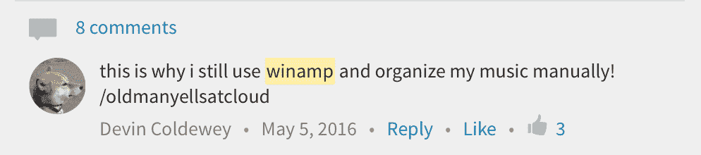

# 用这个 Javascript WinAmp 模拟器打败美洲驼 

> 原文：<https://web.archive.org/web/https://techcrunch.com/2018/02/09/whip-the-llamas-ass-with-this-javascript-winamp-emulator/?guccounter=1&guce_referrer=aHR0cHM6Ly9lbi53aWtpcGVkaWEub3JnLw&guce_referrer_sig=AQAAAA-UTG_sCORkPgjMEiLSHM5Ktn4sat9Kmqwjxgoy_IvNypb3kDsarQFoN8PtaF5tuqmUXONAVTHX0L_41-k5maxvmCIRQ4h9jV30JBhxXq-Fx0awk9PRsKB4Nl5oRPGL_mS318moHolJZ17RuHlzaEp_KIvMA2K1Sj8XJGAd0DRA>

# 用这个 Javascript WinAmp 模拟器鞭打美洲驼的屁股

如果你是一个早期的互联网儿童，你会记得一个叫做 [WinAmp](https://web.archive.org/web/20230131021713/https://techcrunch.com/2013/11/20/after-15-years-of-whipping-the-llamas-ass-winamp-shuts-down/) 的小应用程序，简而言之，它是有史以来最好的 MP3 播放器。这个小程序看起来像一个 skeuomorphic 立体声接收器，有一个完整的均衡器滑块，包括一个重要的 MP3，解释了 WinAmp 的主要任务:[鞭打美洲驼的屁股](https://web.archive.org/web/20230131021713/https://www.youtube.com/watch?v=HaF-nRS_CWM)。

一位名为[的程序员 Jordan Eldredge](https://web.archive.org/web/20230131021713/https://jordaneldredge.com/) 用 JavaScript 创建了一个向 WinAmp 致敬的程序。这个小工具允许你在任何网页上创建一个独立的音乐播放器，它可以直接用 WinAmp 历史中的主题来设计风格。你可以[在这里](https://web.archive.org/web/20230131021713/https://jordaneldredge.com/projects/winamp2-js/)试用，在这里下载代码[。](https://web.archive.org/web/20230131021713/https://github.com/captbaritone/winamp2-js)

“最初的灵感是意识到 Winamp 皮肤的实现方式与 CSS 精灵非常相似，”Eldredge 说。“我十几岁的时候花了很多时间玩 Winamp 皮肤。事实上，这是我在电脑上完成的第一个建设性的创造性作品。”

模拟器使用 Web Audio API 来模拟 WinAmp 在其原始版本中可以做的几乎所有事情。

“我只是一个书呆子，三年前有过一个愚蠢的想法，从来没有明智地问:‘我应该停止吗？’”他说我还发现，必须在网络浏览器的范围内构建所有这些功能的约束非常具有创造性。我认为这种约束激发的创造力反映了 Winamp skins 激发的创造力。在不能移动按钮或调整窗口大小的情况下，创建一个引人注目的用户界面是一个巨大的挑战，但它也有助于将您从选择的瘫痪中解放出来。"

除了代码之外，Eldredge 还发布了一个机器人，为那些想让他们的 MP3 播放器看起来像保龄球馆的人提供 WinAmp 皮肤。

最好的事？现在，TC 记者德文·科迪威有东西可以管理他的音频文件了。
