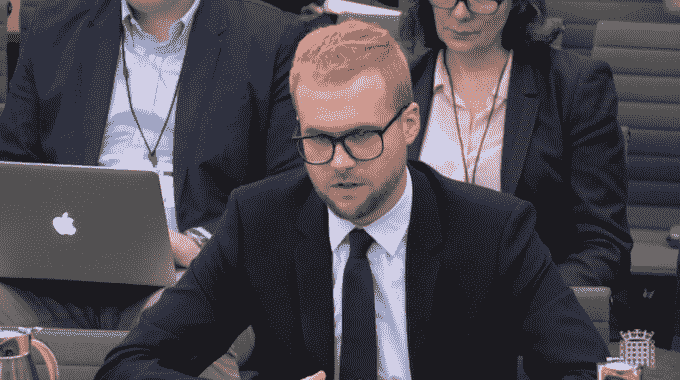
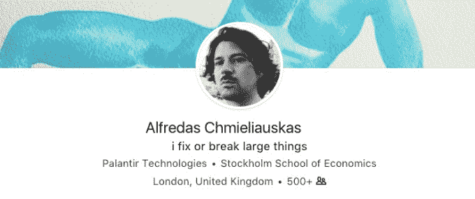

# Palantir 证实了与剑桥分析 TechCrunch 的员工联系

> 原文：<https://web.archive.org/web/https://techcrunch.com/2018/03/28/palantir-confirms-a-staff-link-with-cambridge-analytica/?guccounter=1&guce_referrer=aHR0cHM6Ly93d3cuZ29vZ2xlLmNvbS8&guce_referrer_sig=AQAAACiKUpRrv4fEmX6SVowBprWd9ToTdsznz3HZGH3i4M43F7Zf_2uHBvjZa3SPOK7VMZa58rVyWX_WW2wMYdUOYIJfoLhmRyklw044zZ70YDSea1U-M2MNiV0CaFhCnqtJzt8jvDNCM1tzm9Uyxta72jnOUVGiUN50Lc6hS5A17AuO>

原来，彼得·泰尔神秘的大数据分析公司 Palantir 和剑桥分析公司(Cambridge Analytica)之间存在联系，剑桥分析公司是处于当前脸书数据滥用丑闻中心的政治咨询公司。

从 2013 年开始,[《纽约时报》](https://web.archive.org/web/20230117145450/https://www.nytimes.com/2018/03/27/us/cambridge-analytica-palantir.html?mtrref=t.co&auth=login-email)报道称，一名总部位于英国的 Palantir 员工与剑桥分析公司(Cambridge Analytica)合作，继续获取后者在 2014 年通过部署在社交网络巨头平台上的第三方个性测试应用程序获得的 5000 多万脸书用户的数据集。

昨天在英国议会的[证词中](https://web.archive.org/web/20230117145450/https://techcrunch.com/2018/03/27/facebook-data-misuse-scandal-affects-substantially-more-than-50m-claims-wylie/)，CA 告密者 Chris Wylie 告诉国会议员，Palantir 的高级雇员与该公司在脸书的数据上合作，以帮助它从数据集建立模型，用于政治广告定位目的。

当时，怀利为英国国防承包商 SCL 集团工作，该公司在美国亿万富翁罗伯特·默瑟的资助下成立了 CA 公司。CA 后来被特朗普竞选团队聘用，参加 2016 年总统大选。

昨天，Palantir 的一位女发言人在回应 Wylie 的指控时断然否认了 Wylie 的说法，她告诉我们:“Palantir 从未与剑桥分析公司有过关系，我们也从未研究过剑桥分析公司的任何数据。”

然而，在给 NYT 的一份声明中，Palantir 现在修改了这一说法——他说:“我们今天得知，一名员工在 2013-2014 年期间，以完全个人的身份与剑桥分析公司的相关人员交往。我们正在调查此事，并将采取适当的行动。”

《NYT》报道称，它看到的文件显示，这家大数据公司驻伦敦的一名员工——名叫 Alfredas Chmieliauskas——与 CA 数据科学家合作，后者正在开发其心理分析技术。

这些文件可能是由 Wylie 提供的(见下图)，他还向调查政治竞选中在线虚假信息的 DCMS 委员会以及英国的数据监督机构和选举委员会提交了电子邮件和其他书面证据——这两个机构也在调查数字政治竞选问题(包括围绕英国 2016 年英国退出欧盟公投的投票，Wylie 声称 CA 也参与了这项工作)。

根据 NYT 的报告，实际上是 Chmieliauskas 想出了克隆 Michal Kosinski 的工作的主意，他是第一个剑桥大学的学者，Wylie 说 CA 向他寻求帮助来收集数据。

当时，科辛斯基是剑桥大学心理测量中心的副主任，他和该系的另一位教授大卫·斯蒂尔韦尔已经在进行一个名为[的项目](https://web.archive.org/web/20230117145450/http://mypersonality.org/wiki/doku.php)，该项目旨在将匿名的脸书个人资料和个性调查的反馈联系起来——这些数据也是通过脸书的一个应用程序获得的——旨在将兴趣和投票倾向联系起来。

昨天，怀利告诉委员会，科辛斯基已经要求 CA 预付 50 万美元，并在该商业项目中获得 50%的股权，以开展该项目——他说这最终是为什么它最终与另一位剑桥教授亚历山大·科岗签署了数据许可协议，后者同意首先收集脸书的数据，并在以后讨论商业条款。

据《NYT》报道，Chmieliauskas 在 2014 年 5 月写道:“我已经放弃了这个领域的想法。“把剑桥教授的工作复制成一个连接到 facebook 的移动应用怎么样？”——接着表示，这“可能是与这个人谈判的一个宝贵筹码”。

Chmieliauskas 的 LinkedIn 个人资料显示，他于 2013 年 4 月加入 Palantir，目前仍受雇于伦敦的这家公司，从事“业务发展”工作。

它还包括使命陈述:“我修理或打碎大东西”。

结果，Chmieliauskas 克隆 Kosinski 的应用程序的建议导致 CA 与科岗建立了数据许可关系，后者自己的个性测试应用程序——*thisiyourdigitallife*——是为其项目定制的，并成功用于收集 5000 多万脸书用户的数据，因此 CA 可以反过来建立数百万美国选民的心理档案。

怀利昨天告诉委员会，在 CA 和 GSR 签署正式合同之前，科岗的问答应用程序的试点于 2014 年 5 月推出，有 1 万名脸书用户。GSR 是科岗成立的公司，负责与 CA 一起将这项工作商业化。

该应用程序随后被用于在 2014 年夏天收集完整的脸书数据集，获得了约 27 万次下载——但能够通过脸书(现已关闭)的 friends API 获取更多数据。

昨天，Wylie 还声称 CA 能够[从更多的脸书用户](https://web.archive.org/web/20230117145450/https://techcrunch.com/2018/03/27/facebook-data-misuse-scandal-affects-substantially-more-than-50m-claims-wylie/)那里获取数据，甚至比目前报道的 5000 万用户还要多。

回到 Palantir，据《NYT》报道，2013 年，SCL 和 Thiel 的公司也讨论过合作竞选事宜。该报称，Palantir 的一名女发言人证实，两家公司曾短暂考虑过合作，但声称已拒绝合作——部分原因是高管们希望避开选举工作。

NYT 看到的进一步电子邮件显示，CA(现已暂停)的首席执行官 Alexander Nix 和 Palantir 的 Chmieliauskas 也试图在 2014 年初恢复关于正式合作伙伴关系的谈判，但 Palantir 高管再次拒绝。

我们联系了 Palantir 进行确认，一位女发言人发来了最新的声明(如下)，她称之为“初步调查”。

> Palantir 从未与剑桥分析公司有过关系。剑桥分析公司的人在多个场合接触过我们，但我们拒绝继续前进。根据公司政策，我们不参与也从未参与过世界任何地方的选举或政治活动。我们今天了解到，一名员工在 2013 年至 2014 年以完全个人的身份与剑桥分析公司的相关人员交往。我们正在调查此事，并将采取适当的行动。