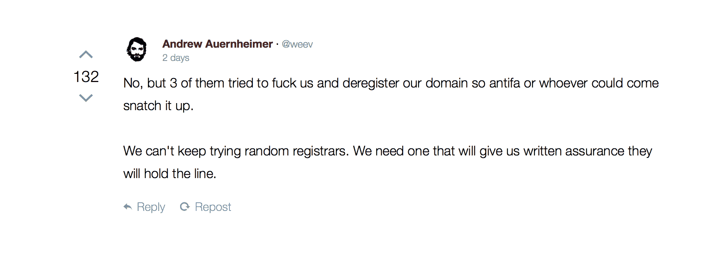
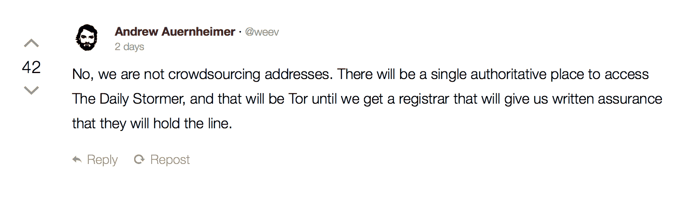

# 《每日风暴》已经正式退守黑暗网络——第 18 页

> 原文：<https://web.archive.org/web/https://techcrunch.com/2017/08/24/daily-stormer-has-officially-retreated-to-the-dark-web/18/>

# 每日风暴已经正式撤退到黑暗网络

**更新**:每日风暴[至少暂时在 DreamHost 上以不同的网址【punishedstormer.com】上线](https://web.archive.org/web/20200113000856/https://beta.techcrunch.com/2017/08/24/easy-come-easy-go-daily-stormer-briefly-reappears-on-dreamhost-before-being-banned-again/)。现在又被封杀了。

随着种族主义网站退回到只能通过 Tor 访问的黑暗网络，反对每日风暴的战斗已经以撤退告终。前灰帽黑客安德鲁·奥伦海默在另类右翼网站 Gab 上宣布了这一决定的动力。

该网站现在可以通过洋葱浏览器等工具访问，地址可在[维基百科](https://web.archive.org/web/20200113000856/https://en.wikipedia.org/wiki/The_Daily_Stormer)上找到。该服务器现在对所有的注册商和主机提供商都是隐藏的，它可能存在于任何地方，而且没有明确的方法来判断是否有任何一家公司在托管该网站。

简而言之，普通用户很难访问每日风暴，但现在如果没有丝绸之路般的干预和跟踪，关闭它几乎是不可能的。

在夏洛茨维尔的 alt-right 抗议之后， [GoDaddy](https://web.archive.org/web/20200113000856/https://beta.techcrunch.com/2017/08/13/godaddy-tells-white-supremacist-site-daily-stormer-to-find-a-new-domain-provider/) 、 [Namecheap](https://web.archive.org/web/20200113000856/https://beta.techcrunch.com/2017/08/20/the-daily-stormer-was-back-online-for-a-quick-second/) 、 [Cloudflare](https://web.archive.org/web/20200113000856/https://beta.techcrunch.com/2017/08/16/digital-ocean-and-cloudflare-ditch-neo-nazi-client-the-daily-stormer/) 、SendGrid 和 [Google](https://web.archive.org/web/20200113000856/https://beta.techcrunch.com/2017/08/14/google-daily-stormer-domain/) 的管理员关闭了网站。希瑟·哈耶被一名右翼抗议者谋杀后，对《每日风暴》服务提供商的搜寻开始了。

Tor 项目的发言人上周指出，虽然它不支持每日风暴，但它的工具是为所有希望自由表达的人准备的。

“我们对这些种族主义者的所作所为感到厌恶、愤怒和震惊。每当 Tor 网络和软件被用于卑鄙的目的时，我们都会有这种感觉。但是，如果我们还控制谁使用这些工具，我们就无法建立自由和开源的工具来保护世界各地的记者、人权活动家和普通人。Tor 旨在通过阻止任何人审查东西来捍卫人权和隐私，即使是我们，”admin Steph 写道。“Tor 反对种族主义和偏见，无论这种仇恨何时何地出现。我们的工作是为每个人提供尽可能最好的安全和隐私工具，以便在全世界促进人类尊严和自由。”