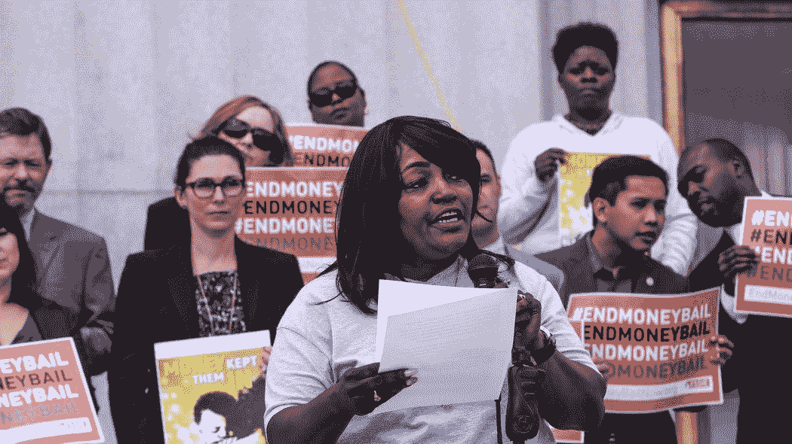

# 保释改革与科技的复杂关系——第 183 页

> 原文：<https://web.archive.org/web/https://techcrunch.com/2018/05/20/bail-reform-has-a-complex-relationship-with-tech/183/>

在美国的任何一天，都有超过 45 万人在监狱里等待宪法规定的公平审判。他们中没有一个人被判有罪——他们被指控犯了罪，但没有做出有罪或无罪的正式裁决。这意味着成千上万的人被监禁仅仅是因为他们没有经济能力支付保释金。

保释最初是为了激励人们出庭，但后来演变成了一种将富人和穷人分开的制度。它要求被逮捕的人在等待审判期间付钱才能出狱。对于那些付不起保释金的人来说，他们最终不得不坐在监狱里，这意味着他们可能面临拖欠租金、失业和无法履行其他责任的风险。

保释金是案件审理过程中获得释放的常见条件。现金保释制度导致许多人被监禁，即使他们没有被判有罪。

美国公民自由联盟全国政治副主任 Udi Ofer 告诉 TechCrunch，美国的现金保释制度是刑事司法系统中最大的不公正之一。奥弗说，保释改革是“实现”挑战刑事司法系统中的种族差异和结束大规模监禁目标的“关键途径”。

正如我们在“[另一条管道](https://web.archive.org/web/20190115194919/https://techcrunch.com/2016/07/31/the-other-pipeline/)中所探讨的那样，美国的刑事司法系统深深植根于种族主义和压迫的历史。根据量刑项目的数据，在美国成人教养系统中被监禁的 220 万人中，黑人和拉丁裔人约占 150 万，或监狱人口的 67%，而他们仅占美国总人口的 37%。

随着刑事司法系统对有色人种的影响越来越大，难怪现金保释系统也会如此。首先，根据 Traci Schlesinger 博士的审前研究，有色人种被拒绝保释的可能性比白人高 25%，[。根据 2010 年的一项研究](https://web.archive.org/web/20190115194919/https://www.tandfonline.com/doi/abs/10.1080/07418820500088929)，对于可以选择支付保释金的黑人来说，保释金平均比白人高出 35%。

全国重罪保释金中位数是 1 万美元。对于那些负担不起的人来说，他们不得不依靠保释代理机构，这些机构收取不可退还的费用，代表该人支付所需的保释金额。根据美国公民自由联盟和变革的颜色，由保险公司支持的保释债券公司每年收取 14 亿至 24 亿美元。

如果保释公司不在，那些坐在监狱里等待审判的人更有可能被判有罪。根据纽约市刑事司法机构的一项研究，审前监禁的非重罪定罪率从 50%上升到 92%。一路走来，直到审判，一些检察官鼓励人们对指控认罪，即使他们是无辜的。

奥弗说:“是时候结束我们国家的现金保释制度了，这个制度让你钱包的大小决定你是获得自由还是继续被关在监狱里。”。“金钱永远不应该决定一个人的自由，但这正是美国每天发生的事情。”

审前拘留对当地市、县和纳税人来说也是昂贵的。根据审前司法研究所的数据，每天要花费大约 3800 万美元来关押这些基本上非暴力的人。每年，大约有 140 亿美元用于监禁未定罪的人。

“唯一受益于保释的人是营利性保释行业，”奥弗说。“如果我们要结束美国的大规模监禁，那么我们需要结束现金保释。”

## 保释改革即将到来

在全国范围内，保释改革已经进入了少数几个州。新泽西州的保释改革法于去年一月生效；根据美国公民自由联盟的数据，自那以来，其每日监狱人数下降了 17.2%，法院只对 33，400 名被告中的 33 名进行了现金保释。

美国公民自由联盟本身正在 38 个州进行保释改革，包括加利福尼亚州，奥弗说他对今年将进行的改革持乐观态度。现在，一项审前释放法案，参议院第 10 号法案，正在[国会进行审议。该法案认为，加州应该确保等待审判的人不会仅仅因为付不起保释金而被监禁。该法案还主张各县建立审前服务机构，以更好地确定人们是否适合被释放。](https://web.archive.org/web/20190115194919/https://leginfo.legislature.ca.gov/faces/billNavClient.xhtml?bill_id=201720180SB10)

该法案由参议员鲍勃·赫茨伯格等人提出，得到了美国公民自由联盟和 Essie 司法小组的支持，这是一个总部设在奥克兰的组织，倡导刑事司法系统中的实际正义。

“今天，我们有一个系统，允许人们在审前释放，如果他们有足够的钱支付保释金，”Essie Justice Group 创始人吉娜·克莱顿告诉 TechCrunch。"其他人都被要求坐在笼子里，没有任何出路."

[Essie Justice Group](https://web.archive.org/web/20190115194919/https://essiejusticegroup.org/) 主要与监禁过亲人的女性合作，并为她们服务。克莱顿说，通常情况下，人们唯一的出路是家人的帮助或认罪协议。

克莱顿说:“当我们看到人们交保释金时，我们看到女性正在背上巨额债务，而且还受到一个行业的恩惠，这个行业一次又一次地被引用，并以令人难以置信的卑劣方式胁迫和骚扰她们的客户。”。“当我们想到谁是知道保释是怎么回事的人时，这个国家的黑人和棕色人种妇女是这样。”

在过去的两年里，Essie Justice Group [在母亲节前后举行了一次行动](https://web.archive.org/web/20190115194919/https://mic.com/articles/189363/this-mothers-day-volunteers-are-paying-to-get-moms-out-of-jail-with-the-blackmamabailout-campaign#.P6kb0UiMP)，目标是将母亲们从监狱或移民拘留所中保释出来。去年的行动导致 30 名妇女获释。

图片来自 Essie Justice Group

## 技术能帮上忙吗？

答案越简短，也许。本月早些时候，谷歌禁止了保释保证书服务的广告，克莱顿说这是任何公司代表那些有亲人入狱的人采取的最大举措。但是，虽然技术可以在某些方面有所帮助，但克莱顿对更多的盈利实体进入刑事司法系统有些担忧。

“肯定有我非常反对的技术解决方案，”克莱顿说，但拒绝评论具体是哪些。“我会说，我在这方面的能量并不是来自想象的地方。我看到它发生了。我们看到的一件事是公司对保释改革感兴趣，因为他们看到了另一个从家庭中赚钱的机会。比如，“让这个人出去，但让他们付费，每周三次到我雇的人那里做这种花哨但昂贵的药物测试，支付脚镣或手镯和 GPS 监控的费用。”我认为那些从这类事情中赚钱的公司是我们需要警惕的。"

然而，有一家营利性公司立即跃入克莱顿的脑海，成为在刑事司法领域做实际好事的公司。那家公司叫 [Uptrust](https://web.archive.org/web/20190115194919/http://www.uptrust.co/) ，为人们提供关于开庭日期的短信提醒。

“我认为这是一个真正伟大的景观，”克莱顿说。“我是他们的支持者，因为我了解他们的政治，我知道他们不会做什么，那就是更进一步，或者参与进来，获得激励，增加一些看起来不像是人民自由，而是他们更多收入的花里胡哨。”

由雅各布·西尔斯和伊莱贾·格温创建的 Uptrust 旨在帮助人们确定出庭日期。Sills 告诉 TechCrunch，虽然电影喜欢描述逃跑风险和人们在开庭日期前逃离城镇，但未能出庭往往归因于缺乏交通工具、工作冲突、没有收到提醒、照顾孩子或时间管理不善。

这就是让系统更人性化的想法，让公设辩护人更容易与他们的客户联系。Uptrust 本质上是双向的，它代表公设辩护人提醒人们有关开庭日期。客户也可以交流他们在法庭上可能遇到的任何问题。

“如果公设辩护人知道客户有问题，他们通常可以让法院转移，”西尔斯说。“但如果他们没有这些信息，他们不会代表客户撒谎。”

西尔斯说，因为公设辩护人没有太多预算，Uptrust 收费也不高。

“但他们真的关心客户，我们看到的一件事是，我们需要改变整个系统的前端，减少敌意，更加人性化，”希尔斯说。

除了文本提醒之外，Uptrust 还使公设辩护人能够协助满足客户的其他需求。

“围绕保释改革的很多东西都是围绕着风险评估，而不是需求评估，”西尔斯告诉我。“但我们看到很多人都有需求，比如在乘车、照顾孩子或提醒方面得到帮助。”

致力于照顾客户的公设辩护人可以通过 Uptrust 提醒他们做一些事情，如请假或安排儿童保育。

对于最终用户，即客户端，Uptrust 都是基于文本的。对于公设辩护人，Uptrust 提供了一个集成到其案件管理系统中的软件解决方案。

希尔斯说，自从 2016 年夏天在加州康特拉科斯塔县推出以来，出庭率从 80%提高到了 95%。迄今为止，Uptrust 已经为 20，000 人提供了 5%的自由贸易协定税率。

“随着我们改进产品，如果我们能把(自由贸易协定税率)降低到 3%，你真的可以开始利用这些数据，推动重大政策变化，”西尔斯说。

Uptrust 的目标是从风险评估转向需求评估，并确保人们在与刑事司法系统的整个互动过程中得到支持。

“我们的观点是在保释改革方面，我们需要确保脚踝监视器之类的东西不会泛滥，”希尔斯说。“对我们来说，成功实际上是成为社区的分包商以及与政府合作。我认为保释改革存在巨大的风险，因为它与技术有关，因为人们将它视为一个巨大的商机。如果一家公司取代了政府，他们可能不会考虑社区的最佳利益。因此，重要的是要记住，他们考虑的是社区的最佳利益。”

与 Uptrust 类似，一个名为 [Appolition](https://web.archive.org/web/20190115194919/https://appolition.us/) 的技术组织通过在系统的范围内运作来工作。科尔特尼·瑞安·齐格勒博士创立的 Appolition 使人们能够将他们的零钱投入到 T2 国家救助基金中。截至 4 月，Appolition [已促成超过 13 万美元用于保释救济](https://web.archive.org/web/20190115194919/https://twitter.com/fakerapper/status/989877226341466113)。齐格勒无法就此事发表评论。

[、](https://web.archive.org/web/20190115194919/https://crunchbase.com/organization/promise) 另一方面，旨在提供现金保释制度的替代方案。今年 3 月， [Promise 筹集了 300 万美元的资金](https://web.archive.org/web/20190115194919/https://techcrunch.com/2018/03/19/jay-zs-roc-nation-and-first-round-capital-invest-3-million-in-bail-reform-startup-promise/)，由首轮资本领投，Jay-Z 的 Roc Nation 参与其中。

这个想法是给县和地方政府提供一个替代的方法来关押仅仅因为他们付不起保释金的人。有了 Promise，案件管理人员可以通过该应用程序监控法院命令的遵守情况，并更好地监控人们。GPS 监控也是一个选择，尽管这是一个有争议的选择。

假设你被捕了，最后有一个保释听证会。公设辩护人可以建议在有保证的情况下审前释放，而不是要求你支付保释金。在此基础上，Promise 将与公设辩护人和您的案件经理一起确定您的护理计划。

“很明显，我们的价值观是让人们远离监狱，”Promise 首席执行官淮德拉·埃利斯-拉姆金斯在 CTRL+T 的一集节目中告诉我。“就像，我们在经营一家公司，但我们从根本上相信，这不仅更具成本效益，而且是正确的事情。”

埃利斯-拉姆金斯说，Promise 没有向县监狱支付每人每天 190 美元，而是向一些县收取每人每天 17 美元。在某些情况下，Promise 的人均收费甚至更低。

正是这种盈利模式让克莱顿感到担忧。

“每当你在刑事司法领域引入盈利精神时，我认为我们需要小心，”克莱顿说。

她没有明确说出任何公司。事实上，她说她还没有准备好对诺言做出判断。但她对技术解决方案有一种普遍的担忧，这种解决方案“让我们真正需要问责的系统参与者眼花缭乱，分散他们的注意力，让他们以更系统、更全面的方式运作。”

克莱顿说，解决方案看起来像社会安全网，像医院和诊所，而不是监狱。

“如果我们真的想远离我们一直在走的这条道路，”克莱顿说，“那就是让国家对人民的控制正常化，那么我们应该非常小心，我们的系统，曾经看起来像是对吉姆·克劳的奴役，到大规模监禁，不会变成对所有人的技术监控。”