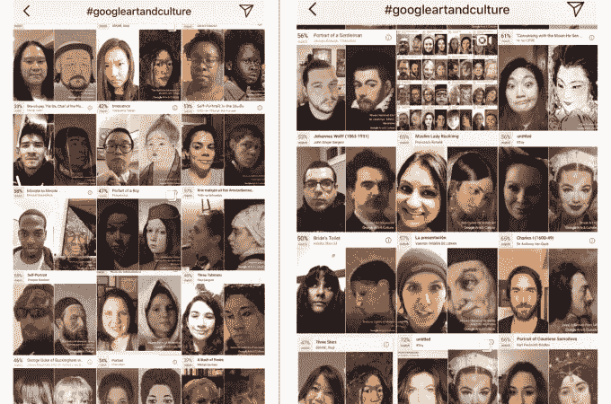
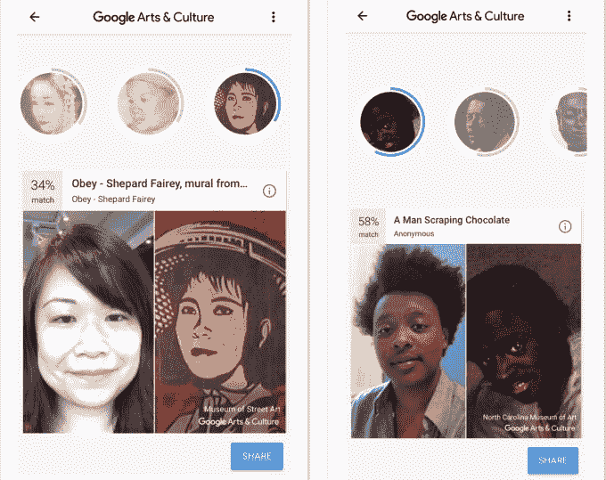

# 为什么加入谷歌艺术与文化自拍功能很重要——第 199 页

> 原文：<https://web.archive.org/web/https://techcrunch.com/2018/01/21/why-inclusion-in-the-google-arts-culture-selfie-feature-matters/199/>

本周早些时候，当 Google Arts & Culture 的新[自拍匹配功能](https://web.archive.org/web/20200110005157/https://www.blog.google/topics/arts-culture/exploring-art-through-selfies-google-arts-culture/)在网上疯传时，许多有色人种发现他们的搜索结果受到了限制，或者偏向于顺从和外来的人物。换句话说，它很好地记录了我作为少数民族探索大多数美国或欧洲艺术博物馆的经历。

这款应用是由谷歌文化研究所于 2016 年推出的[，但艺术自拍第一次让它火了起来。该功能目前仅在美国部分地区可用(一位发言人表示，谷歌“目前没有进一步的计划宣布”其他地区)，但它仍然设法将谷歌艺术文化带到了本周 iOS 和 Android 下载量最多的免费应用的榜首。](https://web.archive.org/web/20200110005157/https://beta.techcrunch.com/2016/07/20/googles-new-arts-culture-app-brings-the-worlds-art-virtual-tours-and-more-to-your-smartphone/)

自拍功能展示了技术如何使艺术更具吸引力，但它也提醒人们艺术的历史偏见。这突显出一个事实，即艺术界和科技行业一样，仍然严重缺乏多样性，为了确保未来，艺术界必须解决这个问题。

Instagram 用户上传的比赛

正如 Digg 新闻编辑 Benjamin Goggin 指出的那样，许多有色人种发现他们的结果似乎来自相对有限的艺术作品。其他人得到的火柴充满了白人艺术家在描绘有色人种时经常使用的老套比喻:奴隶、仆人，或者在许多女性的情况下，性感的新奇事物。谷歌发言人告诉 TechCrunch，该公司“受限于我们平台上的图片。历史艺术品往往不能反映世界的多样性。我们正在努力将更多样化的艺术品带到网上。”

我和另一位 TechCrunch 作家梅根·罗斯·迪基的比赛

自拍功能的种族问题并没有被忽视，这引发了社交媒体的讨论，并在 Digg、 [Mashable](https://web.archive.org/web/20200110005157/http://mashable.com/2018/01/16/google-arts-culture-app-race-problem-racist/) 、 [BGR](https://web.archive.org/web/20200110005157/http://bgr.com/2018/01/17/google-art-selfie-viral-app-privacy-racism/) 、[喧嚣](https://web.archive.org/web/20200110005157/https://www.bustle.com/p/googles-arts-culture-app-is-being-called-racist-but-the-problem-goes-beyond-the-actual-app-7929384)、 [BuzzFeed](https://web.archive.org/web/20200110005157/https://www.buzzfeed.com/krishrach/asian-people-are-not-impressed-with-their-matches-googles) 、[超敏感](https://web.archive.org/web/20200110005157/https://hyperallergic.com/421626/google-arts-culture-app-matches-selfies-portraits/)、 [Marketwatch](https://web.archive.org/web/20200110005157/https://www.marketwatch.com/story/why-googles-selfie-app-works-better-for-white-people-2018-01-17) 和 [KQED Arts](https://web.archive.org/web/20200110005157/https://ww2.kqed.org/arts/2018/01/17/google-arts-and-culture-selfie-app-inherits-art-world-disparities/) 等网站上得到报道。(毫不奇怪，这项功能也引发了许多隐私问题。在自拍功能之前显示的一条间隙消息中，谷歌告诉用户，除了寻找艺术品匹配之外，它不会将自拍数据用于任何其他目的，也不会存储照片)。

有些人可能会对这一讨论不屑一顾，因为谷歌的艺术自拍很快就会被下一个病毒迷因所取代。但是迷因是流行文化的新资本——当许多人感到被迷因边缘化时，就需要更仔细的研究。

## 谁来决定什么是艺术？

谷歌艺术与文化在 2011 年推出时被称为谷歌艺术项目，几乎立即受到了欧洲中心主义的指责。它最初的 17 个合作博物馆大多位于华盛顿特区、纽约市或西欧，引发了对其范围过于狭窄的批评。谷歌迅速采取行动，通过增加来自世界各地的机构来使项目多样化。现在这个项目已经扩展到 70 个国家的 1500 个文化机构。

然而，谷歌艺术与文化的[收藏地图](https://web.archive.org/web/20200110005157/https://www.google.com/culturalinstitute/beta/u/0/partner?tab=map)显示，美国和欧洲的收藏仍然占主导地位。从帖子中可以清楚地看到，该项目正在齐心协力地展示不同的艺术家、艺术传统和风格(最近的话题包括 [Raja Ravi Varma 遗产基金会](https://web.archive.org/web/20200110005157/https://www.google.com/culturalinstitute/beta/u/0/partner/the-raja-ravi-varma-heritage-foundation)和[土生华人服装](https://web.archive.org/web/20200110005157/https://www.google.com/culturalinstitute/beta/u/0/exhibit/WQJyGAwa3F7DJA))，但解开欧洲中心主义意味着解开几个世纪的偏见。

即使是现在，许多美国博物馆的管理也没有反映出这个国家的人口结构。2015 年，梅隆基金会发布了它所说的第一份美国艺术博物馆多样性综合调查，该调查是在艺术博物馆主管协会和美国博物馆联盟的帮助下进行的。研究发现，84%的博物馆管理职位由白人占据。梅隆基金会表示，少数族裔在博物馆初级员工中的代表性也不足，这意味着如果他们希望未来的领导者，包括导演和策展人，是多样化的，就需要积极培养年轻人才。

当争议爆发时，艺术界的多样性问题被推到了风口浪尖，就像戴娜·史高斯在去年的惠特尼双年展上展出的埃米特·蒂尔的画作一样。许多黑人艺术家对白人史高斯展示蒂尔尸体的方式感到不安，认为这种方式淡化并利用了针对黑人的种族暴力。在接受 NBC 新闻采访时，艺术家兼教育家丽莎·惠汀顿指责惠特尼双年展的领导阶层同质化。

“他们缺乏理解渗透到博物馆的墙上，渗透到观众的脑海里，渗透到社会中，”惠汀顿说。“在为惠特尼双年展选择的方向上，应该有更多的指导和更多的思考，应该有非裔美国人的策展人和顾问，而不是清一色的白人和亚裔策展人为非裔美国人‘说话’。”

进展缓慢得令人沮丧。现在艺术学校的女生比男生多，但是当代艺术展览仍然由男性艺术家主导。自从 2002 年《不让一个孩子掉队》被签署成为法律以来，艺术教育的下降已经[不成比例地影响了少数民族学生](https://web.archive.org/web/20200110005157/http://blogs.edweek.org/edweek/curriculum/2011/02/new_study_suggests_arts_ed_for.html)，而且只是在过去几年里，大学委员会才重新制定了高级安置艺术史课程，以解决其教学大纲缺乏多样性的问题，尽管该课程中使用的大约 65%的艺术作品“仍然属于西方传统”，[据《大西洋月刊》报道](https://web.archive.org/web/20200110005157/https://www.theatlantic.com/education/archive/2016/02/rewriting-art-history/435426/)。

与此同时，美国博物馆联盟去年发布的一份报告发现，不仅博物馆董事会“倾向于年长的白人男性——比其他非营利组织更多”，他们也没有采取足够的行动来变得更加包容。

## 算法不是色盲

艺术博物馆反映出的多样性的缺乏悄悄进入了我们对艺术、文化以及最终谁的经历重要到值得保存的定义中。每当有色人种走进博物馆，意识到为数不多的几幅与他们相似的画描绘的是陈腐的刻板印象时，他们就更加坚定了。虽然本意是好的，但谷歌的艺术自拍功能对许多有色人种产生了同样的影响。

算法不能保护我们不受偏见的影响。相反，他们吸收、扩大和传播这些技术，同时制造技术不受人类偏见影响的假象。面部识别算法已经证明了它们造成伤害的能力，比如当谷歌照片的两名黑人用户发现[用“大猩猩”标签](https://web.archive.org/web/20200110005157/https://www.theverge.com/2015/7/1/8880363/google-apologizes-photos-app-tags-two-black-people-gorillas)标记他们的照片时(谷歌为这个错误道歉，[屏蔽了应用程序中的图片类别](https://web.archive.org/web/20200110005157/https://www.wired.com/story/when-it-comes-to-gorillas-google-photos-remains-blind/)“大猩猩”、“黑猩猩”、“黑猩猩”和“猴子”)。

算法只和它们的基准数据集一样好，那些数据集反映了它们的创造者的偏见(有意识的或无意识的)。这个问题正在由包括麻省理工学院研究生 Joy Buolamwini 在内的研究人员进行研究和记录，Joy Buolamwini 创建了[算法正义联盟](https://web.archive.org/web/20200110005157/https://www.ajlunited.org/)以防止偏见被编码到软件中，这对于大规模的种族定性和公民权利侵犯具有令人不安的影响[。在去年的 TED 演讲中，黑人 Buolamwini 讲述了当她戴着白色面具时，一些具有计算机视觉的机器人如何更好地发现她。](https://web.archive.org/web/20200110005157/https://www.theatlantic.com/technology/archive/2016/04/the-underlying-bias-of-facial-recognition-systems/476991/)

“有一种假设，如果你在基准测试中表现良好，那么你总体上表现良好，”Buolamwini 去年五月告诉卫报。“但我们没有质疑基准的代表性，所以如果我们在基准上做得很好，我们会给自己一个错误的进步概念。”

进入面部识别算法的偏见呼应了彩色电影的发展。在 20 世纪 50 年代，柯达开始将描绘女性模特的卡片发送到照相馆，以帮助她们在处理过程中校准肤色。所有的模特[都被昵称为雪莉](https://web.archive.org/web/20200110005157/https://www.npr.org/2014/11/13/363517842/for-decades-kodak-s-shirley-cards-set-photography-s-skin-tone-standard)，在第一个工作室模特使用后，几十年来，他们都是白人。这意味着黑人的形象经常被过分渲染或渲染。在[BuzzFeed](https://web.archive.org/web/20200110005157/https://www.buzzfeed.com/syreetamcfadden/teaching-the-camera-to-see-my-skin)的一篇文章中，作家兼摄影师西蕾塔·麦克法登描述了这些照片如何助长了对黑人的种族主义看法:“我们的牙齿和眼睛在照片中闪闪发光，这反过来又恰当地暗示了黑人就是这样，被模仿以适应一些抹去我们人性的种族化噩梦。”

像谷歌这样的公司现在有一个前所未有的机会来挑战种族主义和短视思维，因为他们的技术和基于这些技术的产品可以超越地理、语言和文化的限制，这是其他媒体无法做到的。谷歌艺术与文化自拍有可能不仅仅是一个愚蠢的迷因，但前提是该功能公开承认其局限性——这意味着更直接地面对艺术史、收藏和策展中的偏见，或许还要就此教育用户。

对许多有色人种来说，这一特写再次提醒了他们是如何被边缘化和排斥的。谷歌的艺术自拍不仅仅是一个迷因或应用参与工具，它还是一个审视谁来定义什么是文化的机会。艺术是文化创造集体叙事的方式之一，当只有一小部分经验受到重视时，每个人都会受到损失。