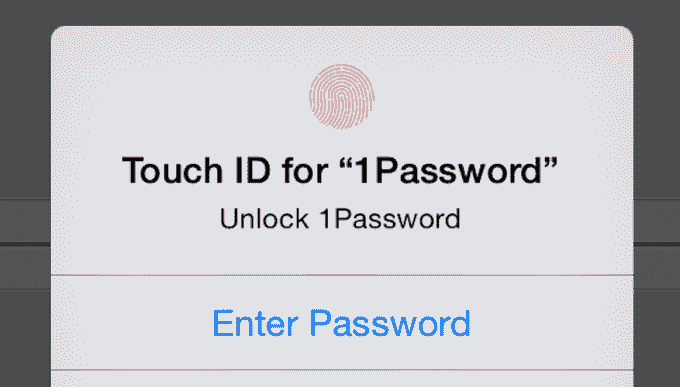
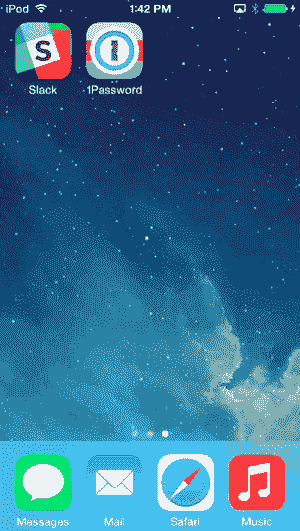

# 1Password 的 iOS 8 更新实现免费增值，为一些应用程序带来触控 ID 

> 原文：<https://web.archive.org/web/https://techcrunch.com/2014/09/17/1passwords-ios-8-update-goes-freemium-brings-touch-id-to-some-apps/>

# 1Password 的 iOS 8 更新实现免费增值，为一些应用程序带来触控 ID

[1 password](https://web.archive.org/web/20221225234719/https://agilebits.com/onepassword/ios),[应用程序，通过生成长而复杂的密码并让你通过自己选择的一个密码访问它们来保护你账户的安全](https://web.archive.org/web/20221225234719/https://itunes.apple.com/us/app/1password-password-manager/id568903335?mt=8&ign-mpt=uo%3D4)，今天在 iOS 8 上发布，并带来了触控 ID、某些应用程序的扩展(包括 Safari)和一个新的低起步价:免费。

iOS 免费密码，免费提供之前付费版本的所有功能。如果你是一个超级用户，现在有一些“专业”功能可用，比如“保险库”，让你可以将密码组织到可共享的组中，并支持更广泛的类别，包括你的银行，电子邮件，俱乐部会员，无线路由器，甚至软件许可证。如果您购买了 1Password 的早期版本，[当您获得 iOS 8 更新时，所有 Pro 功能都将可用。](https://web.archive.org/web/20221225234719/https://twitter.com/chartier/status/512294239993335808)

除了在 1Password 的浏览器和 Safari 中将所有密码置于触控 ID 之后之外，新版 iOS 8 还允许第三方开发人员通过 Apple 的新扩展功能将 1Password 集成到他们的应用程序中。本月早些时候的一篇 AgileBits 博客文章指出，希望在应用中利用 1Password 的开发人员目前可以使用以下功能:

*   将登录名、信用卡和身份信息填入 Safari
*   将登录信息填入其他支持它的第三方应用程序(包括网络浏览器)
*   在注册过程中生成强而唯一的密码并创建新的登录帐户
*   如果您在应用程序中更改了登录密码，请更新该密码

开发人员必须自己集成这些功能，因此您最喜爱的应用程序可能需要一段时间才能支持 1Password 的扩展。这里有一张 GIF 图片，展示了它在斯图尔特·巴特菲尔德流行的商业信息应用 [Slack](https://web.archive.org/web/20221225234719/https://slack.com/) 中的样子(没有使用触控 ID 登录):

