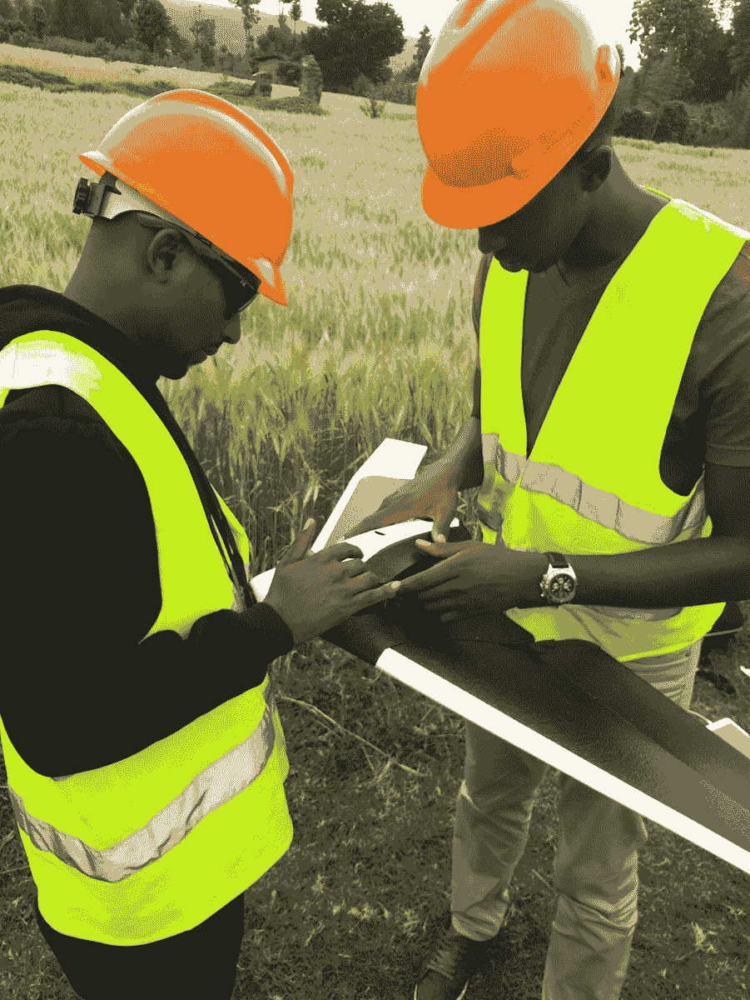
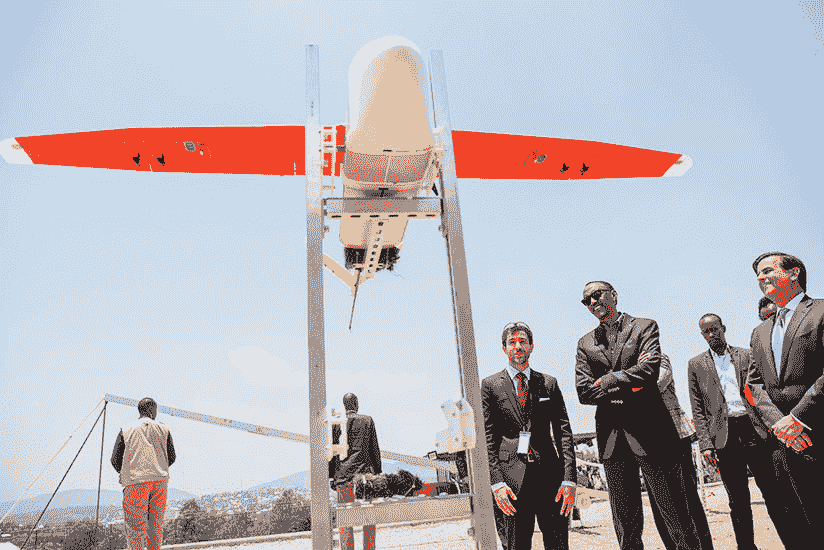

# 非洲的无人机技术实验可能会跨越数十年来对基础设施的忽视

> 原文：<https://web.archive.org/web/https://techcrunch.com/2018/09/16/african-experiments-with-drone-technologies-could-leapfrog-decades-of-infrastructure-neglect/200/>

More posts by this contributor

萨曼莎·斯坦撰稿人

More posts by this contributor

一场无人机革命即将降临撒哈拉以南非洲。

非洲各国都在试验这种 21 世纪的技术，以此来跨越几十年来对 20 世纪基础设施的忽视。

在过去的两年里，总部位于旧金山的初创公司 [Zipline](https://web.archive.org/web/20210207150829/https://www.crunchbase.com/organization/romotive) 在东非推出了一项全国无人机送货计划；南非通过商用无人机立法，对飞行员进行培训并发放执照；马拉维甚至向非洲及其全球合作伙伴开放了无人机测试走廊。

在卢旺达，该国政府今年早些时候成为首批采用基于性能的所有无人机法规的国家之一。该国不断进步的无人机项目引起了白宫和两位美国交通部长的特别关注。

一些专家认为，非洲的无人机空间可能有助于美国和全球其他地方的无人机发展。

商业无人机联盟的联合执行董事丽莎·埃尔曼说:“(全球无人机)公司可以在非洲运营并展示令人惊叹的用例……这是一个很大的好处。

**在非洲测试**

很明显，马拉维和卢旺达的无人机项目正受到国际无人机公司的关注。

2017 年开通， [马拉维的无人机测试走廊](https://web.archive.org/web/20210207150829/http://unicefstories.org/drones/malawi/) 一直在接受全球申请。该项目由中国民航局与联合国儿童基金会合作管理。

联合国儿童基金会在马拉维的无人机项目负责人 Michael Scheibenreif 表示，该项目的主要目的是为人道主义目的测试无人机，但“旨在为……政府……和其他合作伙伴……提供一个可控平台，以探索无人机如何帮助提供服务”。

纳入私营部门的决定为商用无人机打开了发射台。瑞典公司 [GLOBEHE](https://web.archive.org/web/20210207150829/http://www.globhe.com/) 已经使用该走廊进行了测试，中国电子商务公司 JD 的代表也参观了该网站。根据 Scheibenreif 的说法，在马拉维走廊进行测试的其他公司包括比利时无人机空中交通系统公司[Unifly](https://web.archive.org/web/20210207150829/https://www.crunchbase.com/organization/unifly)和美国送货无人机制造商[Vayu](https://web.archive.org/web/20210207150829/https://www.vayu.us/product/)。

虽然卢旺达政府最引人注目的是其高空滑索合作伙伴关系，但它正在为多个无人机演员制定一个国家测试计划。

信息技术和通信部(MiTEC)主任克劳地·艾瑞说:“我们不想把自己局限在一家运营商的范围内。

她说:“当我们开始使用 Zipline 的时候，它更像是一个试验，看看这是否可行。“随着我们越来越感兴趣，并扩大了该计划……这给了我们一个向其他无人机运营商开放的机会，并为我们当地的无人机运营商提供了空间。”

Irere 表示，已经有 16 家无人机运营商与卢旺达进行了接触，“其中一些是知名企业”，但由于临时保密协议，他们不能透露这些信息。她还特别提到了一家名为 [的卢旺达无人机公司，该公司使用了该国的测试项目，目前正在卢旺达国内外进行商业运营。](https://web.archive.org/web/20210207150829/http://charisuas.com/)

**无人机政策**

在过去的 5-7 年里，非洲商用无人机的历史主要被压缩到少数几个项目和国家。一些政府已经在无人机政策上跳出来。

2016 年，南非通过无人机立法，在该国 [民航局](https://web.archive.org/web/20210207150829/http://www.caa.co.za/Pages/RPAS/Remotely%20Piloted%20Aircraft%20Systems.aspx) 下监管该部门。该指南为商用无人机飞行员设定了培训要求，以获得遥控飞机系统的遥控飞行员执照(rpl)。根据最近的一份 [无人机报告](https://web.archive.org/web/20210207150829/https://www.rocketmine.com/state-of-drone-report-2018/) 显示，截至 2017 年底，南非已经注册了 686 架 rpl 和 663 架无人机系统。

在过去一年半的时间里 [肯尼亚](https://web.archive.org/web/20210207150829/https://www.capitalfm.co.ke/news/2018/03/kenya-publishes-rules-for-operating-drones/)[加纳](https://web.archive.org/web/20210207150829/http://3news.com/ghana-to-use-drones-to-deliver-essential-medicines-to-remote-areas-dr-bawumia/) 和坦桑尼亚已经发布或更新了无人机监管指南，并宣布了未来的无人机计划。

2018 年， 卢旺达通过了针对所有无人机的 [基于性能的法规](https://web.archive.org/web/20210207150829/https://innovator.news/rwanda-pioneers-drone-regulation-69a81b8264f9) ，扩大了其在无人机政策上的领导作用——卢旺达声称是世界上第一个这样做的国家。

那么这意味着什么呢？

世界经济论坛(World Economic Forum)民用无人机项目负责人蒂莫西·路透(Timothy Reuter)表示:“在基于性能的监管中，政府声明这是我们的安全门槛，而你们公司告诉我们，你们将使用技术和操作缓解措施的组合来满足它。”。

丽莎·埃尔曼也有类似的解释。

她说，“政府不会说‘你必须使用这种技术来停止你的无人机’，他们会说，‘你的无人机需要能够在这么多秒内停止’”。

根据埃尔曼的说法，这给了无人机操作员围绕性能目标制造无人机的灵活性，而不是“规定需要某种类型的技术”。

据 MiTEC 的克劳地·伊雷雷称，卢旺达仍在努力实施基于绩效的法规。他们与世界经济论坛建立了合作伙伴关系，以进一步发展最佳实践。卢旺达也将很快发布一个在线门户网站，供全球无人机运营商申请在那里测试。

至于卢旺达是第一个发布基于绩效的法规的国家，这是有争议的。“世界上许多国家都在为无人驾驶飞机制定和实施基于性能的法规，”国际民航局遥控飞机系统项目经理莱斯利·卡里说。“国际民航组织没有监测所有这些国家，以确定哪一个是第一，”她补充说。

世界经济论坛民用无人机项目负责人蒂莫西·路透表示，其他国家的政府已经对卢旺达的无人机政策做了一些调整。“但正如目前在卢旺达所写的，这是世界上最广泛的基于绩效的法规的实施。”

**商业用例**

随着非洲无人机项目的成熟，有一些很好的例子和几个项目值得关注。

【Zipline 是撒哈拉以南非洲最强大、最引人注目的无人机使用案例。

虽然这家初创公司的主要重点是运送关键医疗用品，但高管们一再强调，Zipline 是一家盈利性企业，得到了风险投资公司[【4100 万美元】](https://web.archive.org/web/20210207150829/https://www.crunchbase.com/organization/romotive) 的支持。

这家总部位于旧金山的机器人公司也生产自己的无人机，是卢旺达政府最早的无人机合作伙伴之一。

滑索演示

联盟还将 UPS 和 UPS 基金会纳入其中，后者为 Zipline 提供财务和物流支持。

经过几轮测试，Zipline 于 10 月份上线了程序，成为全球首个规模化的国家无人机送货计划。

“自那以后，我们已经完成了 6000 多次送货，记录了 500，000 公里的飞行里程，”Zipline 的联合创始人 Keenan Wyrobek 告诉 TechCrunch。“我们计划很快在坦桑尼亚上线，并与其他一些非洲国家进行交流。”

今年 5 月，Zipline 被美国交通部的无人驾驶飞机系统集成试点项目([【UAS】](https://web.archive.org/web/20210207150829/https://www.faa.gov/uas/programs_partnerships/uas_integration_pilot_program/))接受。在 149 名申请者中，这家专注于非洲的初创公司是 10 家被选中参加美国无人机试点的公司之一——在北卡罗来纳州的视觉视线之外运营医疗交付服务。

在一个非交付商业用例中，南非的 [Rocketmine](https://web.archive.org/web/20210207150829/https://www.rocketmine.com/) 已经在 5 个国家开展了无人机勘测业务。该公司希望在 2018 年为其在采矿、农业、林业和土木工程领域的“航空数据解决方案”服务预订 200 万美元的收入。

Rocketmine 首席执行官克里斯托弗·克拉克(Christopher Clark)告诉 TechCrunch:“我们现在有 50 多架飞机，而几年前只有 15 架。"我们在南非、纳米比亚、加纳、象牙海岸开展业务，并进军墨西哥."

Rocketmine 不打算进入送货服务，但正在寻求扩展到监控和安全市场。“经过市场调查，这可能是我们从客户那里得到的最大要求，”克拉克说。

更多的非洲用例可能来自于 [维多利亚湖挑战赛](https://web.archive.org/web/20210207150829/https://www.lakevictoriachallenge.org/challenge/)——一项在坦桑尼亚姆万扎测试走廊举行的特定任务无人机操作员挑战赛。[we robotics](https://web.archive.org/web/20210207150829/https://werobotics.org/)还在肯尼亚、坦桑尼亚和贝宁开设了飞行实验室。据报道，赞比亚政府正在与索尼的 Aerosense 合作开展无人机送货试点项目。

**非洲和全球无人机**

随着欧洲、亚洲和美国迅速制定无人机法规和测试(或已经运行)交付计划(见 [中国 JD.com](https://web.archive.org/web/20210207150829/https://www.bloomberg.com/news/features/2018-07-03/china-s-on-the-fast-track-to-making-uav-drone-deliveries))，非洲可能不会独霸全球无人机发展的领导者地位——但这些地区(和经济体)所代表的特别具有挑战性的环境中的这些试点项目将塑造无人机行业的发展。

非洲大陆的测试项目——特别是卢旺达基于性能的无人机法规——可能会以更快的速度推进视觉视线之外的无人机技术。这可能为更快开发用于远程互联网接入、商业和医疗交付的自动化无人机队奠定基础，甚至让非洲在测试自动驾驶出租车方面处于领先地位。

WEF 路透社称:“有了无人机，非洲愿意更快地采取更大胆的措施，因为好处就在那里，而且这些国家愿意以更敏捷的方式围绕监管采取行动。”。

他说:“非洲有机会保持其在这一领域的领导地位。“但这些国家需要愿意承担适当的风险，让科技公司能够在那里部署他们的解决方案。”

路透社还强调了“起源于非洲的无人机公司越来越多地开发服务”的潜力

Zipline 已经出现了这种情况。虽然成立于加利福尼亚州，但这家初创公司在卢旺达磨练了其无人机和送货模式。

Zipline 的联合创始人 Keenan Wyrobek 说:“我们绝对会利用我们在非洲积累的经验，现在我们正通过 UAS·IPP 计划在美国进行测试。