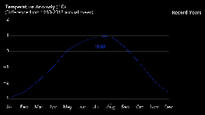

# 2016 年是有记录以来最热的一年 NASA 如何测量地球的温度 

> 原文：<https://web.archive.org/web/https://techcrunch.com/2017/01/18/2016-is-the-new-hottest-year-on-record-how-nasa-takes-the-planets-temperature/>

美国宇航局[周三宣布](https://web.archive.org/web/20230128092346/https://www.nasa.gov/press-release/nasa-noaa-data-show-2016-warmest-year-on-record-globally)2016 年，地球经历了现代史上最热的地表温度。美国国家海洋和大气管理局的独立分析得出了同样的结论。这是地球连续第三年经历创纪录的高温。

这些创纪录的年份是令人担忧的全球气温长期上升趋势的一部分。事实上，有记录以来的 17 个最热年份中，有 16 个发生在 2001 年以后。

> “2016 年是这个系列中连续第三个创纪录的年份。我们不指望每年都有创纪录的年份，但持续的长期变暖趋势是明确的。”Gavin Schmidt，戈达德空间研究所所长

从 1880 年至今的全球月平均气温/美国宇航局/地球天文台 Joshua Stevens 提供

那么 NASA 是如何测量地球温度的呢？

首先，美国宇航局下面的全球温度视频(你可能已经看过任何关于气候变化的文章)是基于在陆地、海洋和南极洲设置的超过 6000 个传感器的网络。

[https://web.archive.org/web/20230128092346if_/https://www.youtube.com/embed/s3RWTTtPg8E?feature=oembed](https://web.archive.org/web/20230128092346if_/https://www.youtube.com/embed/s3RWTTtPg8E?feature=oembed)

视频

> 上面的动画用红色显示高于平均温度的温度，用蓝色显示低于平均温度的温度。地图本身并没有显示温度。这就是为什么两极比赤道更红的原因。多项[研究](https://web.archive.org/web/20230128092346/http://www.npr.org/2014/12/18/371438087/arctic-is-warming-twice-as-fast-as-world-average)表明，由于多种因素，包括融化的冰盖对反射(而不是吸收)阳光能力的放大效应，两极变暖的速度是地球其他地区的两倍。

美国宇航局戈达德太空研究所所长加文·施密特博士详细阐述了这个话题，他告诉 TechCrunch，除了庞大的传感器网络，美国宇航局还利用地球观测卫星系统来获得气候的全貌。

> “我们需要许多额外的信息来源，以便能够将这些变化联系起来。我们使用 GRACE 卫星跟踪冰盖的质量损失，使用 JASON2/3 跟踪海平面上升，使用 CloudSat 和 Calypso 跟踪云层的变化，使用 TRMM 和 GPM 跟踪降雨量的变化，使用 SSMI 跟踪海冰范围等。”Gavin Schmidt，戈达德空间研究所所长

美国宇航局的地球观测卫星网络/图片由美国宇航局提供

同样值得注意的是，2015 年和 2016 年创纪录年份的气温因一种称为厄尔尼诺的天气模式而加剧。厄尔尼诺是最广为人知的气候模式之一，每三到七年发生一次。在厄尔尼诺年，会发生很多事情。例如，世界上的一些地区将经历高于平均水平的降雨量，而其他地区将经历更加极端的干旱。

厄尔尼诺还会导致太平洋的温度比平均温度高出三到五度。正因为如此，一些人(包括美国[众议院科学、空间和技术委员会](https://web.archive.org/web/20230128092346/https://twitter.com/HouseScience/status/804402881982066688))不准确地报告说，如果没有厄尔尼诺，就没有理由担心。

相反，研究人员估计厄尔尼诺只会使 2016 年全球气温*上升 0.2 华氏度。客观地说:*

*   2014 年最初是有记录以来最热的一年，全球平均表面温度比 19 世纪末的平均温度高 1.4 华氏度
*   2015 年取代 2014 年成为有记录以来最热的一年，全球平均表面温度比 19 世纪末的平均温度高 1.8 华氏度
*   2016 年是有记录以来最热的一年，全球平均表面温度比 19 世纪末的平均温度高 2 华氏度

因此，即使没有厄尔尼诺 0.2 华氏度的影响，2016 年仍将是有史以来最热的三年之一。

> 厄尔尼诺或拉尼娜等现象会使热带太平洋上层变暖或变冷，并导致全球风和天气模式的相应变化，从而导致全球平均温度的短期变化美国宇航局新闻办公室

这一消息是在新总统就职前几天发布的——这是一个以淡化气候变化影响(或完全忽视其存在)而闻名的政府。

唐纳德·特朗普的高级顾问鲍勃·沃克(Bob Walker)和彼得·纳瓦罗(Peter Navarro)在《太空新闻》(Space News)的一篇专栏文章中写道，“美国宇航局应该主要关注深空活动，而不是以地球为中心的工作。”他们认为气候科学应该由其他机构来处理。

在[《卫报》](https://web.archive.org/web/20230128092346/https://www.theguardian.com/environment/2016/nov/22/nasa-earth-donald-trump-eliminate-climate-change-research)的另一次采访中，沃克解释说，当选总统川普将取消美国国家航空航天局进行的所有气候变化研究，以打击“政治化的科学”

随着地球继续变暖，新政府上台，许多人将关注政策变化，这些变化可能会影响我们监测地球气候的能力。