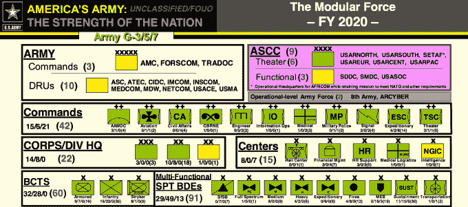
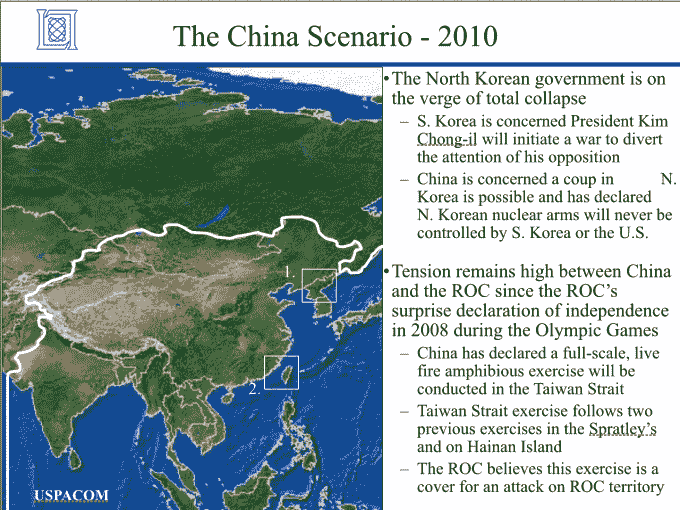

# ISIS“网络哈里发”黑客入侵美国军事指挥部账户——第 202 页

> 原文：<https://web.archive.org/web/https://techcrunch.com/2015/01/12/cyber-caliphate/202/>

网络哈里发，一个声称与恐怖组织 ISIS 有关联的黑客组织，今天控制了代表[美国中央军事指挥部](https://web.archive.org/web/20190315191635/http://www.centcom.mil/)的 [@CENTCOM Twitter](https://web.archive.org/web/20190315191635/https://twitter.com/) 和 [YouTube 账户](https://web.archive.org/web/20190315191635/https://www.youtube.com/user/centcom)。

黑客们在推特上发布了一条名为“五角大楼网络被黑”的信息。美国士兵，我们来了，小心背后。ISIS。#网络帝国”。该邮件包括据称是机密的美国陆军文件的链接，尽管有迹象表明这些文件中的一些可能已经公开或不是高度机密的。

即使只有中央司令部的社交账户被侵入，也显示了美国政府网络安全的糟糕状况。如果黑客能够访问机密文件，这可能表明 ISIS 是一个比一些人预期的更可怕的网络对手。

政治记者 Hadas Gold 在太平洋标准时间上午 9:46 发推文称“Twitter spox 告诉我他们已经知道了 Centcom hack，并正在处理中”。

**太平洋标准时间上午 10:05 更新** : Twitter 现已移除@CENTCOM 的个人资料图片和封面图片。

**太平洋标准时间上午 10:10 更新** : Twitter 已暂停@CENTCOM 账户。

**太平洋标准时间**上午 10:15 更新:据报道，一名国防官员已经向融合记者 Brett LoGiurato，[证实了这些攻击，Brett LoGiurato 在推特上写道](https://web.archive.org/web/20190315191635/https://twitter.com/BrettLoGiurato/status/554702274111746049)“国防官员:“我们可以确认，美国中央司令部推特账户今天早些时候遭到了攻击。"

**太平洋标准时间上午 10:35 更新** : YouTube 已经暂停了 CENTCOM 被黑的 YouTube 账户。

**太平洋标准时间上午 11:55 更新** : The Next Web 的马特·纳瓦拉在推特上写道“五角大楼要求我们协助解决一个账户安全问题，我们正在与他们合作解决这个问题——[**@ Twitter**](https://web.archive.org/web/20190315191635/https://twitter.com/twitter)”

在被关闭之前，被黑的@CENTCOM 账户发推文说:

上周，网络哈里发声称控制了田纳西州福克斯和 CBS 新闻的美国媒体子公司。

在 [Pastebin](https://web.archive.org/web/20190315191635/http://pastebin.com/Y2spP7y9) 上留下的匿名文字帖子中，攻击者写道:

> “以最仁慈、最仁慈的真主的名义，伊斯兰国支持下的网络帝国继续其网络圣战。当美国及其卫星杀害我们在叙利亚、伊拉克和阿富汗的兄弟时，我们侵入了你们的网络和个人设备，了解了你们的一切。
> 
> 你会看到没有怜悯异教徒。ISIS 已经在这里了，我们在你们的电脑里，在每个军事基地里。在真主的允许下，我们现在在中央司令部。我们不会停下来的！我们知道你的一切，你的妻子和孩子。美国士兵！我们在看着你！
> 
> 以下是来自您移动设备的部分机密数据:
> 
> [链接已编辑]
> 
> 除了安拉没有别的神，穆罕默德是他的先知！除了伊斯兰教法没有法律！"

经过编辑的链接指向声称包括“美国陆军军官名单”、“美国陆军预算”、“美国陆军部队”等内容的文件。我们目前正在查看这些文件，以确定它们是否已经在其他地方发表过。有报道称，这些文件中的许多已经可以获得。华尔街日报[发推文](https://web.archive.org/web/20190315191635/https://twitter.com/wsj/status/554713621243367424)“五角大楼高级官员称黑客在推特上发布的信息似乎不是高度机密”。

下面是一个自称是“陆军 2020 领袖书”的文件截图:

另一个据说显示了陆军希望其战役在未来 10 年如何发展:

这张来自“战争场景”文件的图片据称显示了美国利用印度作为基地来应对中东和中国同时发生的冲突的计划。然而，这些文件是 2004 年、2005 年和 2008 年的。战争场景文件夹包括名为“中国场景 IPB 和收集需求”、“朝鲜更新”、“里海场景”、“SOCOM 非洲场景”和“SOCOM 印尼场景”的文件。

[Fortinet](https://web.archive.org/web/20190315191635/http://www.fortinet.com/) 的 FortiGuard 实验室的安全策略师 Richard Henderson 告诉 TechCrunch，“与近年来许多备受瞩目的社交媒体违规事件一样，这次攻击很可能是有针对性的鱼叉式网络钓鱼攻击的结果，目的是获取社交媒体凭据或发送提供远程访问的恶意软件。”

亨德森说，如果机密文件被泄露，“老鼠式的恶意软件攻击，允许文件的渗透”可能是负责任的。他表示，像这样的攻击是“叙利亚电子军队的面包和黄油”，任何重要的公司或政府机构都应该使用双重身份认证和单独的社交媒体计算机来防止这种黑客行为。

ISIS 的袭击表明，美国可能需要大幅加强网络安全，因为它面临着来自世界各地越来越多的威胁。在来自朝鲜等国家的国家支持的黑客和独立的恐怖组织之间，瞄准美国的网络士兵比以往任何时候都多。

更尴尬的是，攻击发生在同一[时刻](https://web.archive.org/web/20190315191635/http://www.whitehouse.gov/schedule/complete)，巴拉克·欧巴马总统正在向联邦贸易委员会发表关于……网络安全重要性的演讲。