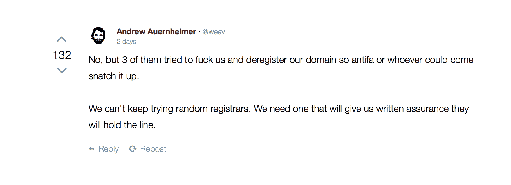
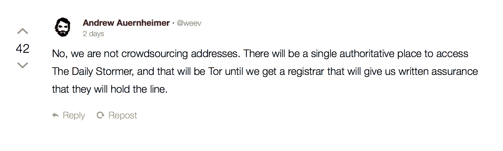

# 《每日风暴》已经正式退居黑暗网络——第 205 页——tech crunch

> 原文：<https://web.archive.org/web/https://techcrunch.com/2017/08/24/daily-stormer-has-officially-retreated-to-the-dark-web/205/>

# 每日风暴已经正式撤退到黑暗之网

**更新**:《每日风暴》在 punishedstormer.com 的另一个网址下至少暂时恢复了在线状态。现在它又被禁止了。

与《每日风暴》的斗争以退却告终，因为种族主义网站已经退回到黑暗的网络中，只能通过 Tor 获得。前灰帽黑客安德鲁·奥伦海默在右上方的网站 Gab 上宣布了这一决定的动力。

该网站现在可以通过洋葱浏览器等工具访问，地址可在[维基百科](https://web.archive.org/web/20200113000856/https://en.wikipedia.org/wiki/The_Daily_Stormer)上找到。该服务器现在对所有的注册商和主机提供商都是隐藏的，它可能存在于任何地方，而且没有明确的方法来判断是否有任何一家公司在托管该网站。

简而言之，普通用户很难访问每日风暴，但是如果没有类似丝绸之路的干预和跟踪，关闭它几乎是不可能的。

[GoDaddy](https://web.archive.org/web/20200113000856/https://beta.techcrunch.com/2017/08/13/godaddy-tells-white-supremacist-site-daily-stormer-to-find-a-new-domain-provider/) 、[name fleet](https://web.archive.org/web/20200113000856/https://beta.techcrunch.com/2017/08/20/the-daily-stormer-was-back-online-for-a-quick-second/)、 [Cloudflare](https://web.archive.org/web/20200113000856/https://beta.techcrunch.com/2017/08/16/digital-ocean-and-cloudflare-ditch-neo-nazi-client-the-daily-stormer/) 、SendGrid 和 [Google](https://web.archive.org/web/20200113000856/https://beta.techcrunch.com/2017/08/14/google-daily-stormer-domain/) 的管理员在夏洛特维尔的 alt-right 抗议后放弃了该网站。对每日风暴服务提供者的追捕始于一名右翼抗议者谋杀希瑟·哈耶之后。

Tor 项目的一名发言人上周指出，虽然它不支持每日风暴，但它的工具是为所有希望自由交流的人准备的。

“我们对这些种族主义者的所作所为感到厌恶、愤怒和震惊。每当 Tor 网络和软件被用于邪恶目的时，我们都会有这种感觉。但是，如果我们也控制使用这些工具的人，我们就不能建立保护记者、人权活动家和世界各地普通人的自由和开放源码工具。Tor 旨在保护人权和隐私，防止任何人审查东西，包括我们，”管理员 Steph 写道。“托尔反对种族主义和偏见，无论何时何地，这种仇恨都会抬头。我们的工作是为每个人提供尽可能好的安全和隐私工具，从而在全世界促进人类尊严和自由。”