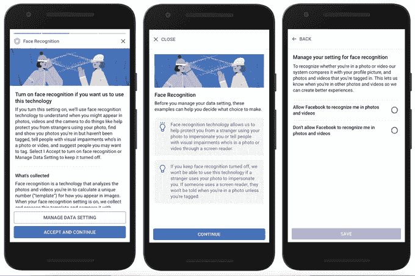
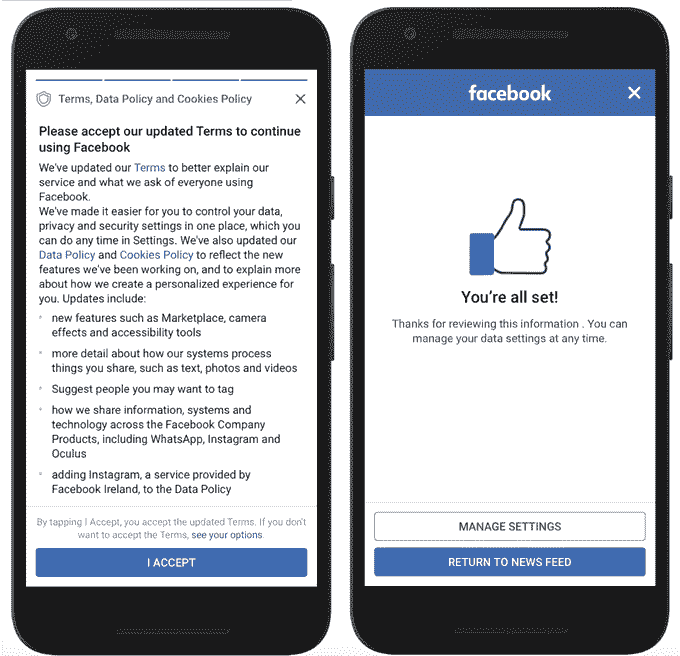
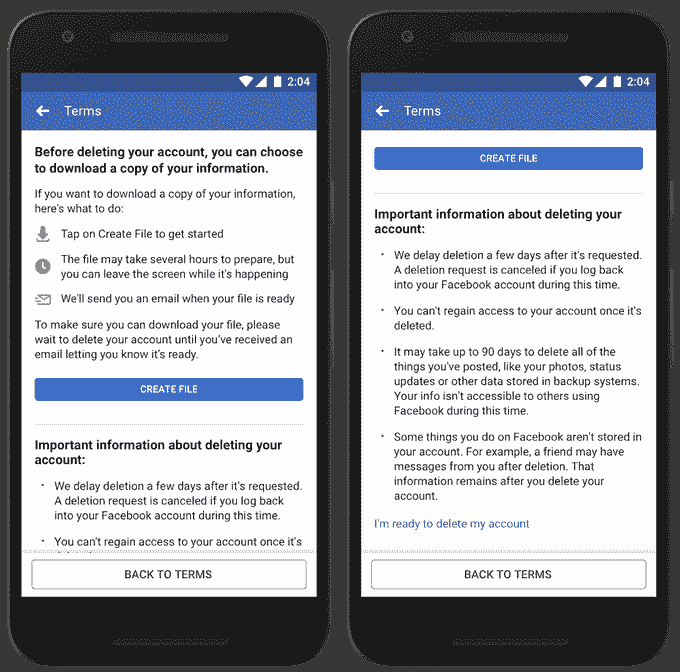
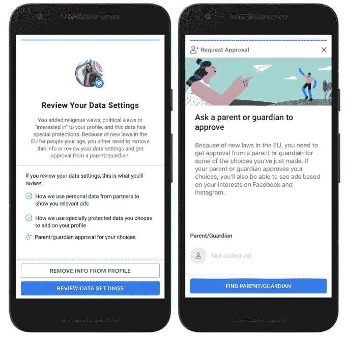
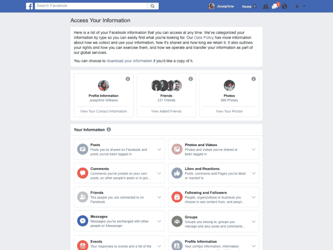
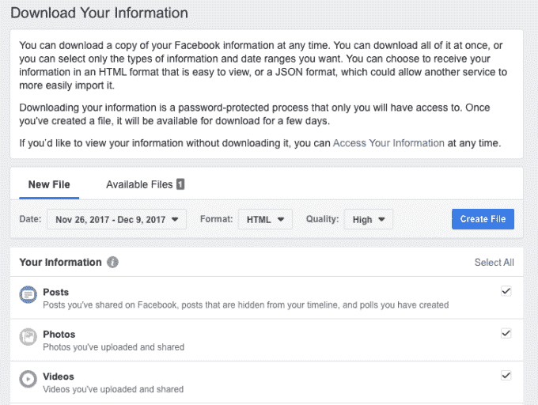

# 脸书新 GDPR 隐私变化的详细指南——226 页

> 原文：<https://web.archive.org/web/https://techcrunch.com/2018/04/17/facebook-gdpr-changes/226/>

脸书即将通过同意其新的 [GDPR 隐私法](https://web.archive.org/web/20190825042508/https://techcrunch.com/2018/01/20/wtf-is-gdpr/)合规变更，开始推动欧洲用户加快速度。它将要求人们审查脸书如何应用来自网络的数据向他们投放广告，并披露他们共享的敏感个人资料信息。[脸书](https://web.archive.org/web/20190825042508/https://crunchbase.com/organization/facebook) 也将允许欧洲和加拿大用户开启面部识别功能，此前该功能在那里被屏蔽了六年。但是，脸书的设计鼓励快速点击“同意”按钮，缺乏精细的控制，为青少年提供可笑的可欺骗的父母同意请求，并对下载你的信息进行美学改造，不会使切换社交网络变得更容易，这表明它仍然渴望你的数据。

新的隐私变化和[服务条款同意流程](https://web.archive.org/web/20190825042508/http://newsroom.fb.com/news/2018/04/new-privacy-protections/)将于本周开始向欧洲用户显示，尽管他们现在可以忽略它——尽管脸书发誓要在欧洲坚持的[5 月 25 日 GDPR 合规期限](https://web.archive.org/web/20190825042508/https://techcrunch.com/2018/04/04/zuckerberg-gdpr/)即将到来。与此同时，脸书表示，它将在未来几周和几个月内在全球范围内推出这些变化和同意流程，但会有一些轻微的地区差异。最后，全世界所有分享敏感信息的青少年都将不得不通过新的薄弱的家长同意流程。

今天，脸书带了一组记者来到位于门洛帕克总部的新大楼 23，预览这些变化。但是当记者们质问脸书的副首席隐私官 Rob Sherman 时，反馈是非常关键的。问题集中在脸书如何使接受更新比审查或更改更新更容易，但谢尔曼坚持谈论给予用户选择和信息的重要性。

“信任真的很重要，很明显，要重新赢得人们对我们服务的信任，我们还有很多工作要做，”他说，让我们对马克·扎克伯格在国会的证词有种似曾相识的感觉。“我们知道，如果人们觉得自己的信息没有得到保护，他们就不会放心使用脸书。”

## 脸书隐私同意流程的每一步都有麻烦

有大量的小变化，所以我们将列出我们的批评。

脸书的同意流程开始得很好，上面的屏幕提供了一个坚实的概述，说明它为什么要为 GDPR 做出改变，以及您将审查什么。但是，由于顶部只有一个“X”来退出，它已经训练用户通过点击底部的蓝色大按钮来加快速度。

—

### 敏感信息

首先是控制你的敏感个人资料，特别是你的性取向、宗教观点和政治观点。正如你将在每一步看到的，无论你是否已经浏览了信息，你都可以点击漂亮的蓝色“接受并继续”按钮。如果你点击难看的灰色“管理数据设置”按钮，你必须通过一个间隙，在那里脸书试图阻止你删除信息，然后让你做出并保存你的选择。很明显，它的设计是为了让用户轻松通过，不提供继续的阻力，但如果你想做些改变，就会有摩擦。

脸书不让广告商根据这些敏感信息锁定你，这很好。唯一的例外是，在美国，政治观点以及你与之互动的政治页面和事件会影响你最重要的个性类别，这些类别可以成为广告的目标。你也可以选择不被那些人盯上。但你唯一的选择是要么删除你在这些类别中分享的任何信息，让朋友看不到，要么允许脸书使用它来个性化网站。没有选项可以将这些内容保留在您的个人资料中，但不让脸书使用。

—

### 面部识别

脸书正将面部识别技术带回欧洲和加拿大。负责监管欧盟的爱尔兰数据保护专员于 2012 年禁止了它。这些国家的用户将有机会打开它，如果他们快速通过，这是默认设置。这是一个有用的功能，可以确保人们知道他们的照片到处浮动。但是这里缺乏粒度是值得关注的。用户可能希望在他们的个人资料照片中看到关于可能的冒名顶替者的警告，但不建议他们在朋友的照片中添加标签。不幸的是，要么全有，要么全无。尽管脸书让开关完全变得简单是正确的，但为那些想要的人展现出来的精细控制会更有力量。

[更新:这篇文章已经更新，以反映脸书确实可以在欧洲和加拿大提供面部识别。]

—

### 网络上的数据收集

扎克伯格的证词引发的一个主要问题是，脸书如何利用从网络上收集的关于你的数据，向用户投放广告并优化其服务。虽然谢尔曼附和扎克伯格说，用户告诉公司他们更喜欢相关的广告，这些数据可以帮助挫败黑客和抓取者，但许多用户对场外收集做法感到不安。在这里，脸书让你阻止它根据你在显示其喜欢和分享按钮、转换像素或观众网络广告的网站上的浏览行为数据向你投放广告。问题是，没有办法阻止脸书使用这些数据来个性化你的新闻订阅或优化其服务的其他部分。

—

### 新的服务条款

脸书最近[重写了服务条款和数据使用政策](https://web.archive.org/web/20190825042508/https://techcrunch.com/2018/04/04/facebook-terms-of-service/)，使其更加清晰易读。除了指出该政策现在适用于其子公司 Instagram 和 Messenger 之外，它没有做出任何重大改变。【更正:但是 WhatsApp 和 Oculus 有自己的数据政策。]这里都解释清楚了，挺好的。

但事实上，拒绝新服务条款的按钮甚至不是一个按钮，而是一个小小的“查看你的选项”超链接，这表明脸书多么希望避免你关闭账户。当脸书的 GDPR 流程产品设计师被问及她是否认为这个超链接是展示“我接受”大按钮的最佳方式时，她不真诚地说是的，引来了记者们的嘲笑。似乎很明显，脸书正试图最小化帐户删除路径的可见性，而不是让它成为一个明显的行动过程，如果你不同意它的条款。

我要求脸书给我们展示一下那个小小的“看你的选择”链接的另一边是什么，这就是我们得到的。首先，脸书没有提到它的临时停用选项，只是可怕的永久删除选项。脸书建议在删除你的账户之前下载你的数据，你应该这样做。但是你必须等待(通常是几个小时)才能下载你的数据，这一事实可能会促使用户推迟删除，也许永远不会恢复。只有你不断滚动，你才能看到另一个微小的“我准备删除我的账户”超链接，而不是一个真正的按钮。

—

### 父母同意

GDPR 还实施了关于青少年待遇的新规定，特别是 13 岁(注册脸书的最低年龄)到 15 岁之间的用户。如果这个年龄段的用户分享了他们的宗教观点、政治观点或性取向，脸书要求他们要么删除，要么得到父母的同意才能保留。他们还需要获得许可，才能投放基于脸书合作伙伴数据的广告。没有这个许可，他们将会看到一个不那么个性化的脸书。但是获得和验证父母同意的系统是一个笑话。

用户只需选择他们的一个脸书朋友或输入一个电子邮件地址，这个人就会被要求同意他们的“孩子”分享敏感信息。但脸书盲目地相信他们实际上已经选择了他们的父母或监护人，尽管它有一个让用户指定他们的家人是谁的功能，孩子可以在电子邮件栏中输入任何人，包括他们控制的备用地址。谢尔曼说，脸书“不寻求收集额外的信息”来核实父母的同意，所以脸书似乎很乐意让青少年轻松绕过体检。

—

### 隐私快捷方式

为了让所有用户都能及时了解他们的隐私设置，脸书重新设计了隐私快捷方式，采用了与众不同的彩色格式。这里没有抱怨。

—

### 下载您的信息

在过去八年保持基本不变后，脸书完全重新设计了它的下载信息工具。您现在可以在不同类别中查看您的内容和数据，而无需下载，这与新的隐私快捷方式一起，可能是今天发布的产品中唯一明确积极且没有问题的变化。

脸书现在允许你选择某些类别的数据，日期范围，JSON 或 HTML 格式和图像质量来下载。例如，如果你只需要某一类型内容的副本，但不需要导出你所有的照片和视频，这可能会更快更容易。谢天谢地，脸书说你现在可以用比旧工具更高的分辨率下载你的媒体了。

但这里的大问题是我本周关于脸书缺乏数据可移植性的专题文章的主题。下载你的信息工具应该让你带着你的数据去一个不同的社交网络。但它只导出你的社交图，也就是你的朋友，作为名字的文本列表。没有链接，用户名或其他唯一的标识符，除非朋友选择让你导出他们的电子邮件或电话号码(只有 4%的朋友这样做)，所以祝你好运，在另一个应用程序上找到合适的约翰·史密斯。新版的下载你的信息导出了同样的旧名单，而不是提供任何可以让你在别处找到你的朋友的可互操作的格式。

## 更高的标准

总的来说，脸书似乎遵守了 GDPR 法律的条文，但精神上却有问题。当然，隐私对很多人来说很无聊。信息太少，他们感到困惑和害怕。太多的选择和屏幕让他们感到不知所措和烦恼。脸书在这里的一些地方取得了恰当的平衡。但是，这些巧妙的、咄咄逼人的设计似乎意在引导人们不要以可能妨碍脸书使命和业务的方式改变他们的违约。

使选择在可见的权重上相等，而不是在灰色的按钮和微小的链接中隐藏做出改变的方法，会更加公平。这也表明了脸书对它所提供的价值有信心，这样用户就会留下来，如果他们真的想的话，就让功能保持启用状态。

当被问及这一点时，谢尔曼将矛头指向了其他科技公司，称他认为脸书对用户更坦诚。当被问及他是否认为脸书的方法“更好”时，他说“我认为那是对的”但脸书并没有被行业标准所评判，因为它不是一家标准公司。它把自己的目的和业务建立在我们的私人数据之上，并标榜自己是世界的福音。但当被要求为隐私清除更高的障碍时，脸书钻研了防止丢失我们数据的设计技巧。