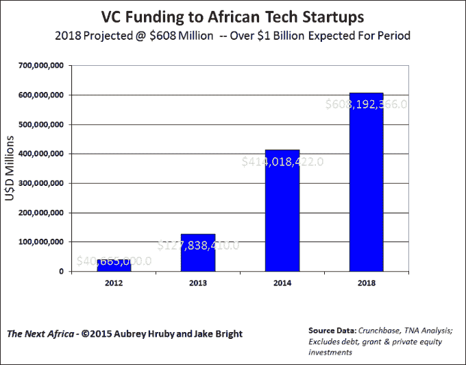
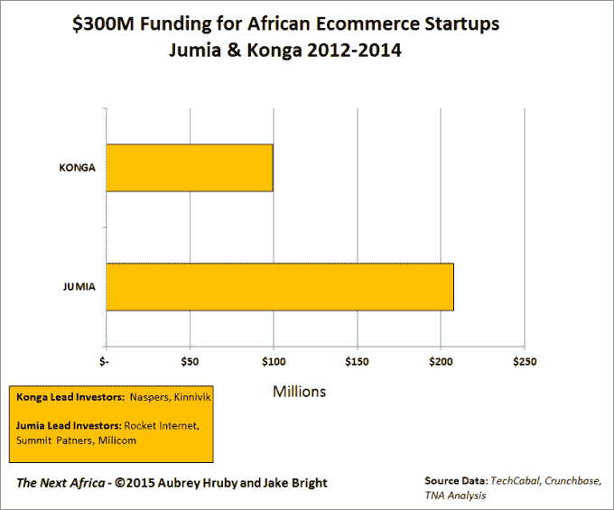

# 硅草原的崛起和非洲的科技运动——第 235 页

> 原文：<https://web.archive.org/web/https://techcrunch.com/2015/07/23/the-rise-of-silicon-savannah-and-africas-tech-movement/235/>

More posts by this contributor

奥巴马总统将在肯尼亚主持全球创业峰会，科技将是他的议程之一，互联网先驱史蒂夫·凯斯和 Airbnb 首席执行官布莱恩·切斯基也将出席。

尽管还处于萌芽状态，撒哈拉以南非洲(SSA)确实有一个充满希望的科技行业——越来越多的企业家、初创公司和创新中心在国与国之间融合。*

肯尼亚现在是公认的信息技术中心。脸书最近在欧洲大陆扩张。从南非到尼日利亚，硅谷风险投资正在向风险企业注入资金。

随着非洲萌芽的科技文化和生态系统的出现，这些碎片正在融合在一起。

**硅草原的崛起**

大多数关于非洲科技运动起源的讨论都可以追溯到肯尼亚。从 2007 年到 2010 年，环境、巧合和有远见的个人共同创造了四个标志，激发了这个国家的硅萨凡纳绰号:

*   移动货币，
*   一个全球众包应用，
*   非洲的科技孵化器模式；和
*   政府对信息和通信技术政策的真正承诺。

2007 年，肯尼亚电信公司 [Safaricom](https://web.archive.org/web/20191112221049/http://www.safaricom.co.ke/) 向一个缺乏零售银行基础设施但拥有大量手机用户的市场推出了其 [M-PESA](https://web.archive.org/web/20191112221049/http://www.safaricom.co.ke/personal/m-pesa) 移动货币服务。该产品甚至可以将最基本的手机转换成漫游银行账户和转账设备。

两年之内，M-PESA 赢得了近 600 万客户，每年转账数十亿美元，赢得了国际科技奖。移动货币服务塑造了非洲大陆最受认可的技术跨越的例子:让没有银行账户的普通非洲人超越传统的实体金融，进入数字经济。

在 M-PESA 到来后不久，肯尼亚的政治事件激发了非洲第一个全球认可的应用程序的创建， [Ushahidi](https://web.archive.org/web/20191112221049/http://www.ushahidi.com/) 。2007 年末，四位技术专家——Erik Hersman(一位在肯尼亚长大的美国人)、活动家 Ory Okolloh、IT 博客作者 Juliana Rotich 和程序员 David Kobia——联手研究如何平息因总统选举无结果而引发的零星暴力事件。

> 尽管硅大草原已经变得引人注目，但它只是非洲科技运动的一个角落。

在三天的时间里，技术人员开发出了 Ushahidi 应用程序(在斯瓦希里语中是“目击者”的意思)，以数字方式快速公开跟踪肯尼亚选举危机期间爆发的暴力事件。

发展起来的 Ushahidi 软件成为了一个高效的数字化人口事件绘图工具。随着肯尼亚恢复稳定，来自世界各地的请求将 Ushahidi 用于其他目的。到 2008 年底，这款应用已经成为国际科技公司 Ushahidi，目前在 20 多个国家拥有多个应用。

此后不久，埃里克·赫斯曼将刺激非洲创新中心运动的想法具体化。他在发给其他技术人员的博客中写道，非洲技术需要的是“永久的社区空间”。中心……在主要城市，重点是年轻的企业家。。。。一部分是开放的社区工作空间(共同工作)，一部分是投资者和风险投资中心，一部分是创意孵化器。技术专家、投资者和科技公司的连接点。”

这些交流在内罗毕现在的非洲 IT 同义语恩贡路上孵化了 iHub 创新中心。自 2010 年以来，已经有 152 家公司脱离了 iHub。它有 15，000 名成员，每天都有无数年轻的肯尼亚人在它的实验室工作，并与全球技术专家互动，如雅虎首席执行官玛丽莎·梅耶尔(一位前演讲者)。iHub 引发了非洲创新中心运动，激发了整个非洲大陆科技中心的热潮。

完成硅萨凡纳标志 M-PESA，iHub 和 Ushahidi 的是完成了[团队](https://web.archive.org/web/20191112221049/http://www.teams.co.ke/)海底光缆，它在 2010 年抵达蒙巴萨，并大大增加了东非的宽带。

该项目在很大程度上是肯尼亚当时的信息和通信部常务秘书 Bitange Ndemo 的愿景，他看到了“发展肯尼亚的信息通信技术(ICT)基础设施，使该国成为区域 ICT 中心”的好处。他在 2006 年制定的 ICT 总体规划最终成为肯尼亚政府对 ICT 政策坚定承诺的模板。到 2013 年，肯尼亚组建了自己的全员信通技术管理局。

**非洲新兴科技景观**

尽管硅大草原已经变得引人注目，但它只是非洲科技运动的一个角落。在整个 SSA，新的硅大草原正在形成，萌芽中的 SSA IT 生态系统的组件正在出现。

***科技孵化器***

类似 iHub 的创新中心正在成为非洲大陆不断发展的 ICT 基础设施的中流砥柱。2015 年，赞比亚的 [Bongo Hive](https://web.archive.org/web/20191112221049/http://bongohive.co.zm/) 和总部位于波士顿的 Fab Foundation 跟踪了整个 SSA 的 170 个创新空间——像尼日利亚的 [CCHub](https://web.archive.org/web/20191112221049/http://cchubnigeria.com/) ，乌干达的 [Hivecolab](https://web.archive.org/web/20191112221049/http://hivecolab.org/) 和加纳的 [Meltwater](https://web.archive.org/web/20191112221049/http://meltwater.org/) 这样的组织——技术人员每天聚集在一起参加各种培训和项目。

非洲的科技中心呈现出许多不同的特征。一些更加社区化，以赠款为基础，以社会风险投资为重点，而另一些则转向以利润为导向的创业加速器模式。无论关注的焦点是什么，这些 IT 空间正在成为整个大陆的思想、企业家、投资和创新的中心连接点。

***初级和高级技术人员***

支撑撒南非洲 IT 中心的是一种独特的非洲科技文化的兴起——一种以多种形式拥抱科技的运动，尤其是在年轻人中。欧洲大陆创新空间的许多成员都是 20 多岁甚至更年轻。

一个成熟的技术群体——其中大多数人在美国学习并在美国 IT 行业工作——也正在崛起。这些人包括 iHub 的 Erik Hersman 和 Juliana Rotich，塞内加尔出生、英国的女商人 Mariéme Jamme，以及 AppsTech 的 CEO Rebecca Enonchong。尼日尼亚有[孔加](https://web.archive.org/web/20191112221049/http://www.konga.com/)的西姆沙加亚和 Hopstop 创始人[希内杜埃切鲁](https://web.archive.org/web/20191112221049/https://www.linkedin.com/in/chineduecheruo)。除了经营各种 IT 企业，这些人正在成为非洲科技的全球代言人和一些最年轻的有志之士的导师。

***投资和创业***

进入非洲 IT 生态系统的三个资金渠道提供了其未来的指标。One on level 赠款捐赠正在流入非洲大陆的创新中心、应用程序竞赛和专注于社会风险投资的初创公司。来源包括美国基金会(Omidyar network to iHub)、援助机构(USAID to mLabs)和非洲政府(尼日利亚对 iDEA Hub 的资助)。

全球科技公司也在向非洲扩张业务。脸书最近任命了它的第一个非洲负责人和撒哈拉以南非洲办事处。SAP 宣布将在 2020 年投资 5 亿美元，向非洲大陆引入一些最新技术。IBM 在肯尼亚开设了第一个非洲研究中心——这是一个价值 1 亿美元的设施，创造了其沃森超级计算机的非洲版本，被称为露西项目。

最后，风险投资基金和非洲创业公司激增。我们的分析表明，在撒南地区有近 3500 家新的科技相关企业。尼日利亚等国家正处于创业热潮中。在非洲人口最多的国家和最大的经济体，数以百计的在线门户网站正在涌现，提供几乎所有的商业服务，解决任何商业问题。

有时尚( [Fashpa](https://web.archive.org/web/20191112221049/http://www.fashpa.com/) )、数字支付( [Paga](https://web.archive.org/web/20191112221049/https://www.mypaga.com/) )、航运([ACE——非洲快递](https://web.archive.org/web/20191112221049/http://www.ace.ng/))、就业( [Jobberman](https://web.archive.org/web/20191112221049/http://www.jobberman.com/) )、机票预订、数字电影和音乐( [SOLO](https://web.archive.org/web/20191112221049/http://www.gosolo.ng/) )。

推动非洲初创企业发展的风险投资价值正从数百万迅速上升到数十亿。通过对 CrunchBase 提供的数据进行分析，我们能够在 2014 年为非洲初创公司确认超过 4 亿美元的风险投资，并预计 2012 年至 2018 年期间非洲科技初创公司的风险投资至少为 10 亿美元。[图表 1]大赢家是尼日利亚的电子商务企业 Jumia 和 Konga，它们指望将数字商务扩展到非洲人口最多的国家和其他地方[图表 2]。

**非洲科技的未来有四大看点**

1.  ***国家 ICT 竞赛:*** 在肯尼亚的引领下，非洲各国政府对充实 ICT 计划和基础设施的期望越来越高。卢旺达、尼日利亚和加纳等国家已经感受到了压力，意识到了硅萨凡纳的成功。

2.  ***科技颠覆发展:*** 非洲的信息技术将继续被用来解决长期存在的社会经济问题。以前给非政府组织的援助机构拨款已经被转移到以社会风险投资为重点的非洲科技组织。在企业方面，IBM Lucy 项目的一项指令正在解决许多“非洲的重大挑战”——其中许多已经被归入发展部门。解决非洲大陆的长期问题将日益成为一个商业技术机会。

3.  ***全球应用的非洲科技解决方案:*** M-PESA 成为全球数字支付的案例研究。美国政治竞选在上次总统选举中使用了 Ushahidi。非洲太阳能供电的 BRCK wifi 设备正在威斯康辛州的网络死角使用。视频点播网站 iROKO partners 是为解决尼日利亚电影的货币化和发行问题而创建的，现在被网飞看中，在非洲销售美国数字产品。SSA 的大多数技术应用都是作为当地问题的解决方案而开发的，但这正在为其他市场创造不可预见的机会，并将继续如此。

4.  ***撒哈拉以南非洲的首批退出、首次公开募股和科技巨头:*** 非洲一家以商业为导向的初创公司将一个创收平台扩展到大量人群，并创造非洲大陆第一笔大型收购、首次公开募股和第一次马克·扎克伯格式的轰动，这只是时间问题。

EchoVC 的投资者 Eghosa Omoigui 说:“这些事情正在发生。“有 IPO 潜力的初创公司正在非洲成长。你会看到来自非洲的科技公司获得巨额收入，足以支持在当地交易所上市，甚至去纳斯达克上市。”

我们预测，从尼日利亚开始的电子商务、数字金融或视频点播平台将创造非洲科技的第一个十亿美元全垒打。

*虽然本文主要关注西非和东非的新 IT 趋势，但值得注意的是，南部非洲(即博茨瓦纳和南非)十多年来一直是活跃的技术舞台。