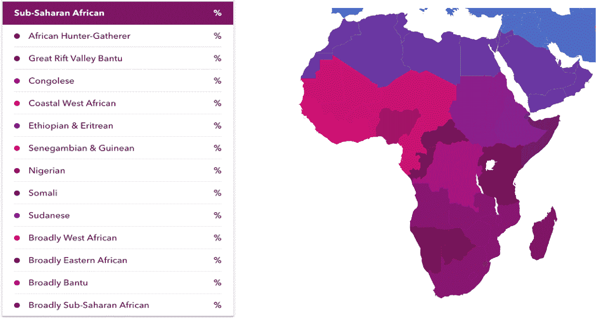
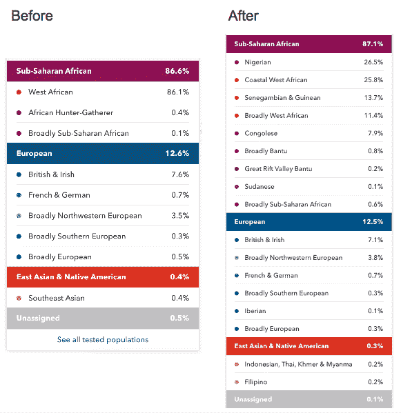

# 23andMe 的祖先工具对有色人种越来越好 

> 原文：<https://web.archive.org/web/https://techcrunch.com/2018/08/21/23andmes-ancestry-tools-are-getting-better-for-people-of-color/>

23andMe 正在增强其非洲、东亚和美洲土著血统的能力——这是它非常缺乏的。具体来说，23andMe 在其数据库中增加了非洲和东亚的 12 个新地区。几年前，当我第一次尝试 23andMe 时，它告诉我我有 71%的西非血统，这几乎不能告诉我我的大部分祖先来自哪个国家。嗯，这一切都在改变——尽管，[我已经从 Ancestry](https://web.archive.org/web/20230217185339/https://techcrunch.com/2017/10/22/ancestrydna-versus-23andme/) 那里收到了 23andMe 的最新产品更新信息。

23andMe 高级产品经理罗宾·史密斯(Robin Smith)告诉 TechCrunch:“这次更新的关键是从世界各地，特别是非洲和亚洲获得更多数据。“通过某些倡议，如[非洲基因工程](https://web.archive.org/web/20230217185339/https://www.23andme.com/africa-project/)和[全球基因工程](https://web.archive.org/web/20230217185339/https://www.23andme.com/global-genetics/)，这是可能的。”

之前，23andMe 仅在撒哈拉以南非洲地区提供三个子群。现在，该地区又增加了八个亚组，东亚也增加了四个种群。

以下是 23andMe 网站上新增的 12 个人群:

1.  东南非
2.  刚果人
3.  西非海岸
4.  埃塞俄比亚和厄立特里亚
5.  塞内加尔和几内亚人
6.  尼日利亚人
7.  索马里人
8.  苏丹人
9.  中国傣族
10.  。越南人
11.  菲律宾人
12.  。印度尼西亚语、泰语、高棉语和缅甸语

23andMe 于 2007 年首次推出，但它花了很长时间来收集所需的数据，以便为某些人群提供更全面的家谱视图。23andMe 的首席执行官安妮·沃西基在 TechCrunch Disrupt SF 2017 上表示，大约 75%的 23andMe 客户是欧洲血统。因此，23andMe 意识到“在某个时候，我们需要这些计划去获取数据，”史密斯说。

史密斯说，对于 23andMe 的早期采用者，他们将不得不重新参加测试，因为这一更新仅适用于使用最新基因分型芯片的人。23andMe 现在已经开发出第五个版本的芯片，他说这个版本“更好地反映了世界多样性的理念”

史密斯说，这意味着他们要么必须购买新的套件，要么选择加入尚未推出的升级程序。除了此次更新，23andMe 计划定期发布更新，并继续添加新的人群。

**更新:** 23andMe 发言人随后澄清了 Smith 的评论，称“所有客户(甚至早期采用者)最终都会在他们的祖先构成报告中反映出新的结果——时间是 TBD，但他们预计在 2019 年初。我们也在研究芯片升级的途径，这是要收费的，因为有些健康报告是旧芯片上的人无法获得的。具体到血统对比更新，将会为**所有**V5**之前的客户免费更新。”**

 **去年 9 月，23andMe 以大约 17.5 亿美元的估值筹集了 2.5 亿美元。Wojcicki 说，作为融资的一部分，23andMe 计划努力扩大数据的多样性以及对这种多样性的研究。

除了祖先信息，23andMe 还提供健康报告。2017 年早些时候，[食品药品监督管理局开始允许](https://web.archive.org/web/20230217185339/https://techcrunch.com/2017/04/06/23andme-is-finally-allowed-to-tell-you-if-you-have-the-genes-for-parkinsons/) 23andMe 进行 10 种不同的基因风险测试，包括帕金森氏症和老年痴呆症的测试。除了测试某些疾病的风险，23andMe 还告诉你一些有趣的事实，如你的 DNA 如何影响你的外表、偏好和身体反应。

我将很快重考 23andMe 测试，并将让你们知道我的发现。与此同时，23andMe 的一名研究人员分享了他们研究结果的前后对比。下面来看看吧。

**