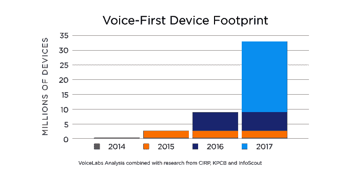
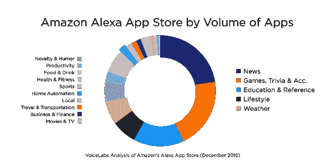
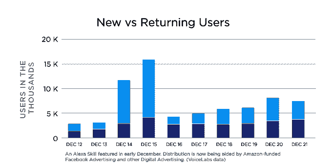

# 2450 万语音优先设备预计今年发货，但应用程序难以留住用户

> 原文：<https://web.archive.org/web/http://techcrunch.com/2017/01/24/24-5m-voice-first-devices-expected-to-ship-this-year-but-apps-struggle-to-retain-users/>

下一个主流计算平台可能不是机器人、AR 或 VR，而是基于语音的计算。根据 VoiceLabs 的最新[行业状况报告](https://web.archive.org/web/20230325150247/http://voicelabs.co/2017/01/15/the-2017-voice-report/)，预计今年将有 2450 万台语音优先设备出货，这将使流通中的设备总量达到 3300 万台。

如果预测属实，这将是 2015 年 170 万台语音优先设备和去年 650 万台设备的显著增长。

语音优先设备包括亚马逊 Echo、亚马逊 Tap 和 Echo Dot 等产品，以及谷歌 Home 等后来的产品。VoiceLabs 预计，其他三大科技公司中至少有两家——苹果、三星或微软——也将在 2017 年推出语音优先的设备，这有助于其估计。

目前，亚马逊在这一领域处于市场领先地位，因为消费者将语音计算作为与机器交互的自然方式。据[估计，在 2016 年假期之前，亚马逊 Echo 的销量已经超过 500 万部。随后，亚马逊表示，Echo 家庭设备的销量比去年假期增长了 9 倍多，这一年在全球范围内售出了“数百万台”。](https://web.archive.org/web/20230325150247/http://www.geekwire.com/2016/amazon-echo-sales-reach-5m-two-years-research-firm-says-google-competitor-enters-market/)

新报告估计，现在消费者家中有超过 700 万台亚马逊 Echo 设备。

这个市场还值得注意的是，它有很高的消费者锁定度。也就是说，在拥有 Echo 或 Google Home 的受访者中，只有 11%的人表示他们会购买与之竞争的设备。

“因此，尽管这不是一个赢家通吃的市场，但 VoiceLabs 预测，2017 年这将是一个赢家通吃的市场，”该报告称。"这就给硬件供应商施加了压力，要求他们快速分发设备."

亚马逊在语音计算领域取得成功的原因是它在销售消费电子产品方面的专业知识，这使它在分销方面具有优势。与此同时，它还使开发者能够轻松地为其 Echo 系列设备构建 Alexa 语音应用程序，并投资开发应用程序开发工具。

这得到了回报。2016 年初，Alexa 的应用程序刚刚超过 130 个，也就是“技能”。到年底，这个数字已经从[增长到超过 5000](https://web.archive.org/web/20230325150247/https://developer.amazon.com/blogs/post/Tx3PW7BACQVE53B/introducing-the-alexa-skills-kit-built-in-library-offering-developers-hundreds-of-new-voice-interactions-developer-preview)。今天，有超过 7000 个。报告还指出，2016 年下半年，应用增长超过 500%。

就绝对数量而言，新闻、琐事和教育类别目前占据主导地位，但就现实世界的使用而言，许多应用基本上是“僵尸”只有 31%的应用程序有一个以上的评论，这表明它们没有被大量使用。

当谈到与消费者产生共鸣的用例时，音乐流媒体和书籍、家庭自动化、游戏和娱乐以及新闻和播客占据主导地位。

今年，VoiceLabs 预测智能家居用例将继续增长，游戏和娱乐类别也会有创新。

目前，平台所有者亚马逊和谷歌能够对应用发现产生重大影响。Alexa 的特色技能在推广时可以预期新用户增加 200%，VoiceLabs 表示，每个应用程序的新用户数量在 500 到 250，000 之间。

在 Google Home 上，也有类似的趋势。在推广周期内，特色 Actions 的新用户预计将增长 290 %, Actions 的每个应用程序将有 1，600 到 3，100 名新闻用户。

但报告发现，除了少数例外，大多数应用都在努力留住用户。在添加应用程序后的第二周，用户活跃程度只有 3%的变化。

此外，这些应用程序还不能赚钱——报告预计亚马逊和谷歌将在第二季度解决这一挑战。

2017 年可能是语音优先计算的里程碑年，这是一个超越家用智能扬声器的类别。还有桌面、平板电脑、智能手机和电视流媒体播放器上的虚拟助手之战，如 Cortana、Siri、谷歌助手和 Alexa，而苹果 AirPods 等其他设备可以让你在旅途中更好地利用语音计算。

报告摘要可通过 VoiceLabs 网站[此处](https://web.archive.org/web/20230325150247/http://voicelabs.co/2017/01/15/the-2017-voice-report/)获取，或根据要求获取全文。