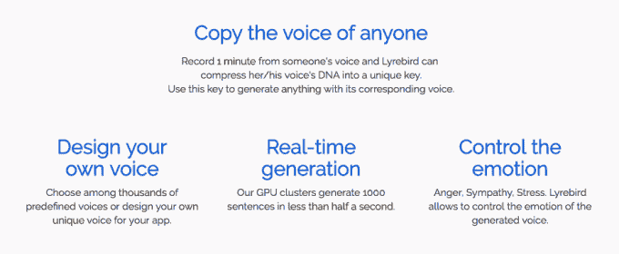

# Lyrebird 是假新闻时代的声音模拟——第 281 页

> 原文：<https://web.archive.org/web/https://techcrunch.com/2017/04/25/lyrebird-is-a-voice-mimic-for-the-fake-news-era/281/>

一家总部位于蒙特利尔的人工智能初创公司名为 [Lyrebird](https://web.archive.org/web/20191227185754/https://lyrebird.ai/) 已经推出了一种语音模仿算法，该团队表示，这种算法不仅可以模仿真人的语音，还可以改变其情绪节奏——并且只需一小段真实世界的音频就可以做到这一点。

昨天在网上发布的[公开演示](https://web.archive.org/web/20191227185754/https://lyrebird.ai/demo)，由一系列使用他们的算法生成的(虚假)语音音频样本和一分钟的说话者声音样本组成。他们使用特朗普、奥巴马和希拉里·克林顿总统的声音样本来演示这项技术的实际应用——显然是为了最大限度地制造假新闻。

这里有一个假奥巴马的例子:

这里有一张假王牌:

这是假特朗普、假奥巴马和假克林顿之间完全虚构的讨论。我们确实生活在最奇怪的时代…

[Lyrebird](https://web.archive.org/web/20191227185754/https://crunchbase.com/organization/lyrebird) 表示其意图是在未来提供一个 API，以便第三方可以利用音频模仿技术达到自己的目的。所以，如果你现在认为网上的假新闻不好，那就等着瞧吧，有一种技术可以让任何人轻而易举地生成一段明显证明自己有罪的人的“录音”。

这家初创公司在其网站上确实有一份[道德声明](https://web.archive.org/web/20191227185754/https://lyrebird.ai/ethics)来直面它所描述的由技术伪造记录证据的能力引发的“重要社会问题”——其中声明:

> 在我们的社会中，尤其是在许多国家的司法管辖区中，录音目前被认为是强有力的证据。我们的技术质疑这种证据的有效性，因为它可以很容易地操纵录音。这可能会产生危险的后果，例如误导外交官、欺诈以及更普遍的由窃取他人身份引起的任何其他问题。
> 
> 通过公开发布我们的技术，让任何人都可以使用，我们希望确保不会有这样的风险。我们希望每个人都将很快意识到这种技术的存在，并且复制别人的声音是可能的。更一般地说，我们想引起人们对缺乏证据的关注，在不久的将来，录音可能会成为证据。

当被问及是否担心将这项技术投入野外时，开发深度学习技术的博士生之一亚历山大·德·布雷比松(Alexandre de Brébisson)告诉 TechCrunch:“通过公开发布 API 并允许任何人使用它，我们希望人们意识到这项技术的存在，以及音频记录并不像我们想象的那样可靠。和 Photoshop 做的差不多。

“因为这些潜在的滥用而不发布该技术对我们来说没有意义，因为我们认为积极的方面可以克服消极的方面(锤子可以用来建造，也可以用来打破)。如果我们自己不公布这项技术，其他人将来也会这样做(而且，与我们相反，他们可能有不良意图，可能对一部分人隐瞒了这一点)。”

这当然是一个公平的观点。你不能插手工程进度的阻碍。但是你可以警告人们变得更聪明，对他们(显然)接触到的东西进行更批判性的思考。如果需要证据的话，更多的证据证明批判性和分析性思维的价值，以智能地导航一个不断扩大的数字领域，这个领域的意图是不断增加和改变现实。

在这一阶段，de Brébisson 不会给出 API 发布的时间表，只是说复制语音的测试版“将很快推出”，并且他们将随着时间的推移添加新功能。“我们在这项技术上已经工作了一年多(在蒙特利尔大学的 MILA 实验室，人工智能先驱 Yoshua Bengio 为我们提供建议)，”他补充道。

也不清楚 Lyrebird API 是否会免费——听起来更像是计划推出一个免费的 API。de Brébisson 说，它不一定是免费的。“也许简单的功能会，或者最初的样本会，”他告诉 TechCrunch。“我们的意思是，任何有互联网的人都可以使用我们的 API——我们不会把这项技术卖给特定的公司或特定的政府。”

尽管他也明确指出 API 货币化计划是让开发者/公司为他们请求的样本数量付费(例如，x 美元 1000 个生成的句子)。“第一批样品将是免费的，”他证实道。

下面是 Lyrebird 如何介绍 API 将能够做什么:

就声音模仿技术的潜在应用而言，天空无疑是极限。但是它的网站上有一些潜在应用的想法来激发开发者的创造力——比如个人助理；有声读物，有声读物；各种类型的连接设备；残疾人的语音合成；和动画电影或视频游戏工作室。

样本中的音质对我来说仍然有明显的金属刺耳声——如果我可以这样说的话，这是一种音频恐怖谷。因此，它似乎不太可能为专业录制的有声书提供类似的替代品(至少目前还不可能)，尽管它可能会提供一种更经济的替代方案。

de Brébisson 还指出，他们用作演示录音来源的一分钟音频样本并不包含所有“声音的 DNA”，并声称:“更多的数据将显著提高质量。”

“我们仍然相信我们的声音比其他公开发表的声音有更自然的语调，”他说。“有时我们可以在样本中听到一点点噪音，这是因为我们根据真实世界的数据训练了我们的模型，模型正在学习背景噪音或麦克风噪音。我们正在努力移除这些工件，以便发布。”

当被问及他是否相信未来有可能开发出完美的语音合成技术时，也就是说，与真实的东西无法区分，他说他相信这在“几年内”确实是可能的。因此，开始调整你对(技术上)可辨别现实的结束的听觉预期。

到目前为止，Lyrebird 团队一直在引导开发，在 MILA 实验室研究核心技术，作为他们博士研究的一部分，并表示他们希望在筹集任何外部资本之前发布网站。自昨天发布以来，de Brébisson 表示，他们已经收到了“几份报价”——因此，这家深度学习初创公司似乎不需要太长时间纯粹依赖自己的财政资源。

“发布会非常成功(网页上的 一天内有 10 万次访问 ，一天内有 100 万个样本被)我们已经和几个著名的投资者取得了联系，”他补充道。

如果你想知道 Lyrebird 的名字来自哪里，它的名字是一种真实生活的模仿物:一种能够再现至少 20 种其他物种的歌曲的鸟，伴随着各种各样的(而不是那么美妙的)人造声音，如照相机快门、汽车警报器和链锯。又名假新闻的羽毛品种。

 [https://web.archive.org/web/20191227185754if_/https://www.youtube.com/embed/VjE0Kdfos4Y?version=3&rel=1&fs=1&autohide=2&showsearch=0&showinfo=1&iv_load_policy=1&wmode=transparent](https://web.archive.org/web/20191227185754if_/https://www.youtube.com/embed/VjE0Kdfos4Y?version=3&rel=1&fs=1&autohide=2&showsearch=0&showinfo=1&iv_load_policy=1&wmode=transparent)

视频