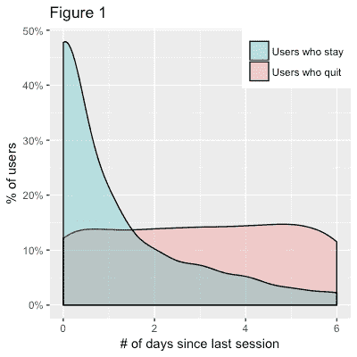
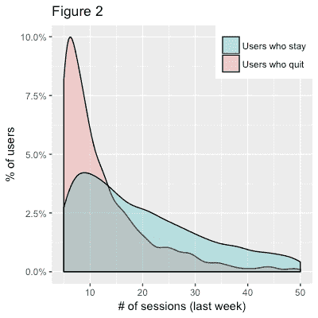
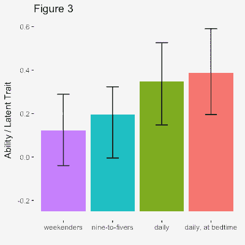
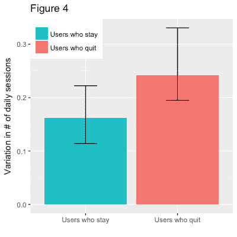
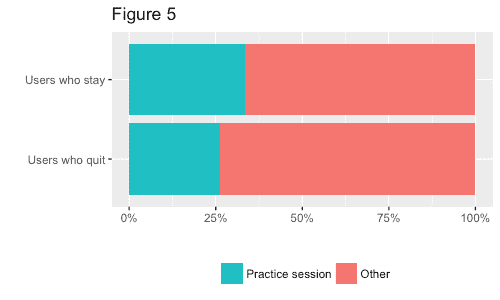

# 成功语言学习者的 3 个习惯 

> 原文：<https://web.archive.org/web/https://techcrunch.com/2017/03/05/3-habits-of-successful-language-learners/>

萩原圣人撰稿人

[Masato Hagiwara](https://web.archive.org/web/20230215190731/http://masatohagiwara.net/)

是一名研究科学家和工程师

[Duolingo](https://web.archive.org/web/20230215190731/https://www.duolingo.com/)

。Hagiwara 博士拥有名古屋大学博士学位，研究方向包括日语和汉语语言处理、机器翻译和语言教育。他能流利地说日语、汉语和英语。

[Burr Settles](https://web.archive.org/web/20230215190731/http://burrsettles.com/)

是一名研究科学家和工程师

[Duolingo](https://web.archive.org/web/20230215190731/https://www.duolingo.com/)

。Settles 博士拥有威斯康星大学麦迪逊分校的博士学位。他对大规模机器学习与语言学和认知科学的交叉感兴趣。他能流利地说法语，并爱上了海地克里奥尔语。

目前全球约有 12 亿人在学习外语。如果你是其中之一，这篇文章是给你的。

无论你是在学习改善你的工作前景，在学校做得更好，准备出国旅行，甚至只是为了好玩，所有成功的语言学习者都有三个共同的习惯。我们分析了数百万 Duolingo 用户的数据，在这个过程中，我们发现了掌握一门外语到底需要什么。

## 学习语言很像减肥(某种程度上)

一些语言学习服务声称非常有效，你可以在几周内甚至一夜之间流利地学习(是的，没错！).还有人声称通过被动倾听让你变得流利。我们更加现实:科学和个人经验表明，大多数人需要时间来精通第二语言。那么，从长远来看，怎样才能成功呢？

将语言学习与减肥和保持健康相比较可能会有所帮助。一夜之间能瘦 50 斤吗？不可能。经过几个月的时间？现实多了。

正如你需要锻炼和健康的饮食来保持健康一样，你需要养成定期学习和复习的习惯，以便坚持学习语言并最终取得成功。正如知道什么类型的食物和锻炼最有助于保持健康一样，知道什么类型的学习习惯对长期的语言学习成功最有帮助也很重要。

全世界超过 1.5 亿人使用 Duolingo 学习语言，其中许多人在休息和日常通勤期间使用手机和平板电脑。从这些活动中，我们收集了大量关于学习和行为模式的数据。以下是我们学到的成为一名成功的语言学习者的一些最佳习惯。

## 习惯 1:只有周末和朝九晚五的时间是不合适的

长期成功的最佳预测之一是定期做某事。语言学习也不例外。特别是，图 1 显示，大多数长期坚持语言学习的人确保每天或每两天花几分钟练习。另一方面，每 5 或 6 天一次的人更有可能完全放弃。图 2 显示，成功的学习者每周完成的课时也多得多，这意味着他们花了大量的时间学习。

我们还确定了使用模式的“集群”，例如只在周末使用该应用程序的“周末人士”，或者只在正常工作时间学习的“朝九晚五者”。图 3 显示，与几乎每天使用该应用的人相比，这些使用群中的人表现出较低的语言能力(根据一项名为 [IRT](https://web.archive.org/web/20230215190731/https://en.wikipedia.org/wiki/Item_response_theory) 的心理分析)。此外，不同用户群中学习“每天，在睡觉时间”的人甚至似乎达到了稍高的熟练程度。这一发现与 T4 关于睡眠对提高语言学习效果的实验室研究是一致的。

尤其是刚起步的时候，养成每日作息，每天学习几次，保持记忆新鲜，是很值得的。我们的数据表明，从长远来看，你更有可能坚持下去并学到更多东西。如果你能养成睡前习惯，那就更好了！

## 习惯 2:不要过度学习

成功的语言学习者的第二个习惯是他们不暴饮暴食。相反，他们养成了分散练习(T2)的习惯，或者在更长的时间内进行一些短期的学习。为了说明这一点，图 4 显示了每日会话数量的变化(相对标准偏差)。对于成功的学习者来说，这种差异较低，这意味着他们每天的课程和练习次数更加一致。另一方面，更高的变化意味着用户会时不时地出现在马拉松比赛中以赶上进度。这些暴饮暴食的学习者更有可能放弃。

许多心理学研究也表明，与分散练习相比，在较短的时间内死记硬背会降低学习效果。这适用于各种技能，从学习语言到扔球、玩视频游戏或驾驶飞机(见[本文](https://web.archive.org/web/20230215190731/http://citeseerx.ist.psu.edu/viewdoc/download?doi=10.1.1.740.6703&rep=rep1&type=pdf)对该主题几十年研究的荟萃分析)。要掌握一门语言，你最好尽可能有规律地坚持学习，不管学习量有多小。额外收获:你可能会坚持下去，也会学到更多。

## 习惯 3:复习，复习，复习

勇往直前学习尽可能多的新材料是很有诱惑力的，尤其是当学习语言的过程感觉像是一场游戏的时候。然而，任何学第二语言的学生都知道，随着时间的推移，你会逐渐忘记你所学的内容(你还记得高中西班牙语中所学的虚拟语气吗？).

一个多世纪以来对所谓的[间隔效应](https://web.archive.org/web/20230215190731/https://en.wikipedia.org/wiki/Spacing_effect)和[滞后效应](https://web.archive.org/web/20230215190731/https://en.wikipedia.org/wiki/Spacing_effect#Lag_effect)的心理学研究告诉我们，如果你定期复习旧材料，你更有可能记住想法和概念。这有助于知识从你的短期记忆进入你的长期记忆。

 

*用“力量计”来衡量何时练习旧材料。*

但是你怎么知道什么时候练习旧材料呢？当你的语言技能达到“最高水平”时，你应该专注于学习新的东西。最好的复习时间是在你快要忘记的时候，所以如果之前学过的技能已经过了一半，是时候练习了。我们甚至会向用户展示哪些单词最弱，并提供一键“练习弱技能”按钮，自动搜索你最需要练习的技能。

图 5 显示，成功的语言学习者比最终放弃的人在课程(学习新材料)和实践(复习旧材料)之间取得了更好的平衡。

我们的研究团队在我们的“间隔重复”技术上投入了大量的精力，该技术旨在精确地测量你在任何时候记住给定单词或语法概念的可能性。我们去年发表了一篇学术文章，介绍了我们发明的一种叫做半衰期回归的方法，我们每天都在用新数据改进这些技术。这项技术帮助我们在恰当的时间帮助你复习恰当的语言概念。

所以，现在你知道了:定期学习，不要暴饮暴食，复习你生疏的概念。不要担心是否需要时间；其实语言学习是要花时间的。好极了。

这篇文章最初出现在 [TechCrunch Japan](https://web.archive.org/web/20230215190731/http://jp.beta.techcrunch.com/2016/12/20/duolingo/) 上。