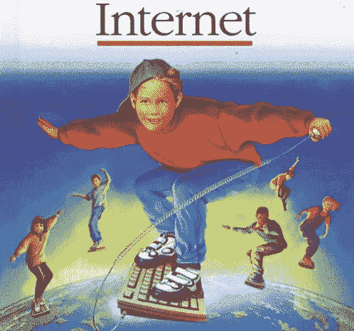
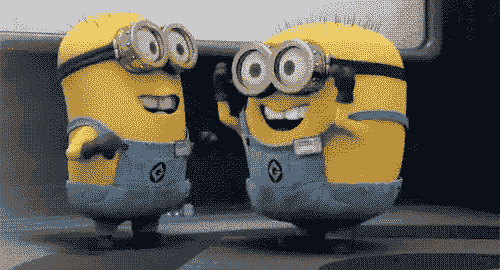

# GIF  年

> 原文：<https://web.archive.org/web/https://techcrunch.com/2017/07/27/30-years-of-the-gif/>

大卫·麦金托什撰稿人

大卫·麦金托什是谷歌的首席执行官和联合创始人

Tenor

.

很少有技术能在没有重大变化的情况下存活超过 5 年，更不用说 30 年了。仅在过去的 10 年里，我们的手机获得了 20 倍的处理能力，并增加了从多任务处理到可视信息的功能。我们是 HTML 的第五个标准，已经从 FLV 发展到 MP4，成为网络上占主导地位的视频流格式。正如英特尔创始人之一安迪·格罗夫所说，“只有偏执狂才能生存。”不改变的技术只能被淘汰。

但是今年夏天庆祝其 30 岁生日的 GIF 作为一种格式一直存在。虽然它的技术方面没有改变，但 gif 已经有了三种不同的生命——gif 的使用率从未像今天这样高。

## GIF 的第一次生命:图像托管技术

随着它在 1987 年的引入，GIF 开始作为一种无损数据压缩的图像格式，这使得图像在文件大小上比 BMP 等替代方案更小。它很快获得了支持，尤其是在网络浏览器中。虽然对 gif 的动画支持是在 1989 年引入的，但通过这种格式托管的许多图像还没有动画——这只是托管静态图像的一种更有效的方式。

## GIF 的第二人生:视频娱乐精简版

许多最早的动画 gif 在外观上类似于微软剪贴画，有时在早期网站中用作导航元素。GeoCities 帮助数百万人创建了他们自己的网站，网站所有者经常转向 gif，如旋转菜单、子弹点或 3D 动画，以个性化他们的网站并娱乐他们的访问者。
随着 Myspace 的流行，这种行为进一步加速。

整个网站致力于帮助人们找到“珠宝”添加到他们的 Myspace 页面。随着 Myspace 的人气逐渐消退，YouTube 等视频网站开始帮助人们分享短视频，GIF 的相关性开始下降，其使用仅限于利基互联网论坛。但随着 Tumblr 在 2009 年开始加速发展，gif 的使用又回来了。

与 Myspace 类似，人们在 Tumblr 上使用 gif 来表达他们的个性，但人们不是分享闪烁的文本，而是创建他们最喜欢的电影、电视节目和在线视频的短片。这种行为开始蔓延到托管 gif 的网站，如 BuzzFeed、Imgur 和 Giphy。

## GIF 的第三次生命:交流和视觉语言

随着手机短信的爆炸式增长，注意力的持续时间缩短了——语言也随之快速发展，常见短语被简化为“lol”和“jk”之类的速记。三到五秒是新的三到五分钟。

gif 现在是一种视觉速记形式——一种利用文化共鸣时刻在几秒钟内传达人类全部情感的语言。这种语言比传统的速记更具表现力和扩展性。

例如，在过去的一年里，人们已经搜索了超过 40 亿个不同的想法、感觉和情感，随着新闻、文化和模因的出现，不同搜索词的数量每天都在增长。

移动 gif 的拐点可以追溯到 2014 年秋季 iOS 8 的推出，当时苹果推出了对定制键盘的支持。GIFs 作为移动通信语言的第三次生命使其过去的所有生命都相形见绌，因为移动是最大的数字平台，通信是移动上的主导行为。

gif 问世 30 年后，现在已经融入到通信的结构中，并且已经发展成为一种移动可视信息协议。虽然这是一项巨大的成就，但 GIF 还有很长的路要走——最终，所有 30 亿移动用户都将使用 GIF 来表达他们一天中的数十种情绪。

为了庆祝上个月的重大周年纪念日，下面是 GIF 30 年历史中开创性时刻的快照:

1987 年:图形交换格式(GIF)被在 CompuServe 编写软件的 Steve Wilhite 成功部署。1989 年:CompuServe 推出了该格式的增强版，支持动画。
1993 年:马赛克浏览器让不太懂技术的用户也能访问万维网。
1995 年:随着 Navigator 2.0 的发布，Netscape 引入了动画 gif 循环的功能。2003 年:Myspace 发布，开启了人们用 gif 展示个人网页的潮流。【2007 年 6 月:第一部 iPhone 发布，标志着 iMessage 和其他流行的信使应用程序开始激增。2010 年 8 月:《新牛津美语词典》更新了第三版，增加了 GIF 的硬 g 音和软 g 音。【2014 年 10 月:iPhone 首款 GIF 键盘上市。2015 年 6 月:脸书在 Messenger 中引入了 GIF 按钮，加速了“GIF 无处不在”的趋势，数百家其他服务(如 Twitter、Kik、WhatsApp 和 Discord)迅速将 GIF 整合到消息中。【2017 年 6 月:全球移动用户庆祝 GIF 30 周年。