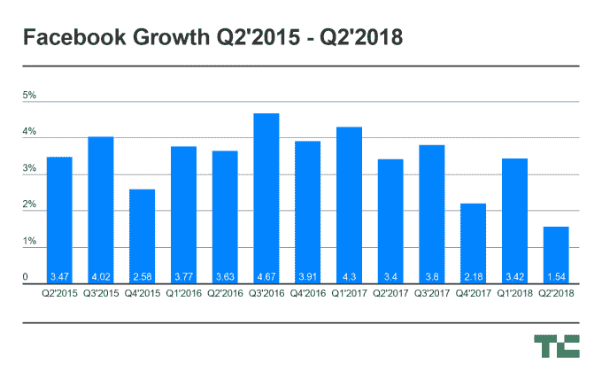

# 25 亿人至少使用脸书的一款应用——第 31 页

> 原文：<https://web.archive.org/web/https://techcrunch.com/2018/07/25/facebook-2-5-billion-people/31/>

# 25 亿人至少使用一款脸书的应用

[脸书](https://web.archive.org/web/20190707215052/https://crunchbase.com/organization/facebook) 通过公布一项新指标，隐瞒用户正在离开其主要应用程序，但仍坚持使用 Instagram 和 WhatsApp。脸书今天首次宣布，6 月份，25 亿人至少使用了其应用程序中的一个:脸书、 [Instagram、](https://web.archive.org/web/20190707215052/https://crunchbase.com/organization/instagram) [WhatsApp](https://web.archive.org/web/20190707215052/https://crunchbase.com/organization/whatsapp) 或 Messenger。这是一个有用的数字，因为它统计的是真实的人，而不是账户，因为人们可以在一个应用程序上拥有多个账户。25 亿人，相比之下，脸书每月有 22.3 亿用户，Instagram 有 10 亿用户，WhatsApp 有 15 亿用户，Messenger 有 13 亿用户。

马克·扎克伯格在脸书 Q2 2018 年收益电话会议上宣布了新的统计数据，此前一份艰难的报告显示其用户增长放缓至有史以来的最低水平。扎克伯格说，这 25 亿人是“个人用户，而不是活跃账户”，他说，“当人们在一个应用程序上有多个账户时，就不包括在内了”。这反映出许多人不止使用一种我们的服务。”

似乎脸书宣布这一数据是希望转移人们的注意力，让人们不去关注其用户数量在欧洲萎缩，在美国和加拿大持平的事实，这导致了异常低的月度和每日用户增长。这种增长困境反过来又导致脸书的股价在盘后交易中下跌了 20%以上。

对于 25 亿美元的统计数据，脸书首席财务官大卫·韦纳解释说:“我们认为这个数字更好地反映了我们社区的规模。”他还澄清说，脸书每月 22.3 亿的活跃用户数“确实计入了一个用户的多个账户，这占了脸书 MAU 的 10%，即 2.23 亿”。

通过将用户数量捆绑到一个“应用程序观众指标家族”，脸书可以掩盖其核心应用程序碰壁的事实。相反，它可以依靠 WhatsApp 和 Instagram 来支撑这个数字。例如，如果青少年从脸书转到 Instagram，他们仍然会被计入新的指标。但这并不能改变该公司的主要赚钱来源正在失去优势的事实。