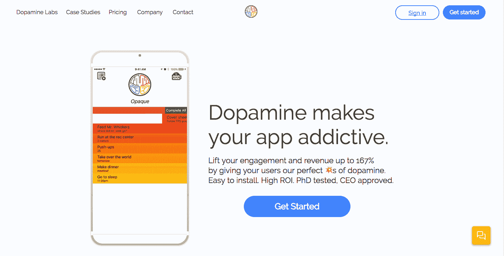

# 见见想让你更加沉迷于手机的科技公司

> 原文：<https://web.archive.org/web/https://techcrunch.com/2017/09/08/meet-the-tech-company-that-wants-to-make-you-even-more-addicted-to-your-phone/347/>

通过一系列神奇的代码，[多巴胺实验室](https://web.archive.org/web/20201111033729/https://usedopamine.com/)旨在赋予任何应用同样的上瘾能力，这是脸书、Zynga 和其他公司花费数百万美元完善的。

这家公司是一个鲜为人知的笑话“当一个神经心理学家和一个神经经济学家走进酒吧时，你会得到什么？”——是由南加州大学的[拉姆齐·布朗](https://web.archive.org/web/20201111033729/https://www.linkedin.com/in/ramsaybr)和联合创始人【that 道尔顿·库姆斯进行的多年研究的顶峰。

现在，有了 100 万美元的种子资金和一些初步数据，他们在精神控制方面的实验确实有效，[多巴胺实验室](https://web.archive.org/web/20201111033729/https://crunchbase.com/organization/dopaminelabs) 正在花钱增加员工和销售及营销工作，以在其脑科学领域引入更多应用。

这 100 万美元的资金大部分来自现已倒闭的 Lowercase Capital，该公司由克里斯·萨卡(Chris Sacca)和马特·马泽奥(Matt Mazzeo)执掌。在 Sacca 和 Mazzeo 卷入 2017 年漫长而可怕的夏天席卷风险行业的性行为不端丑闻之前，多巴胺似乎是该公司最后的交易之一。

虽然布朗谴责了萨卡的行为，并对马泽奥在他未来的新家二元资本发现同样的问题表示失望，但他说这并没有阻止他接受小写的钱。

“这是我们在社区的所有工作，以确保这种态度和信仰不会在未来的行业中有一席之地，”布朗告诉我。“我们的工作是确保每个人都被当作人对待，而不是一件物品。”

除了小写资本，这轮额外投资来自 Social Starts，这是最多产的早期投资公司之一；深叉资本；和首轮资本创始人霍华德摩根，通过个人投资。摩根也是多巴胺实验室董事会的一员。

摩根在一份声明中说:“我很高兴发现一个强大的团队，他们对神经科学有着深刻的了解，并了解如何在当今世界应用它，因为人们经常超负荷投入。”“我认为多巴胺可以成为许多应用的主要工具，我很高兴投资并帮助他们成长。”

布朗说，吸引这些投资者的是多巴胺实验室在它为成瘾实验招募的试点客户身上看到的结果。

“随着你收集更多的数据，数据集内发生的事情提高了模型的质量，这反过来提高了服务的质量，”布朗说。

管理所有这些数据的是 Skinner，这是一款以著名心理学家 B.F. Skinner 命名的人工智能软件，它监控它在使用多巴胺实验室代码的应用程序上向客户做出的不同提示。Skinner 的目的是了解什么可以提高应用程序的使用率或获得回头客，并在客户继续使用应用程序时优化这些通知。

这项技术以前有一个关于强化策略如何工作贝叶斯假设。“它更新其概率情景(信念),即它过去的决定有多大可能导致今天的行为，然后调整一个参数，”布朗解释说。“在第 30 天，当对我们所有用户进行的实验结束时，它会确定哪些方面似乎很重要，哪些方面可以进行改进。”

本质上，该软件现在可以学习如何在其使用的每个应用程序中提高用户保留率。

“它代表我们进行这些优化，”布朗说。“我们精心设计让它了解一些关于人类动机如何运作的结构。它现在正在自己收集足够的数据，以进行有意义的观察来改变人类的行为。”

其他公司已经尝试采用这种自动化的智能方法在应用程序上吸引人们。像 Urban Airship、Retention Sciences 和 Marketo 这样的公司会让布朗想到它们——但它们从营销和广告的角度来看待事物。布朗说，如果你试图让人们简单地买东西，这可能行得通。

利用多巴胺实验室的代码，布朗假设一个应用程序可以全面提高使用率——不仅仅是销量。

如果这一切听起来令人毛骨悚然，不要担心…的确如此。

为了抵消该公司的心理游戏，多巴胺实验室开发了一款名为 Space 的工具，允许用户关闭应用程序的某些通知或降低其频率……尽管我认为任何人都可以通过关闭手机通知来解决这个问题。

这款应用在《60 分钟》一集中进行了简介。

 [https://web.archive.org/web/20201111033729if_/https://www.youtube.com/embed/9x8jOvhxs9w?version=3&rel=1&fs=1&autohide=2&showsearch=0&showinfo=1&iv_load_policy=1&wmode=transparent](https://web.archive.org/web/20201111033729if_/https://www.youtube.com/embed/9x8jOvhxs9w?version=3&rel=1&fs=1&autohide=2&showsearch=0&showinfo=1&iv_load_policy=1&wmode=transparent)

视频

最终，多巴胺实验室预测他们可以为公司增加 10%的收入。在实践中，他们的数字有点无处不在，一些公司在用户与应用程序的交互方面看到了超过 100%的反弹。对其他公司来说，增幅可能在 8%左右。

在我的脑海中有一个挥之不去的问题，那就是让玩心理游戏的顾客回到一个应用程序或网站的道德性。这个行业已经在与应用程序和屏幕上瘾的阴暗面作斗争。

多巴胺的创始人辩称，他们保留拒绝向工作似乎不达标的特定公司提供服务的权利，但是，就像当今的大多数技术一样，一个人手中掌握着很大的权力。

所有这一切的另一面是，如果像多巴胺这样的技术能够真正鼓励以自我改善为目的的应用程序的保留，那无疑是一件好事。