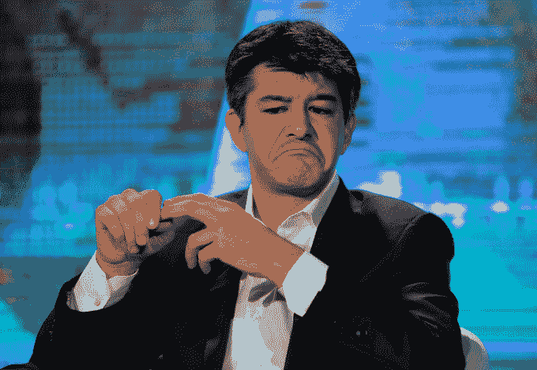

# 非常著名的风险投资家比尔·格利说，创业公司的董事会会议室现在充满了拍手声

> 原文：<https://web.archive.org/web/https://techcrunch.com/2018/02/14/very-famous-vc-bill-gurley-says-startup-boardrooms-are-now-just-filled-with-clapping-hand-noise/35/>

# 非常著名的风险投资家比尔·格利说，创业公司的会议室现在充满了拍手声

刚刚结束优步投资者 Benchmark Capital 和前优步首席执行官特拉维斯·卡兰尼克之间的公开争吵，Benchmark 普通合伙人比尔·格利在高盛互联网和技术大会上站在一大屋子的银行家面前，谈论创业公司董事会如何现在充满了许多啦啦队员，他们不追究创始人的责任。

“硅谷有一个系统性的问题，风险资本家董事会成员发现越来越难站出来让企业家对财务表现负责，”格利说。“我们的业务竞争变得异常激烈。风险资本家害怕的是失去下一个大项目。如果他们获得了声誉——几年前，(一些最优秀的风险投资家)因冲进董事会会议室(要求受托责任)而闻名——如果你获得了这样的声誉，你就不会赢得下一笔交易。”

他接着说，“硅谷的董事会会议室大多已经变成了，”然后他拍了几下手，暗示这主要是人们在为创始人鼓掌，给他们很多回旋的余地。这并不十分令人惊讶，因为 Benchmark 和优步之间的一场大争吵导致了卡兰尼克的下台。在一波文化问题之后，以及优步和 Waymo 之间关于收购 Otto 的重大诉讼([上周解决](https://web.archive.org/web/20190713011135/https://beta.techcrunch.com/2018/02/09/uber-settles-lawsuit-with-waymo/)，[在卡兰尼克作证后不久](https://web.archive.org/web/20190713011135/https://www.wired.com/story/uber-waymo-self-driving-trial-day-3-kalanick/))， [Benchmark 起诉卡兰尼克](https://web.archive.org/web/20190713011135/https://beta.techcrunch.com/2017/08/10/benchmark-sues-former-uber-ceo-travis-kalanick/)。

优步首席执行官特拉维斯·卡兰尼克出席 2016 年 6 月 26 日在中国天津举行的夏季世界经济论坛。路透社/张数

“我和我的公司在 2017 年经历的事情可能是我一生中最不愉快的经历，当然也是我们做过的最艰难的工作，”格利说。“这不是激励我们每天来上班的工作类型。更多的是来自信托责任和义务感，由于当时公司的规模，这种感觉非常重要。这不仅仅是对我们投资者的责任，而且房间里的许多人都有风险敞口，因为名单太长了。让我感到欣慰的是，如果我从今天开始回顾 5 月或 6 月，我很难提出一个论点，即该公司目前的状况并没有好到哪里去。”

就在几年前，FOMO——害怕错过——的观点在硅谷非常普遍。当点播爆炸式增长，Shyp 和 Luxe 等公司通过大轮融资获得了可观的估值时，投资者的一系列活动似乎很快转向了下一家公司，这对拥有理论上有意义的想法的创始人来说有很大的回旋余地。当然，美国经历了一场大洗牌，这导致大公司的大型融资增多，但总体而言融资减少。

Benchmark 的[诉讼被驳回](https://web.archive.org/web/20190713011135/https://beta.techcrunch.com/2018/01/25/benchmarks-lawsuit-against-former-uber-ceo-kalanick-dismissed/)，作为软银在优步大规模投资的条件，据报道 Benchmark [从其早期投资](https://web.archive.org/web/20190713011135/https://beta.techcrunch.com/2018/01/05/menlo-benchmark-first-round-sell-uber-stakes-worth-hundreds-of-millions/)中获得了一些清算。Dara Kosrowshahi 还表示，优步计划在 2019 年成为一家上市公司，Gurley 说这只是让公司成为更好的公司，因为他们对投资者有更强的信托责任。所有这一切，包括任命新的首席执行官 Dara Kosrowshahi，最终表明优步试图摆脱尽可能多的与卡兰尼克有关的包袱。

另外，当被问及加密货币时，格利表示，房间里的每个人可能都厌倦了谈论加密，并要求转移到下一个主题。主持人接着谈到下一个议题。