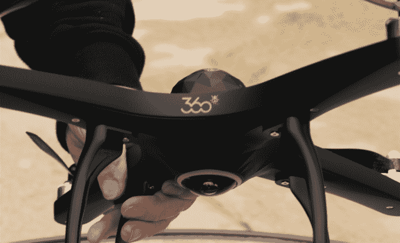
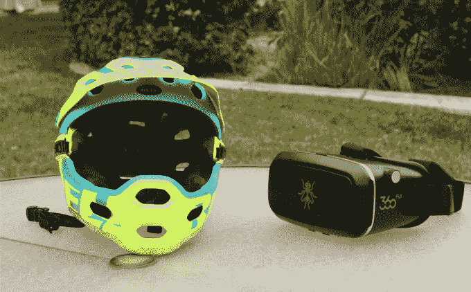

# 360fly 进军虚拟现实体育领域，并展示了其 360 度摄像无人机 

> 原文：<https://web.archive.org/web/https://techcrunch.com/2016/01/04/360fly-pushes-into-virtual-reality-sports-and-gives-a-sneak-peek-at-its-360-degree-camera-drone/>

# 360fly 进军虚拟现实体育，并展示了其 360 度摄像无人机

我们在 [CES 2014](https://web.archive.org/web/20221025230915/https://beta.techcrunch.com/2014/01/17/the-360-fly-can-capture-your-entire-world/) 上首次发现的小型坚固的全景球 [360fly camera](https://web.archive.org/web/20221025230915/https://360fly.com/videos/) 又回来了，并与运动品牌 BRG 合作，为体育爱好者带来现场或录制的 360 度、无缝、 4k 视频，以及所有这些，推动虚拟现实的计划。

GoPro 有自己的球形解决方案，为这些真人拍摄提供 4k 录制功能，柯达的 PixPro 也打算这样做。

GoPro 的设备贴在头盔上，在拍摄过程中可能会抓住树枝和树叶。然而，Giro 和 Bell——两个 BRG 品牌——将在他们的运动头盔中嵌入这些“全视角”360fly 相机，以捕捉直播或播放 360 度视频，供谷歌 Cardboard 或 iPad 或智能手机上的互动应用程序使用。

想象一下，从滑雪运动员那里获得全景视频，在高山荒野上滚动，从高高的岩架上跳下，进入下面的新雪中，并以互动视频或虚拟现实的方式向世界展示连续、全方位的视图。

360fly 还让 TechCrunch 的工作人员先睹为快，看到了一架具有 360 度功能的无人机，它的顶部和底部都装有单镜头摄像头，可以从各个角度拍摄视频——该公司迄今为止一直对此保密。有趣的是，GoPro 最近推出了 [Karma](https://web.archive.org/web/20221025230915/http://shop.gopro.com/drones/karma/2016.html) ，据传这是一款具有 360 度功能的无人机，也为 VR 做好了准备。

GoPro 的股票在去年年底随着更好的智能手机相机的推出而暴跌。一些人猜测，360 度无人机可能是让它重返游戏的门票——尽管 360fly 的无人机可能会在这方面击败它。

360fly 的内容负责人安迪·皮科克不想对无人机说太多，但他确实与 TechCrunch 谈到了新的 BRG 合作伙伴关系和相机功能。他还展示了该应用的升级版，可以让你调整相机亮度和其他功能，以获得更好的观看效果。

全新的高级 360fly 摄像机功能包括:

*   前视模式——当你出于某种原因不想要 360 度视角时使用。
*   延时模式–能够选择 1、2、5、10、30 或 60 秒的快门间隔。
*   运动和自动检测模式–当有运动或声音时自动记录。
*   加速度计激活记录模式-当你摇动相机时开始记录。
*   遥测技术——跟踪你的位置、高度和速度，然后根据需要将这些数据叠加到你的视频上。
*   单键按钮颜色编码–单键按钮和安装基座底部周围的附加颜色编码照明。

该摄像机的 360 度监控能力还包括:

*   自动驾驶跟踪–使用机器学习在整个 360 度视野内跟踪所需的主题/对象。
*   防撞警报——头盔佩戴者会被告知身后是否有危险的东西出现。
*   精彩片段——相机会自动编辑和编译它认为最有趣的内容。

每台相机的零售价为 499 美元，高于百思买最初的 400 美元。看看上面采访孔雀的视频，看看新的 360 飞球，好好感受一下相机和新头盔的能力。

