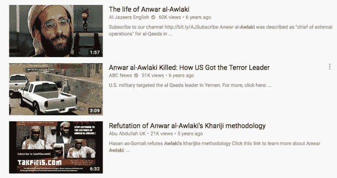

# YouTube 现在正在删除更多已知极端分子的视频——在《重大政策变化》——第 362 页

> 原文：<https://web.archive.org/web/https://techcrunch.com/2017/11/14/in-major-policy-change-youtube-is-now-taking-down-more-videos-of-known-extremists/362/>

谷歌证实了一项重大政策转变，即如何处理 YouTube 上的极端主义内容。一名女发言人告诉我们，它已经扩大了删除极端主义内容的政策:不仅删除直接宣扬仇恨或试图煽动暴力的视频，还删除其他被点名的恐怖分子的视频，除非内容是新闻或教育性质的——如新闻报道和纪录片。

路透社早些时候报道了这一变化，此前纽约时报周一报道称，YouTube 大幅减少了圣战教士 Anwar al-Awlaki 布道的内容，删除了激进教士不是直接宣扬仇恨而是谈论各种表面上非暴力话题的视频。

奥拉基在六年前的一次美国无人机袭击中丧生，但据说他仍然是主要的英语圣战招募者，因为他的布道有如此广泛和容易获得的数字遗产。

在与 TechCrunch 的电话中，YouTube 的一位女发言人证实，目前大约有 5 万段奥拉基演讲的视频已经被删除。

YouTube 上仍然有奥拉基的内容——这位女发言人强调，搜索他的名字永远不会出现零个视频。但表示，目的是删除已知的极端分子制作的内容，并阻止其他人重新上传相同的视频。

她补充说，制定政策将是一个持续的过程。

她说，政策变化是 YouTube 与非政府组织专家网络更密切合作的结果，这些专家在这一领域工作，并参与了其社区内容监管[可信旗手 T10 项目——他们建议 YouTube，即使表面上不宣扬仇恨的布道也可以成为圣战极端分子用来激进化和招募的更广泛叙事的一部分。](https://web.archive.org/web/20200302223621/https://youtube.googleblog.com/2016/09/growing-our-trusted-flagger-program.html)

今年，YouTube 和其他用户生成内容平台也受到越来越大的政治压力，要求 T4 对极端主义内容采取更强硬的立场。当发现广告与极端主义内容一起显示时，YouTube 也面临广告商的强烈反对。

6 月[日](https://web.archive.org/web/20200302223621/https://beta.techcrunch.com/2017/06/19/google-to-ramp-up-ai-efforts-to-id-extremism-on-youtube/)该公司宣布了一系列措施，旨在扩大打击圣战宣传的力度——包括扩大人工智能技术的使用，以自动识别恐怖主义内容；将 50 个“专家非政府组织”加入其受信任的 flagger 计划；以及不断增长的反激进化努力，比如当用户搜索某些极端主义触发词时，返回解构和揭穿圣战观点的内容。

然而，当时 YouTube 从删除非暴力极端主义内容中划了回来。相反，它表示将在包含“煽动性宗教或至上主义内容”的视频上显示间隙警告，并取消上传者利用此类内容赚钱的能力。

“我们认为这在自由表达和获取信息之间取得了正确的平衡，同时没有宣扬极端冒犯的观点，”谷歌 SVP 和总法律顾问肯特·沃克当时说。

显然，它现在决定，事实上，继续主持和提供极端分子的布道并没有取得正确的平衡。现在已经重新划定了政策路线，以减少获取已知恐怖分子制造的任何东西。

据 YouTube 的发言人说，它正在根据政府列出的恐怖分子和外国恐怖组织的名单，确定将适用更广泛的取缔政策的个人。

她证实，根据新的更广泛的政策，目前删除的所有内容都与奥拉基有关。但是我们的想法是将此扩展到从其他极端分子名单中删除其他非暴力视频。

目前还不清楚这些名单是否公开。这位发言人表示，YouTube 希望这些信息能够公开，并表示该公司将与政府部门就透明度问题进行沟通。

她说，YouTube 正在依靠其现有的审核团队来制定扩大的政策，使用机器学习技术的组合来帮助识别内容和人工审查来理解上下文。

她补充说，一年多来，YouTube 一直在考虑调整其针对极端主义内容的政策——尽管在 6 月份避免采取这一步骤。

她还试图淡化这一政策转变，称其是对来自政府的打击网络极端主义压力的回应——她说这是 YouTube 与专家互动并听取专家意见的结果。