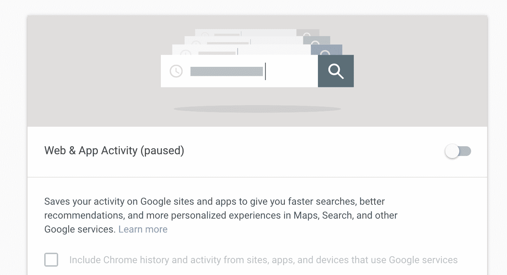

# 即使关闭了位置历史记录，谷歌也会保留你的位置历史记录——369 页

> 原文：<https://web.archive.org/web/https://techcrunch.com/2018/08/13/google-keeps-a-history-of-your-locations-even-when-location-history-is-off/369/>

这是一个非常明显的“黑暗模式”的例子，旨在误导用户并保持对他们数据的控制，[谷歌](https://web.archive.org/web/20200130141706/https://crunchbase.com/organization/google) 继续跟踪你的位置，即使你关闭了位置历史，并被告知“你去过的地方不再被存储”谷歌说，它会告诉用户，但它的披露是最低限度的，用户不鼓励进一步干涉数据收集。

[美联社](https://web.archive.org/web/20200130141706/https://www.apnews.com/828aefab64d4411bac257a07c1af0ecb/AP-Exclusive:-Google-tracks-your-movements,-like-it-or-not)的一份报告列出了细节，但对于任何试图完全删除其位置数据的人，或者阅读过[6 月](https://web.archive.org/web/20200130141706/https://techcrunch.com/2018/06/27/study-calls-out-dark-patterns-in-facebook-and-google-that-push-users-towards-less-privacy/)的“黑暗模式”报告的人来说，这些信息不会令人惊讶。

这个问题很简单。当你关闭“位置历史”，一个主要的谷歌帐户级别的设置(技术上来说是“暂停”，一个本身就很麻烦的词语选择)，你会被告知:“关闭位置历史，你去的地方不再被存储。”

然而，谷歌提供的许多应用和服务在关闭位置历史记录时，实际上*会记录和存储你的位置。*

公平地说，当你关闭位置历史([这里是](https://web.archive.org/web/20200130141706/https://myaccount.google.com/activitycontrols))时，这被解释为:“这个设置不影响你设备上的其他位置服务，如谷歌位置服务和查找我的设备。一些位置数据可能会被保存为你在搜索和地图等其他谷歌服务上的活动的一部分。”

**更新**:上一段的语言是在 AP 报告的时候才添加的，意思是最初的设置只是说不再存储数据。由于这显然不是真的，谷歌可能会发现自己在联邦贸易委员会和私人提起的诉讼中陷入严重的法律麻烦。

尽管检查天气需要位置数据是有道理的，但是系统地收集数据就不那么有道理了，这与用户被告知的直接矛盾。这不完全是谷歌的欺骗，而是该公司其他位置跟踪做法的故意轻描淡写。

未列出:每次您与一些应用程序和服务交互时，都会记录一个精确的位置。

作为你搜索历史的一部分的“一些位置数据”是精确和有组织的，足以重建一个人几天的活动，正如美联社记者所做的那样；随着位置历史的关闭，事实上有一个详细的位置历史存储在谷歌。

谷歌抗议说，你也可以关闭这种位置数据收集——它只是在一个名为“网络和应用活动”的单独设置下为什么会在那里？为什么会有多个地方？为什么没有告诉用户，为了真正关闭位置历史，还有第二个设置也必须调整？为什么假定用户会理解位置也存储在搜索和其他服务的单独标题下？几乎不需要说，就通知用户他们的数据是如何被处理的而言，这是完全不够的。

此外，它完全属于黑色图案的概念。用户被欺骗，以为他们的位置不再被谷歌记录，因为谷歌警告说，如果位置历史被禁用，一些服务可能无法正常工作。同时，位置仍然被无声地记录，并且不通知用户，例如，某某动作将产生位置记录，该位置记录将被保存，并且给用户机会删除它或召回该动作。

顺便说一下，删除这些点是谷歌的另一项防御措施:你可以随时删除它们。但是删除位置历史点是谷歌在[黑暗模式论文](https://web.archive.org/web/20200130141706/https://techcrunch.com/2018/06/27/study-calls-out-dark-patterns-in-facebook-and-google-that-push-users-towards-less-privacy/)中的主要批评点之一，该论文发现他们的测试人员几乎没有一个知道如何做到这一点。对于不同类型的位置集合有单独的控制，这些控制彼此隔离，并且每一个都不受另一个的删除或限制的影响，但是没有解释为什么，或者为什么例如一些可以批量删除，而其他的必须一个一个地进行。

这种令人困惑的、不光明正大的(更不用说恶意的)做法在科技公司中并不少见，但这种做法尤其站不住脚。当用户有意表明他们不希望记录位置历史时，继续维护这样的位置历史简直是荒谬的。

在给 TechCrunch 的一份声明中，谷歌解释道:

> 位置历史是一个谷歌产品，用户可以完全选择加入，并且可以随时控制编辑、删除或关闭它。正如这篇报道所指出的，我们确保位置历史用户知道，当他们禁用该产品时，我们会继续使用位置来改善谷歌的体验，当他们执行谷歌搜索或使用谷歌寻找驾驶方向时。

很容易想象一些微小的 UI 或警报变化会完全通知用户正在记录什么以及什么时候记录。例如，生成位置时的通知，或者到单独的位置跟踪设置的链接就足够了。但它告诉我们，不仅界面是这样的，而且系统的设计也是这样的:不管用户偏好如何，都默默地记录位置，没有办法在不损害服务的情况下选择退出。这些都是经过深思熟虑的选择，这样的选择被曝光和质疑的越多，对用户越有利。