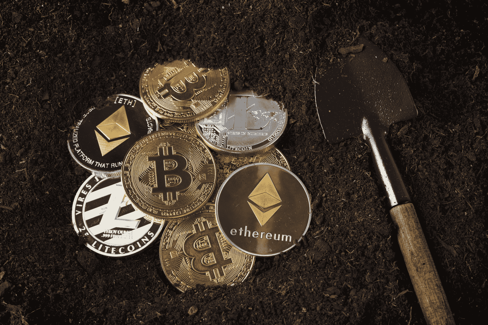

# ETH 的倒闭是不可避免的——第 383 页

> 原文：<https://web.archive.org/web/https://techcrunch.com/2018/09/02/the-collapse-of-eth-is-inevitable/383/>

杰里米·鲁宾目前是

[Stellar](https://web.archive.org/web/20190925151327/https://www.stellar.org/)

，比特币核心贡献者，早期加密初创公司的投资者和顾问，创办了一家比特币可扩展性和隐私解决方案公司，加密货币技术基础和尽职调查的自由顾问。此前，杰里米还共同创立了

[MIT Digital Currency Initiative](https://web.archive.org/web/20190925151327/https://dci.mit.edu/)

、缩放比特币会议系列、麻省理工学院比特币 100 美元空投。

这里有一个预测。ETH——资产，而不是以太坊网络本身——将归零。

那些已经认为 ETH 不会真正被采用的人——由于未能扩大规模，未能采用更安全的合同创作实践，或在竞争中击败其竞争对手——不需要相信价格暴跌会随之而来。

但是，如果有人认为以太坊作为一个平台会取得超出任何人最疯狂梦想的成功，那么以太坊(作为一种货币)将走向零的主张将更有说服力，因为它可以安全地运营全球商业的很大一部分。

这就是以太坊最终大获成功但变得毫无价值的原因。 以太坊的价值主张，由[【ethereum.org】](https://web.archive.org/web/20190925151327/https://www.ethereum.org/)给出，如下:

**构建不可阻挡的应用**

以太坊是一个 **去中心化的平台，运行智能合约** :完全按照编程运行的应用，没有任何宕机、审查、欺诈或第三方干扰的可能性。

这些应用程序运行在定制的区块链上，这是一个非常强大的共享全球基础设施，可以移动价值，代表财产的所有权。

这使得开发商能够创建市场，存储债务或承诺的登记，根据很久以前给出的指令(如遗嘱或期货合同)转移资金，以及许多其他尚未发明的东西，所有这些都没有中间人或交易对手的风险。

如果以太坊成功实现其价值主张，将因此减轻分散应用的外部风险因素。

土耳其 i̇stanbul——2018 年 1 月 28 日:比特币、莱特币和以太坊纪念币和铲子在土壤上的特写镜头。比特币莱特币和以太币是加密货币，是一种世界性的支付系统。

## “天然气”没有未来

在官方描述中，ETH 没有任何价值主张。也许这种遗漏是因为 ETH 的价值对以太坊基金会来说是如此明显，以至于几乎不值得一提:ETH 费用(被称为“汽油”)是你支付所有这些费用的方式。

如果气体的概念不是很明显，让我们扩展一下这个比喻:以太坊网络就像一辆共享汽车。当一个合同希望由共享汽车驾驶时，汽车用完了燃料，你必须为此向司机支付费用。你欠多少油钱取决于你要开多远，以及你在车里留了多少垃圾。

天然气是一个很好的比喻，但这个比喻不足以作为支持非零 ETH 价格的论据。汽油实际上是在内燃机内部燃烧的；没有可燃燃料，内燃机就不能工作。$ETH as Gas 比喻汽油是如何消耗的；以太坊合约对气没有硬性要求。 

(图片由 Manuel Romano/NurPhoto 通过 Getty Images 提供)

## 购买“流行语币”

假设我们正在构建一个新的去中心化应用程序，BuzzwordCoin。默认情况下，按照标准的 ERC-20 代币模板，BuzzwordCoin 上的每笔交易都将以$ETH 支付汽油费。要求每项 BuzzwordCoin 交易也依赖于 ETH 收取费用会产生巨大的风险、第三方依赖性以及对基础令牌价格的人为下行压力(如果必须提前向 ETH 出售 BuzzwordCoin 以进行 BuzzwordCoin 交易，那么出售压力将在交易需要之前发生，并且必须是比确保有足够资金支付交易所需的更大的出售)。

我们可以让每笔 BuzzwordCoin 交易直接向该区块矿工的地址存入少量 BuzzwordCoin，以支付合同执行费用，而不是在 ETH 支付天然气费用。以非 ETH 资产支付汽油费用在以太社区中有时被称为 *经济抽象* 。

修改后的 BuzzwordCoin 合约对 ETH 没有功能依赖。我们能够激励矿工进行采矿交易，而无需支付任何 ETH 费用。

如果 BuzzwordCoin 合同具有非交易性合同条款，即，任何一方都应该定期调用的功能，用于计算和更新合同中的缓存统计数据等任务，我们可以指定执行这些条款的矿工从通货膨胀或共享天然气池中接收硬币。在共享池中，特定合同中用户交易的所有费用都支付给该合同的钱包。执行非交易条款的费用分配合同调用将费用释放给矿商(这在某种程度上类似于比特币生态系统中的子支付父)。

## 对抗经济抽象

对经济抽象以太坊的反驳主要有四个:缺乏对经济抽象的软件支持；许多代币定价困难；与代币无关的合同的存在；以及对 ETH 进行股权证明的需要。虽然有细微差别，但所有四个论点都不攻自破。

**软件支持:** 目前矿工根据 ETH 提供的气量选择交易。由于 ETH 不是合同(像 ERC-20 令牌一样)，代码是 ETH 交易的特例。然而，有人努力让以太坊不那么特殊地对待 ETH，而更像其他 ERC-20 令牌，反之亦然。例如，将 eth 包装在 1:1 挂钩的 ERC-20 兼容令牌中，用于分散式交易所的交易。

经济抽象的批评者(特别是 [维塔利克·布特林](https://web.archive.org/web/20190925151327/https://ethresear.ch/t/pos-and-economic-abstraction-stakers-would-be-able-to-accept-gas-price-in-any-erc20-token/721/6) )认为增加的复杂性不值得生态系统的收益。这个论点是荒谬的。如果软件不支持理性用户的 需求，那么软件应该被修改。此外，任何给定令牌所需的实际钱包软件变得更加复杂，因为钱包必须管理 ETH 和应用令牌中的余额。

**市场定价:** 为了利用经济抽象在以太坊上采矿，采矿者只需要一种软件，这种软件允许他们考虑他们对活动代币的感知价值的差异，并在此基础上合理地包括交易。这种软件需要根据定价信息对未决交易进行动态重新排序，这些信息是通过矿商自己的展望或监控加密货币交易所的价格收集的。

[弗拉德·赞菲尔](https://web.archive.org/web/20190925151327/https://medium.com/@Vlad_Zamfir/against-economic-abstraction-e27f4cbba5a7) 认为，监控价格市场信息的潜在需求使得经济抽象变得困难。

然而，矿工需要定价信息已经是现状——理性行为者在采矿(或打桩)前需要一个未来 ETH 价格的模型，以最大化电力成本、硬件成本和机会成本的利润。

**非代币合约:** 不是所有的合约都有硬币，或者即使有，也不一定被广泛认可，有价值，在交易所交易。这样的合同可以不用 ETH 付费吗？

无代币合同的用户可以用他们想要的代币支付费用。例如，TokenlessContract 的用户可以用 50/50 的 LemonadeCoin 和 TeaBucks 混合支付费用。为了确保拥有不同资产的用户和矿商之间的流动性，用户可以简单地发出多个互斥交易，用不同资产的费用进行支付。

专门的钱包合同也可以直接与矿商谈判费用。如果存在开放分散交易(DEX)要约，以将费用资产交换为他们更喜欢的东西，则矿工也可以处理用他们不想要的资产支付费用的交易——可以创建 DEX 支付费用订单，该订单仅允许区块的矿工按照用户在该区块中已经支付的费用的比例来填写用户的要约，从而防止非矿工接受用户的费用多样化要约的情况。

**股权证明:** 没有 ETH，如果每个节点为所有资产的投票权选择一个权重向量(姑且称之为 HD-PoS，或异质存款股权证明)，具有多个资产的股权证明的修改版本仍然可以决定共识。虽然这是一个有待研究的问题

显示在哪些条件下 HD-PoS 将保持一致性，如果权重向量足够相似，则一致性是可能的。

通过假设权重向量的成对欧几里德距离或任意两个价格之间的最大差异的界限，HD-PoS 的证明可能是可能的。如果这样的共识算法被证明是不可能的，那么找不到这样的算法就指向以太坊 PoS 中更普遍的漏洞。

假设未来以太网的主要用途是治理投票，为什么以太坊上所有其他有价值的应用程序在共识过程中没有发言权？通过焚烧股权来撤销有价值的象征性合同可能是一项有利可图的业务；如果使用 HD-PoS，这种攻击是不可能的。

Vitalik Buterin(以太坊基金会)在 TechCrunch Disrupt SF 2017

## ETH 的飘渺值

如果所有的应用程序和交易都可以在没有 ETH 的情况下运行，那么 ETH 就没有存在价值的理由，除非矿商实施某种手段要求用户在 ETH 中付费。但是，如果矿工们是不协调的、相互不感兴趣的、理性的，他们会更愿意以他们自己选择的资产而不是像 ETH 这样的东西来获得报酬。此外，规避风险的用户会希望最大限度地减少他们不必使用的不稳定资产。最后，代币开发者受益，因为对他们的原生资产定价将有助于减少抛售压力。因此，在一个无状态的生态系统中，替换 ETH 是一个帕累托改进(即各方都更好)。唯一处于不利地位的一方是现有的 ETH 持有者。

*   *作者持有恒星和比特币，其他加密货币持有相对较少。他之前在以太坊上为他的事业做了一个虚拟的翻领别针销售(就像一个 ICO)，这个项目叫做“去他妈的纳粹”，面临着政府审查和以太坊社区的审查。*