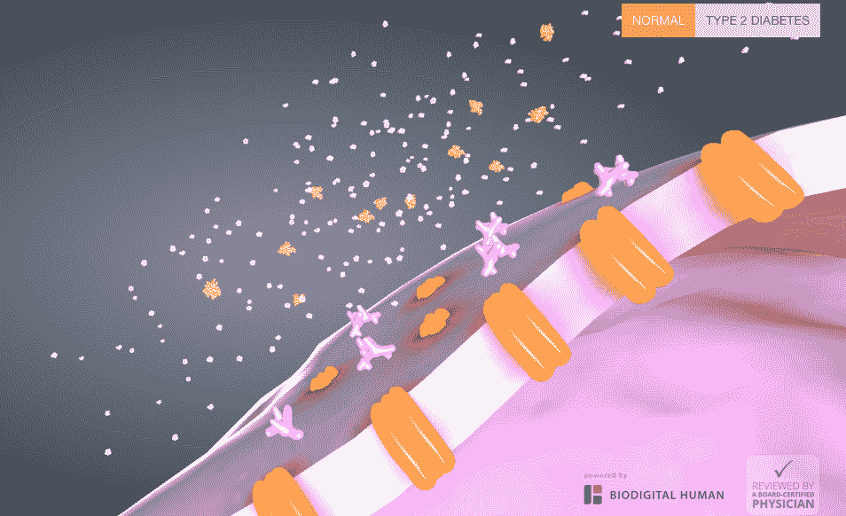

# 3D 建模初创公司 BioDigital 发布人体应用程序接口

> 原文：<https://web.archive.org/web/https://techcrunch.com/2015/10/01/3d-modeling-startup-biodigital-launches-an-api-for-the-human-body/>

想象一下这样一个现实:外科医生在走进手术室之前，在他们的病人的虚拟再现上练习高难度的程序，而职业运动员在他们走出球场后，在 3D 游戏磁带上回顾他们确切的肌肉运动。

现在，3D 人体建模初创公司 [BioDigital](https://web.archive.org/web/20230227002611/https://www.biodigital.com/) 正在向公众发布其 API，这是可能的。

在过去的两年里，这家总部位于纽约的初创公司与医疗保健各个领域的 100 多家组织密切合作，根据特定的用例定制其虚拟人体，包括 7000 个手工建模的物体。

例如，美国国立卫生研究院正在使用生物数字技术[绘制人体内的细菌图](https://web.archive.org/web/20230227002611/https://www.youtube.com/embed/0CQ1Kyw4iv0)。对于为颅面疾病患者提供治疗的非营利组织 [MyFace](https://web.archive.org/web/20230227002611/http://myface.org/) 来说，虚拟人使世界各地的医生能够[远程学习如何进行腭裂手术](https://web.archive.org/web/20230227002611/https://www.biodigital.com/human-case-studies/smiletrain)。

“在过去的 15 年里，我们已经看到了 3D 技术对视频游戏的深远影响，最近又对地理浏览器和我们如何在地球上导航产生了深远影响，”BioDigital 创始人弗兰克·斯库利说。"没有什么比表现人体更有意义的了."

它可能不像电子游戏那样令人兴奋，但玩起来却非常有趣:

你可以把 BioDigital 想象成人体的谷歌地图。就像星巴克将谷歌地图集成到其应用程序和网站中，指引你去最近的零售店一样，开发人员现在可以利用生物数字 API 来可视化他们的健康数据。

西奈山和其他教学医院已经在使用生物数字人来训练他们的外科医生，他们现在在 3D 人体和尸体上练习。

“当你改变心率时，你可以真正地进去看到虚拟心脏跳动，或者当你改变屏幕上的光线时，观察瞳孔的扩张，”斯库利解释道。

虽然这种教育对医生来说是必不可少的，但大多数患者也想知道发生了什么。

根据最新的皮尤报告，在过去的 12 个月里，72%的互联网用户在网上搜索健康信息。毫不奇怪，这个群体中 77%的人最常咨询谷歌(或另一个搜索引擎)作为他们的在线医学博士选择。

“当人们去 WebMD 和维基百科阅读什么是心力衰竭时，这是非常被动的，你要么在读，要么在看，”斯库利说。“现在你可以与它互动，参与其中，它背后有着深刻的分析。”

今年早些时候，BioDigital 与 About.com 合作，提供常见健康状况的交互式可视化。例如，搜索二型糖尿病信息的患者会看到一个细胞对胰岛素反应的 3D 模型[，他们可以从不同角度探索这一过程，同时在糖尿病和正常细胞功能之间切换。](https://web.archive.org/web/20230227002611/http://conditions.about.com/cc/type2diabetes/newly-diagnosed/insulin/view-diabetes)

不过，API 发布的革命性之处在于，现在开发人员可以通过整合自己的成像数据、可穿戴设备收集的运动数据和健康记录数据等来源，对生物数字人进行个性化设置。

因此，本质上，我们不用在 About.com 上点击标准人体模型，而是很快就可以探索我们自己身体的 3D 模型，用我们独特的健康数据构建。

尤其对运动员来说，虚拟复制一个运动的身体的直接优势是显而易见的。如果你能准确地看到哪些动作会给你的身体带来疼痛或压力，就更容易理解如何避免它们。

然而，对于医疗专业人员来说，通过生物数字人实时可视化大量健康数据的能力有可能改变新信息的分析和消费方式。

“人体是一个不可思议的系统，有无限的细节，”斯库利说。“因此，我们可以开始绘制细胞机制、基因组和大脑活动，以及所有这些从研究和可穿戴设备中大量收集的信息，并使其可供人们消费。”