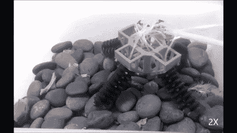
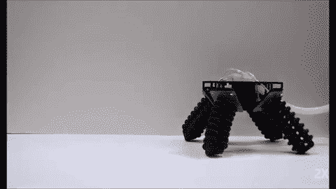

# 3D 打印软腿可以帮助机器人穿越崎岖不平的地形

> 原文：<https://web.archive.org/web/https://techcrunch.com/2017/05/19/3d-printing-soft-legs-can-help-a-robot-walk-across-rough-and-rocky-terrain/>

加州大学圣地亚哥分校的一组工程师应用了生物启发的软机器人原理，以开发出能够在岩石和沙子等不平坦地形上导航的机器人。

柔软柔韧的材料意味着机器人的四条腿能够适应周围的环境，所以它的机载传感器在穿越它时不需要地面的精确照片。如果系统遇到不平坦的地方，它可以简单地调整它的步态。

机器人的四条腿是软硬印刷部件的结合，依靠基于气囊的膨胀和收缩橡胶腔的系统来推动其运动。这是一个类似于软机器人项目的系统，在它之前，包括由哈佛大学[乔治·怀特塞德斯机器人实验室](https://web.archive.org/web/20230327174804/http://gmwgroup.harvard.edu/research/index.php?page=23)开发的许多机器，该实验室帮助开发了受章鱼和鱿鱼等海洋生物启发的机器人。

UCSD 助理教授 Mike Tolley 领导了这项新的研究，他是哈佛实验室的资深成员，曾参与其中一个更著名的项目，[一个不受束缚的 X 形机器人](https://web.archive.org/web/20230327174804/https://www.sciencedaily.com/releases/2014/09/140911180756.htm)，由于它几乎完全柔软的身体，它能够挤进狭小的空间。

Tolley 在本周的一次谈话中告诉 TechCrunch:“我们确实演示了一些行走，但(称之为)“行走”是很慷慨的，因为它真的是拖着脚走的。”当被启动时，它基本上只能向一个方向移动。这让我们想出了一些有趣的步态。我们做了一个起伏的步态，看起来有点像蠕虫。”

这项研究已经导致了一些有趣的现实世界应用，包括由 Soft Robotics 设计的工业夹钳[，其章鱼灵感的手可以在没有精确机器人视觉的情况下抓取各种形状和尺寸。当然，腿完全是一种不同的动物——设计一双可以真正抬起并四处移动的腿，而不仅仅是在表面上波动。](https://web.archive.org/web/20230327174804/https://techcrunch.com/2017/04/01/soft-robotics-grippers/)

该团队维持了一个与哈佛机器人类似的基于压力的气囊系统，但在拼图中添加了一些部件，以开发一套更复杂的腿，以及一些更硬的结构部件。

“以前，我们有这些通道，我们正在膨胀，使腿向一个方向弯曲，”托利说。“但要做我想做的事情，我们必须让腿绕着不同的轴弯曲。我们以前用简单的分层成型技术是做不到的。事实上，我们必须想出一种方法，能够重复、快速地制造更复杂的 3D 打印膀胱。”

新系统的特点是并排放置三个 3D 打印膀胱。膨胀不同的组合，允许更全面地控制机器人的运动。“它们以这样的方式连接，当你给一个充气时，你会向一个方向弯曲，”托利补充道。“如果你弯曲另一个或做一些它们的组合，你实际上可以控制一个完整的 360 度弯曲角度。”