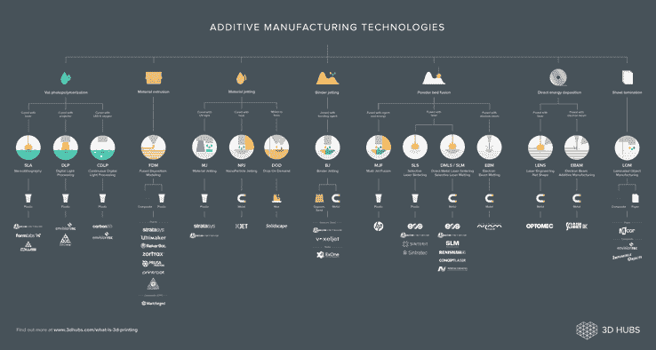
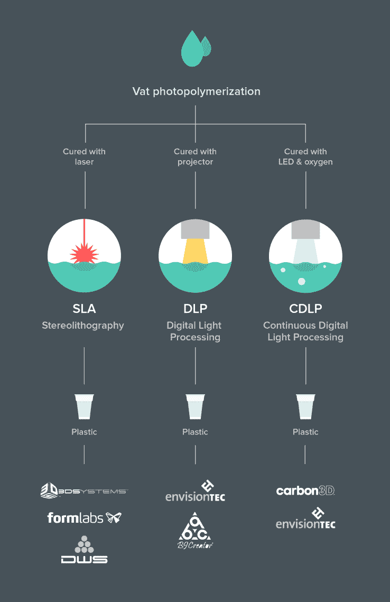
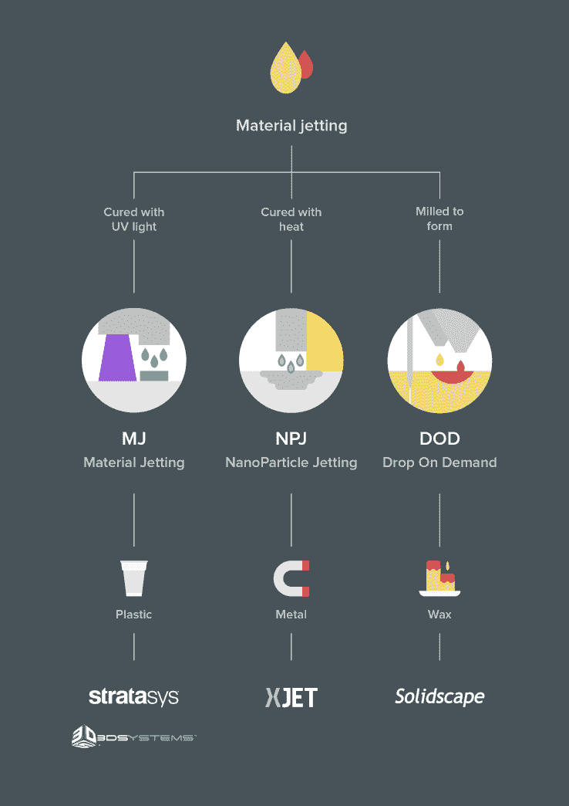
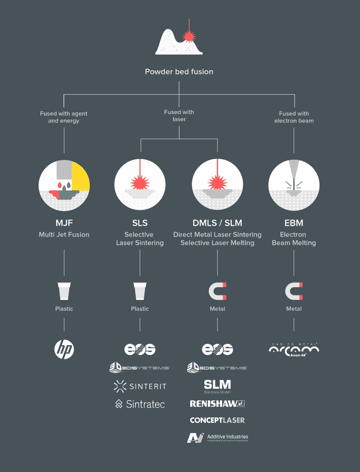

# 3D 打印技术讲解 

> 原文：<https://web.archive.org/web/https://techcrunch.com/2016/09/06/3d-printing-technologies-explained/>

菲莱蒙·谢弗撰稿人

Filemon Schoffer 是

[3D Hubs](https://web.archive.org/web/20221203091141/https://www.3dhubs.com/)

.

More posts by this contributor

如果你曾经迷失在所有的 3D 打印 技术中，你就会知道掌握不同的机械、应用和相关公司有多难。

专利纠纷、狡猾的营销团队和发明者之间的争斗导致了这样一种情况，即相同的技术使用不同的商标，并且由于潜在的侵权而限制了它们的应用。许多“新技术”——实际上是商标——被说成是革命性的，而事实上它们与现有系统相似或相同。

对于工业设计师或工程师来说，掌握这些技术很重要，因为它们可以从一开始就告诉你许多可能的应用和限制。这通常不是一件容易的事情。为了阐明这种情况，并帮助您理解不同的技术，这里有一个概述让您入门。

该概述包含当今所有主要的增材制造技术，从工艺描述开始，贯穿所有单独的技术和材料选项，以主要行业参与者结束。

利用该概述，看看新的 3D 打印 技术在什么地方适合事物的大计划，以及它们的应用和可能的限制的预期可能是特别有趣的。

## 碳

一年多前，来自北卡罗来纳大学教堂山分校的化学教授约瑟夫·M·德西蒙尼走上了 T2 TED 大会的舞台，让观众们肃然起敬。在舞台上，他展示了一项被称为连续液体界面生产(CLIP)的技术，该技术有望比类似的 3D 打印 技术快 100 倍，能够制造出光滑、坚固的零件，相当于注射成型的零件。在 10 分钟的演示结束时，一个固体从他随身携带的不起眼的 3D 打印机中升起。

https://www.youtube.com/watch?v=UpH1zhUQY0c&feature=youtu.be

从概述中可以看出， [Carbon 的](https://web.archive.org/web/20221203091141/https://www.crunchbase.com/organization/carbon3d#/entity)技术与现有的 DLP 技术相似。它的不同之处在于使用了“一种光化学过程，这种过程小心地平衡光和氧，以快速生产零件。”光聚合通常产生脆弱、易碎的部件，并且当暴露于紫外光时会降解。Carbon 声称“通过在材料中嵌入第二种热激活反应化学物质”来克服这一问题，从而产生具有工程级机械性能的高分辨率部件。"

Carbon 得到了包括谷歌、欧特克和红杉资本在内的知名投资者的支持，该公司迄今为止已筹集了 1.41 亿美元。他们的第一台打印机，M1，定价为每年 40，000 美元，最低期限为三年——这是一种基于订阅的模式，对于 3D 打印行业来说是非常新的。

## XJet

以色列公司 [XJet](https://web.archive.org/web/20221203091141/https://www.crunchbase.com/organization/xjet-2#/entity) 的纳米粒子喷射(NPJ)技术承诺将基于喷墨的 3D 打印技术引入金属工业。这是一种革命性的方法，考虑到材料喷射技术(例如类似喷墨)迄今为止仅成功应用于生产塑料或蜡零件。

在 XJet 系统中，包含金属纳米颗粒的“打印头沉积一层超细液滴”到构建托盘上。极高的温度导致金属纳米颗粒周围的液体“外套”蒸发，金属部件在所需位置结合。

与[粉末金属印刷](https://web.archive.org/web/20221203091141/https://beta.techcrunch.com/2016/07/24/metal-3d-printing-takes-flight/) 相比，该工艺产生了“更强的金属结合力，与传统制造的金属部件几乎相同。”液体原料也装在密封的筒中，省去了金属粉末的复杂处理过程。

https://www.youtube.com/watch?v=9wiZUr6Ryow&feature=youtu.be

经过十年的研发，以及 Autodesk 和 Catalyst 提供的 2500 万美元资金，XJet 在 5 月的 RAPID 2016 上展示了这项技术。该公司现在有 7 台机器在以色列总部 Rehovot 运行，但尚未宣布正式的发布日期和第一款产品。一旦上市，XJet 可能会在主要生产领域扰乱复杂金属零件的短期生产。

## 大功率(High Power)ˌ高压(High Pressure)ˌ高性能(High Performance)ˌ高聚物(High Polymer)

当惠普在 2014 年 10 月宣布其首款 3D 打印机时，谣言被证明是真的。凭借丰富的资源和 2D 打印数十年的专业知识，该公司的第一台 3D 打印机将于今年[上市](https://web.archive.org/web/20221203091141/https://beta.techcrunch.com/2016/05/17/hps-new-3d-printers-pave-the-way-for-an-interesting-future)。

https://www.youtube.com/watch?v=VXntl3ff5tc

Multi Jet Fusion (MJF)每秒钟可以喷射数百万滴化学试剂——类似于该公司首创的 2D 纸印刷——到一薄层粉末材料上，同时立即固化它。最终，这种新的 3D 打印过程允许人们设置每个单独的体积像素的属性(或者如惠普所称；“体素”)，从而控制整个零件的机械和物理特性，能够添加比以往任何时候都更多的细节，包括颜色和结构力学，惠普指出。

惠普的机器提供 155，000 美元的端到端解决方案，价格颇具竞争力。目前只有一种可用的材料(尼龙)，但该公司正计划在未来几个月推出更多的材料，显示出未来发展的巨大潜力。

看看这些最近的发展，人们很容易(再一次)陷入每项新的 3D 打印技术的宣传中——但在这些新系统的经济性、速度和质量之间，我们真的似乎正处于全功能按需和本地生产的未来的尖端。让我们允许自己在炒作浪潮中多待一段时间。