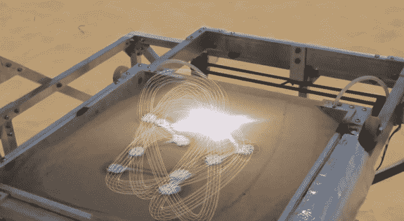

# 利用太阳的力量进行沙子 3D 打印 

> 原文：<https://web.archive.org/web/https://techcrunch.com/2014/09/25/3d-printing-with-sand-using-the-power-of-the-sun/>

# 利用太阳的力量用沙子进行 3D 打印

[https://web.archive.org/web/20221209072658if_/https://www.youtube.com/embed/ptUj8JRAYu8?feature=oembed](https://web.archive.org/web/20221209072658if_/https://www.youtube.com/embed/ptUj8JRAYu8?feature=oembed)

视频

"马库斯，这个周末你打算做什么？"

“哦，你知道的。前往沙漠，利用太阳的*能量*制造一台 3D 打印机，它可以用沙子打印出物体*。你呢？”*

“……赶上《绝命毒师》。”

你知道你以前邻居家的一个孩子，他利用业余时间用放大镜煎蚂蚁吗？这就像那个——除了他用的不是放大镜，而是一个大的菲涅耳透镜。他没有烤昆虫，而是把奇怪的沙子融化成东西。

由艺术家 Markus Kayser 建造的“SolarSinter”概念与 SpaceX 等公司使用的激光烧结打印机[不太相似，这些打印机可以用金属打印出原本不可能的物体。当然，聚焦的太阳光束远不如精细打磨的激光精确——但核心概念是相同的。](https://web.archive.org/web/20221209072658/https://beta.techcrunch.com/2013/09/05/elon-musk-shows-off-his-crazy-iron-man-inspired-3d-modeling-setup/)

我打赌这家伙可以做一个很棒的沙堡。

[via [黑客新闻](https://web.archive.org/web/20221209072658/https://news.ycombinator.com/item?id=8364958)

